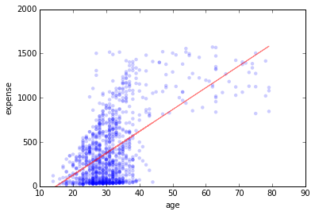
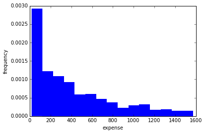
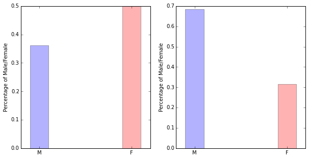

##Solutions to morning matplotlib exercise

1. Import libraries and read in data

   ```python
   import pandas as pd
   import numpy as np
   import matplotlib.pyplot as plt
   import scipy
   %matplotlib inline

   df = pd.read_csv('data/expense.csv')
   ```

2. Scatter plot of `age` against `expense`

   ```python
   plt.scatter(df['age'], df['expense'], edgecolor='none', alpha=0.2)
   plt.ylim([0, 2000])
   plt.xlabel('age')
   plt.ylabel('expense')
   slope, intercept = np.polyfit(df['age'], df3['expense'], 1)
   plt.plot(df['age'], df['age'] * slope + intercept, alpha=0.5, color='r')
   ```
   
   

3. Histogram of `expense`

   ```python
   # Using the regular matplotlib api
   plt.hist(df['expense'].tolist(), bins=15, normed=True, edgecolor='none')
   # Using the pandas plot api
   # df['expense'].hist(bins=15, normed=True, edgecolor='none')
   plt.xlabel('expense')
   plt.ylabel('frequency')
   ```

   

4. Barplot of male/female ratio

   ```python
   # Getting percentage of male and female
   male_num = df[df['gender'] == 'M'].shape[0]
   female_num = df[df['gender'] == 'F'].shape[0]
   male_percent = male_num / ((male_num + female_num) * 1.)
   female_percent = female_num / ((female_num + female_num) * 1.)
   ```
   
   ```python
   # Getting the percentage of male and female for expense over 800
   over800_df = df[df['expense'] > 800]
   male_over800_num = over800_df[over800_df['gender'] == 'M'].shape[0] 
   female_over800_num = over800_df[over800_df['gender'] == 'F'].shape[0] 
   male_over800_percent = \
     male_over800_num / ((male_over800_num + female_over800_num) * 1.)
   female_over800_percent = \
     female_over800_num / ((male_over800_num + female_over800_num) * 1.)
   ```
   
   ```python
   fig, (ax1, ax2) = plt.subplots(1, 2, figsize=(10, 5))
   #Plotting bar chart for overall female/male percent
   ax1.bar(range(2), [male_percent, female_percent], 
        width=.2, color=['b', 'r'], alpha=.3, align='center')
   ax1.set_xticks(range(2))
   ax1.set_xticklabels(['M', 'F'])
   ax1.set_ylabel('Percentage of Male/Female')
   # Plotting bar chart for overall female/male percent over 800 expense
   ax2.bar(range(2), [male_over800_percent, female_over800_percent], 
         width=.2, color=['b', 'r'], alpha=.3, align='center')
   ax2.set_xticks(range(2))
   ax2.set_xticklabels(['M', 'F'])
   ax2.set_ylabel('Percentage of Male/Female')
   ```
   
   