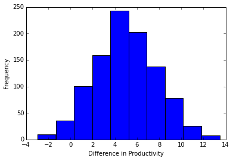
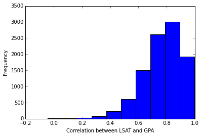

##Solutions to Sampling and Bootstrapping Exercises

##Part 0: Central Limit Theorem

- **Question (1 - 3)**: Implemetation of `make_draws()` and `plot_mean()` 

    ```python
    import scipy.stats as scs
    import numpy as np
    import matplotlib.pyplot as plt
    import sys
    
    
    def make_draws(distribution, parameters, size=200):
        """
        - distribution(STR) [specify which distribution to draw from]
        - parameters(DICT) [dictionary with different params depending]
        - size(INT) [the number of values we draw]
        """
        if distribution == 'uniform':
            a, b = parameters['a'], parameters['b']
            values = scs.uniform(a, b).rvs(size)
    
        elif distribution == 'poisson':
            lam = parameters['lam']
            values = scs.poisson(lam).rvs(size)
    
        elif distribution == 'binomial':
            n, p = parameters['n'], parameters['p']
            values = scs.binom(n, p).rvs(size)
    
        elif distribution == 'exponential':
            lam = parameters['lam']
            values = scs.expon(lam).rvs(size)
    
        elif distribution == 'geometric':
            p = parameters['p']
            values = scs.geom(p).rvs(size)
    
        return values
    
    
    def plot_means(distribution, parameters, size=200, repeats=5000):
        """
        - distribution(STR) [specify which distribution to draw from]
        - parameters(DICT) [dictionary with different params depending]
        - size(INT) [the number of values we draw]
        - repeat(INT) [the times we draw values]
        """
        mean_vals = []
        for _ in range(repeats):
            values = make_draws(distribution, parameters, size=200)
            mean_vals.append(np.mean(values))
    
        d_xlabel = {'uniform': 'Mean of randomly drawn values from a uniform',
                    'poisson': 'Mean events happening in an interval',
                    'binomial': 'Mean number of success',
                    'exponential': 'Mean of waiting time before an event happens',
                    'geometric': 'Mean rounds of failures before a success'
                    }
        xlabel = d_xlabel[distribution]
        plt.hist(mean_vals, bins=30)
        plt.xlabel(xlabel)
        plt.ylabel('Frequency')
        plt.title('Mean of %s samples with size %s drawn from %s distribution' %
                  (repeats, size, distribution.capitalize()), fontsize=14)
        plt.show()
    
    plot_means('uniform', {'a': 10, 'b': 20})
    plot_means('poisson', {'lam': 2})
    plot_means('binomial', {'n': 100, 'p': 0.1})
    plot_means('exponential', {'lam': 2})
    plot_means('geometric', {'p': 0.1})
    ```

- **Question 4:** What do you observe if you change the sample size to 10 instead of 200, keeping repeats
  constant at 5000? Explain your observation on a high level. Does the CLT applies when your sample size
  is small even given a large number of draws?
  
  The distribution appears to be non-normal. The mean of samples drawn from any distributions only converge
  to a normal distribution when the sample is large enough (>30 in general)
  
- **Question 5:** Instead of taking the mean of the samples, take the maximum of each of the samples and plot
 the histograms again. Do they resemble the normal distribution? Do all sample statistics follow a normal distribution?
 
 No. The CLT only applies to sample means, not explicitly for any other statistics


##Part 1: Population Inference and Confidence Interval

1. Suppose Google sampled 200 of its employees and measured how long they are gone for lunch. Load the data by
   `numpy.loadtxt('data/lunch_hour.txt')` and compute the mean lunch hour of the sample
   ```python
   lunch_hr = np.loadtxt('data/lunch_hour.txt')
   print lunch_hr.mean()#2.1845    
   ```

2. According to the CLT, any sample mean of a sufficiently large sample has a sampling distribution that approximates
   to the Normal
   
3. We assume the sampling distribution is approxmiately normal, hence we assume the z-score at the 95% CI is 1.96
    ```python
    def sample_sd(arr):
        return np.sqrt(np.sum((arr - np.mean(arr)) ** 2) / (len(arr) - 1))
    
    def standard_error(arr):
        return sample_sd(arr) / np.sqrt(len(arr))
    
    se = standard_error(lunch_hr)
    m = lunch_hr.mean() 
    print 'Lower 95% CI:',  m + 1.96 * se #2.26471462215
    print 'Upper 95% CI:', m - 1.96 * se #2.10428537785
    ```

4. If we are to draw 100 samples and compute the 95% CI, 95 of those 100 CI would contain the true population mean.

5. If the sample size is smaller, the CI will be wider since the sample standard deviation is larger and hence the
   standard error is larger and therefore `mean +/- 1.96 * SE` is of a larger range. If the sample size is 10,
   we cannot make the same computation since the sampling distribution of the mean would not approximate to normal.

##Part 2: What is Bootstrapping and Why

1. Because we are not making any distritional assumptions with the bootstrapping
   distribution (i.e. the distribution being normal). At small sample sizes, the CLT does not
   apply.

2. Bootstrap Implementation

    ```python
    def bootstrap(arr, iterations=10000):
        if type(arr) != np.ndarray:
            arr = np.array(arr)
            
        if len(arr.shape) < 2:
            arr = arr[:, np.newaxis]
            
        nrows = arr.shape[0]
        boot_samples = []
        for _ in xrange(iterations):
            row_inds = np.random.randint(nrows, size=nrows)
            boot_sample = arr[row_inds, :]
            boot_samples.append(boot_sample)
        return boot_samples
    ```

##Part 3: Bootstrap to find Confidence Interval of Mean

1. Load the data in with loadtxt function in numpy

   ```python
   productivity = np.loadtxt('data/productivity.txt')
   ```
   
2. We need to have some idea of the variability of the point estimate since
   we are drawing a sample
   
3. Computing the 95% CI from the CLT
 
    ```python
    # Calculate 95% confidence interval by mean +- 1.96 * SE
    def sample_sd(arr):
        return np.sqrt(np.sum((arr - np.mean(arr)) ** 2) / (len(arr) - 1))
    
    def standard_error(arr):
        return sample_sd(arr) / np.sqrt(len(arr))
    
    def confidence_interval(arr, ci=0.95):
        alpha = 1 - ((1 - ci) * 1.) / 2
        z = sc.stats.norm.ppf(alpha)
        lower_ci = np.mean(arr) - z * standard_error(arr)
        higher_ci = np.mean(arr) + z * standard_error(arr)
        return lower_ci, higher_ci
    
    # standard_error(productivity)
    productivity = np.loadtxt('data/productivity.txt')
    print confidence_interval(productivity)
    #(-0.3301040181838788, 10.418104018183879)
    ```

4. 25 is too small of a sample size for us to apply the CLT, and hence we
   are not sure the sampling distribution will be normal. The CI would be 
   imprecise if the sampling distribution is not normal
   
5. Implementation of `bootstrap_ci`

   ```python
    def bootstrap_ci(sample, stat_function=np.mean, iterations=1000, ci=95):
        boostrap_samples = bootstrap(sample, iterations=iterations)
        bootstrap_samples_stat = map(stat_function, boostrap_samples)
        low_bound = (100 - ci) / 2
        high_bound = 100 - low_bound
        lower_ci, upper_ci = np.percentile(bootstrap_samples_stat, [low_bound, high_bound])
        return lower_ci, upper_ci, bootstrap_samples_stat
        
    lower_ci, upper_ci, bootstrap_samples_stat = bootstrap_ci(beak_clap, ci=95)
    print lower_ci, upper_ci
    #-0.39616 10.50464 Your results would be slightly different
   ```

6. Histogram of bootstrap means

   ```python
   plt.hist(bootstrap_samples_stat)
   plt.ylabel('Frequency')
   plt.xlabel('Difference in Productivity')
   ```
   
   
   
##Part 4: Bootstrap to find Confidence Interval of Correlation

1. Load the correlation data in

   ```python
   law_sample = np.loadtxt('law_sample.txt')
   ```

2. Sample correlation

   ```python 
   def pearson_correlation(arr, p_val=False):
    col1 = arr[:, 0]
    col2 = arr[:, 1]
    corr_coeff, pval = sc.stats.pearsonr(col1, col2)
    if not p_val:
        return corr_coeff
    else:
        return corr_coeff, pval
    # Computer Pearson correlation    
    corr_coeff, p_val = pearson_correlation(law_sample, p_val=True)
    print corr_coeff, p_val 
    #0.776374491289 0.000665102011103
    ```

3. Use of bootstrapping to construct 95% CI for sample correlation 
   ```python
   lower_ci, upper_ci, bootstrap_samples_stat = \
       bootstrap_ci(law_sample, stat_function=pearson_correlation,
                    iterations=10000, ci=95)
   print lower_ci, upper_ci
   #0.43 0.97
   ```
   
   Based on the 95% CI, there is a 95% chance that `0.43 - 0.97` 
   contains the population correlation.

4. Histogram of bootstrap correlations

   

5. Load in the population data and verify the population correlation is in
   the 95% CI
   
   ```python
   law_all = np.loadtxt('data/law_all.txt')
   corr_coeff, p_val = pearson_correlation(law_all, p_val=True)
   print corr_coeff, p_val 
   #0.76 1.24e-16
   ```
   
