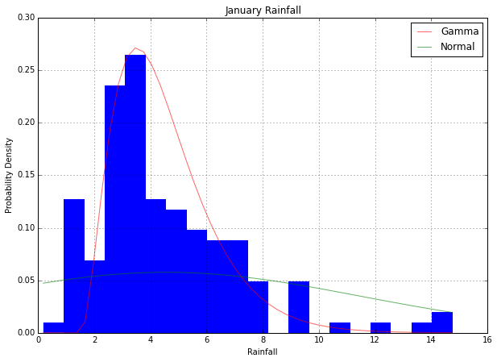
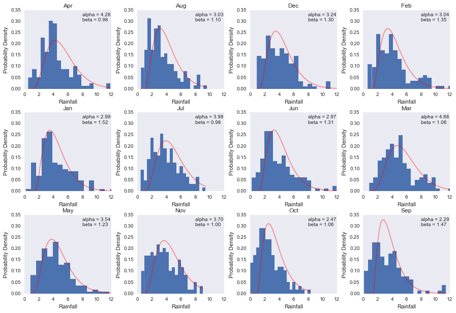
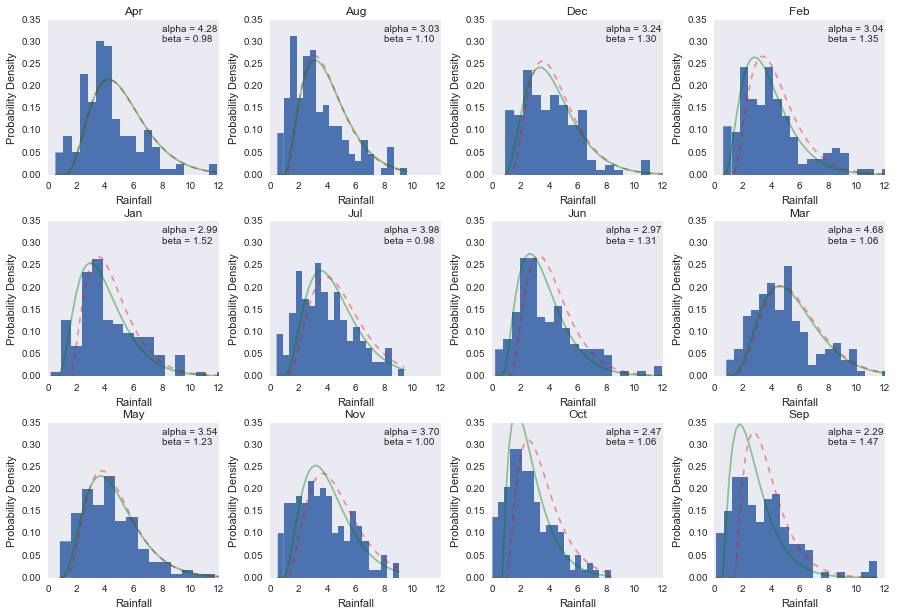
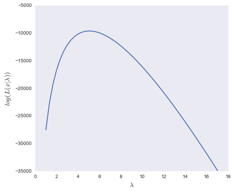
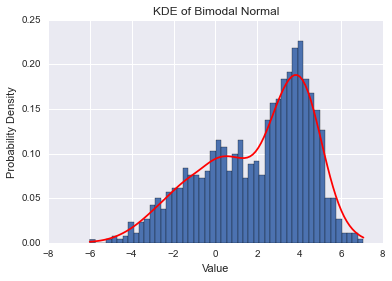

##Solutions to paramteric estimation exercise

## Choosing a distribution

- Plot a histogram of **January's rainfall**. Consider the data type, name two
   candidate distributions (from below) that can be used to model the data.
   Explain your answer.

   ```
   - Gamma and Normal can be potentially be used to fit the data.
     These two distributions are continuous.

   - The Poisson and Binomal are both discrete distributions,
     and are not appropriate for fitting continuous data
   ```

## MOM to estimate parameters

   - Calculate sample mean and variance

   ```python
   import pandas as pd
   import numpy as np
   import scipy.stats as scs
   import matplotlib.pyplot as plt
   %matplotlib inline
   
   all_data = pd.read_csv('data/rainfall.csv')
   jan_data = all_data['Jan']
   sample_mean = jan_data.mean()

   # Numpy has no built-in function for sample variance, only population var
   sample_var = np.sum(np.square(jan_data - sample_mean)) /  (jan_data.count() - 1)
   ```

   - Approximate sample mean and variance to population mean and variance
     and compute paramters

     - **Alpha** and **Beta** for **Gamma**
     - **Mean** and **Variance** got **Normal**

   ```python
   ###############
   #### Gamma ####
   ###############

   alpha = sample_mean**2 / sample_var
   # 2.99

   beta = sample_var / sample_mean
   # 1.52

   ################
   #### Normal ####
   ################

   norm_mean = sample_mean
   norm_var = sample_var   
   ```

   - Use the estimated parameters and plot the distribution on top of data

   ```python
   # Define the distributions in scipy
   gamma_rv = scs.gamma(alpha, beta)
   norm_rv = scs.norm(norm_mean, norm_var)

   # Get the probability for each value in the data
   x_vals = np.linspace(jan_data.min(), jan_data.max())
   gamma_p = gamma_rv.pdf(x_vals)
   norm_p = norm_rv.pdf(x_vals)

   # Plot those values on top of the real data
   ax = jan_data.hist(bins=20, normed=1, edgecolor='none', figsize=(10, 7))
   ax.set_xlabel('Rainfall')
   ax.set_ylabel('Probability Density')
   ax.set_title('January Rainfall')

   ax.plot(x_vals, gamma_p, color='r', label='Gamma', alpha=0.6)
   ax.plot(x_vals, norm_p, color='g', label='Normal', alpha=0.6)
   ax.legend()
   ```

   <div align="center">
    
   </div>

2. Iterate through the 12 months and plot parameters estimated by MOM

  ```python
  # Define a function that plots distribution fitted to one month's of data
  def plot_mom(df, col, ax):
      data = df[col]

      sample_mean = data.mean()
      sample_var = np.sum(np.square(data - sample_mean)) /  (data.count() - 1)

      alpha = sample_mean**2 / sample_var
      beta = sample_var / sample_mean

      gamma_rv = scs.gamma(alpha, beta)

      x_vals = np.linspace(data.min(), data.max())
      gamma_p = gamma_rv.pdf(x_vals)

      ax.plot(x_vals, gamma_p, color='r', alpha=0.4)

      ax.set_xlabel('Rainfall')
      ax.set_ylabel('Probability Density')
      ax.set_title(col)

      ax.set_xlim(0, 12)
      ax.set_ylim(0., .35)
      ax.legend()


      label = 'alpha = %.2f\nbeta = %.2f' % (alpha, beta)
      ax.annotate(label, xy=(8, 0.3))


  months = df.columns - ['Year']
  months_df = df[months]

  # Use pandas to get the histogram, the axes as tuples are returned
  axes = months_df.hist(bins=20, normed=1,
                      grid=0, edgecolor='none',
                      figsize=(15, 10))

  # Iterate through the axes and plot the line on each of the histogram
  for month, ax in zip(months, axes.flatten()):
      plot_mom(months_df, month, ax)
  ```
  <div align="center">
    
  </div>

## MLE to estimate parameters

1. Plot MOM and MLE for rainfall data

  ```python
  # Function to plot the MOM and MLE on top of the data
  def plot_mom_mle(df, col, ax):
      data = df[col]

      sample_mean = data.mean()
      sample_var = np.sum(np.square(data - sample_mean)) /  (data.count() - 1)

      alpha = sample_mean**2 / sample_var
      beta = sample_var / sample_mean

      # Use MLE to fit a gamma distribution
      ahat, loc, bhat = scs.gamma.fit(df[month], floc=0)
      alpha_mle, beta_mle = ahat, 1./bhat

      gamma_rv = scs.gamma(alpha, beta)
      mle_gamma_rv = scs.gamma(alpha_mle, beta_mle)

      x_vals = np.linspace(data.min(), data.max())

      gamma_p = gamma_rv.pdf(x_vals)
      mle_gamma_p = mle_gamma_rv.pdf(x_vals)

      ax.plot(x_vals, gamma_p, color='r', alpha=0.4, linestyle='--', label='MOM')
      ax.plot(x_vals, mle_gamma_p, color='g', alpha=0.4, label='MLE')
      ax.plot(x_vals, kde_p, color='b', alpha=0.4, label='KDE', linestyle='--' )

      ax.set_xlabel('Rainfall')
      ax.set_ylabel('Probability Density')
      ax.set_title(col)

      ax.set_xlim(0, 12)
      ax.set_ylim(0., .35)

      label = 'alpha = %.2f\nbeta = %.2f' % (alpha, beta)
      ax.annotate(label, xy=(8, 0.3))


  months = df.columns - ['Year']
  months_df = df[months]

  # Use pandas to get the histogram, the axes as tuples are returned
  axes = months_df.hist(bins=20, normed=1,
                      grid=0, edgecolor='none',
                      figsize=(15, 10))

  # Iterate through the axes and plot the line on each of the histogram
  for month, ax in zip(months, axes.flatten()):
      plot_estimate(months_df, month, ax)
  ```
  <div align="center">
    
  </div>

2. MLE with Poisson distribution

  ```python
  poisson_vals = np.loadtxt('data/poisson.txt')
  sum_logs = []
  for lam in np.linspace(1, 17):
      sum_log_liklihood = np.sum(np.log10(np.array([likelihood(lam, val) for val in poisson_vals])))
      sum_logs.append(sum_log_liklihood)

  fig = plt.figure(figsize=(7,6))
  plt.plot(np.linspace(1, 17), sum_logs)
  plt.ylabel('$log(L(x | \lambda))$', fontsize=14)
  plt.xlabel('$\lambda$', fontsize=14)
  plt.grid('off')
  ```

  <div align="center">
    
  </div>

## Non-parametric Estimation

1. Plot histogram of bimodal data and fit a kde to it

  ```python
  from scipy.stats import kde

  x1 = np.random.normal(0, 2, 500)
  x2 = np.random.normal(4, 1, 500)

  # Append by row
  x = np.r_[x1, x2]

  density = kde.gaussian_kde(x)
  xgrid = np.linspace(x.min(), x.max(), 100)
  plt.hist(x, bins=50, normed=True)
  plt.plot(xgrid, density(xgrid), 'r-')
  plt.ylabel('Probability Density')
  plt.xlabel('Value')
  plt.title("KDE of Bimodal Normal")
  ```

  <div align="center">
    
  </div>


2. Consider some of the advantages and disadvantages of using a non-parametric
   model as oppose to a parametric model. State at least one application where
   one is more appropriate than the other.

   ```
   A parametric model could be easily specificed by a few parameters, e.g. 2
   parameters in the gamma distribution. A parametric model often would aim
   to model some underlying mechanism which gives rise to the data observed.
   The model can result in very poor fit if the wrong parametric form is chosen
   (i.e. the wrong distribution is chosen).

   A non-parametric model does not require choosing a parametric form. The
   model structure is instead determined from data. Non-parametric models result
   in better fit to the data, but does not attempt to model an underlying
   mechanism which gives rise to the data observed.

   Non-parametric methods are widely used for studying populations that take on
   a ranked order (such as movie reviews receiving one to four stars). The use
   of non-parametric methods may be necessary when data have a ranking but no
   clear numerical interpretation, such as when assessing preferences.
   ```

