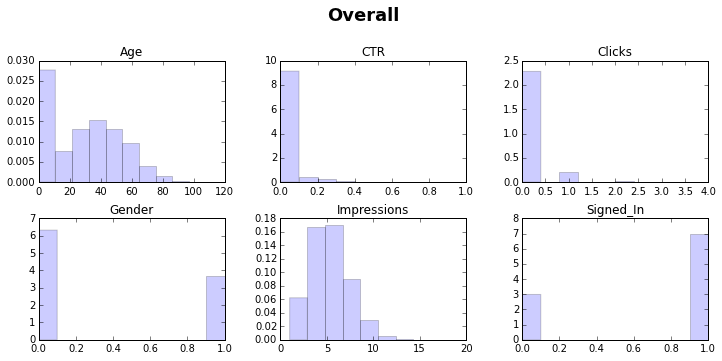
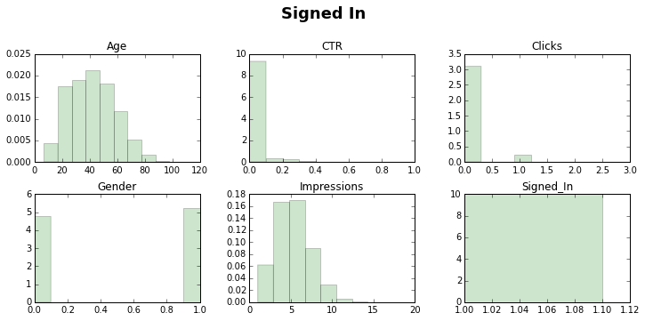
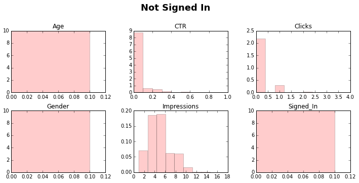
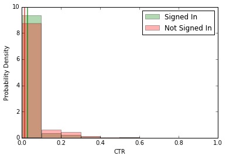
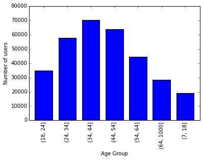

##Part 1: Hypothesis testing recap
Include the answers in ``morning_answers.md``

1. State which test should be used for the following scenarios to calculate p-values. Explain your
   choice.

   (**Estimated Time: 5 mins**)

   a. You randomly select 5 dogs and 5 cats from a large animal shelter, and want to
      know if dogs and cats have the same weight.
      ```
      2 sample t-test
      ```

   b. A random sample of San Franciscans and Oaklanders were surveyed about their favorite baseball team,
      and you want to determine if the same proportion of people like the SF Giants.
      ```
      z-test for two proportions
      ```

2. A study looked at the incidence of hospitalization for heart failure in Ohio,
   in 12 groups of patients defined by their astrological sign (based on their
   birthday). People born under the sign of Pisces have the highest incidence of
   heart failure. The researchers then performed a z-test compare the incidence
   of heart failure under Pisces with the incidence of heart failure among all
   other signs. The p-value is 0.026. What is the problem with concluding
   people born under the sign of Pisces have higher incidence of heart failure
   at significance level of 0.05? How would you adjust the p value to reach
   an alternative conclusion.

   (**Estimated Time: 5 mins**)

   ```
   The p value evaulated from the z-test has to be adjusted for multiple testing,
   even though only one explicit test was run. Implicitly 12 tests are run since
   we selected the group with the highest incidence out of 12 and did the z-test
   with that group against the rest of the groups.

   The corrected p value is 0.05/12=0.0042. And the test is not statistically
   significant.

   In general, you would define the comparison you are going make before collecting
   the data. It is also important that your null hypothesis has resonable basis.
   Statisitcal significance should not override reasoning. The size of the
   difference should also be taken into account.
   ```


##Part 2: Analyzing Click Through Rate
Include the word answers for ``1,4,5,6,8`` in ``morning_answers.md``

For the code, you may use an ipython notebook to get started with.

_**Please download your code into**_ ``morning.py``

We will use hypothesis testing to analyze **Click Through Rate (CTR)** on the New York Times website.
CTR is defined as the number of clicks the user make per impression that is made upon the user.
We are going to determine if there is statistically significant difference between the CTR of
the following groups:

```
1. Signed in users v.s. Not signed in users
2. Male v.s. Female
3. Each of 7 age groups against each other (7 choose 2 = 21 tests)
```
<br>
```python
#imports into script
import pandas as pd
import matplotlib.pyplot as plt
import scipy.stats as scs
from itertools import combinations
%matplotlib inline
```
1. Calculate the adjustment needed for multiple testing at 0.05 significance level.

   (**Estimated Time: 2 mins**)

   ```python
    # significance adjusted for multiple testing
    # 0.002173913043478261
    alpha = 0.05 / 23
   ```

2. Load ``data/nyt1.csv`` in a pandas dataframe.

   Use ``data.info()`` to make sure the datatypes are valid and there are no null values.
   This data has been cleaned for you, but generally it is good practice to check for those.

   (**Estimated Time: 2 mins**)

   ```python
   data = pd.read_csv('data/nyt1.csv')

   data.info()

   # No null types and the types matches what the column should be typed

   <class 'pandas.core.frame.DataFrame'>
    Int64Index: 458441 entries, 0 to 458440
    Data columns (total 5 columns):
    Age            458441 non-null int64
    Gender         458441 non-null int64
    Impressions    458441 non-null int64
    Clicks         458441 non-null int64
    Signed_In      458441 non-null int64
    dtypes: int64(5)
   ```

3. Make a new column ``CTR`` using the ``Impressions`` and the ``Clicks`` columns.
   Remember to remove the rows with ``0`` impressions.

   ```python
   # Remove rows with 0 impressions
   data = data[data['Impressions'] != 0]
   # Calculate a CTR column
   data['CTR'] = data['Clicks'] / data['Impressions'].astype(float)
   ```

   (**Estimated Time: 5 mins**)

4. Plot the distribution of each column in the dataframe. Do that using ``data.hist()``.
   Check out the argments you can use with the function
   [here](http://pandas.pydata.org/pandas-docs/stable/generated/pandas.DataFrame.hist.html).
   Set the ``figsize=(12,5)`` to make sure the graph is readable.

   (**Estimated Time: 5 mins**)

    ```python
    # Function to plot the columns in the histograme
    def plot_hist(df, title, color):
        df.hist(figsize=(12, 5), grid=False, normed=True, color=color, alpha=.2)
        # suptitle to place a title in the center of the figure
        # x,y to adjust where the title is placed
        plt.suptitle(title, size=18, weight='bold', y=1.05)

    # Plotting the columns in the dataframe containing the whole set of data
    plot_hist(data, 'Overall', 'b')
    ```

    

4. Make 2 dataframes separating the rows where the users who are signed in and users who are not signed in.
   Plot the distributions of the columns in each of the dataframes. By visually inspecting
   the two sets of distributions, describe the differences between users who are signed in and not
   signed in?

   (**Estimated Time: 10 mins**)

    ```python
    # Making the 2 dataframes, with signed and non-signed in users
    signin_data = data[data['Signed_In'] == 1]
    notsignin_data = data[data['Signed_In'] == 0]

    # Plot the 2 dataframes
    plot_hist(signin_data, 'Signed In', 'g')
    plot_hist(notsignin_data, 'Not Signed In', 'r')
    ```

    ```
    Users who are not signed in are all females aged 0, suggesting that the
    gender and age are not registered unless the user is signed in.
    ```

    

    


5. Use a Welch t-test to determine if the mean CTR between the signed-in users
   and the non-signed-in users is statistically different. Explain how you
   arrive at your conclusion.

   The Welch t-test assumes the two populations in which the samples are drawn from
   have different variances.

   ```python
   scipy.stats.ttest_ind(a, b, equal_var=False)
   ```
   (**Estimated Time: 5 mins**)

    ```python
    # Function to run the t-test and plot the distributions of each of
    #  the sample
    def t_test(gp1_df, gp2_df, gp1_name, gp2_name):
        fig = plt.figure()
        gp1_mean = gp1_df['CTR'].mean()
        gp2_mean = gp2_df['CTR'].mean()

        print '%s Mean CTR: %s' % (gp1_name, gp1_mean)
        print '%s Mean CTR: %s' % (gp2_name, gp2_mean)
        print 'diff in mean:' , abs(gp2_mean - gp1_mean)
        p_val = scs.ttest_ind(gp1_df['CTR'], gp2_df['CTR'], equal_var=False)[1]
        print 'p value is:', p_val

        gp1_df['CTR'].hist(normed=True, label=gp1_name, color='g', alpha=0.3)
        gp2_df['CTR'].hist(normed=True, label=gp2_name, color='r', alpha=0.3)
        plt.axvline(gp1_mean, color='r', alpha=0.6, lw=2)
        plt.axvline(gp2_mean, color='g', alpha=0.6, lw=2)

        plt.ylabel('Probability Density')
        plt.xlabel('CTR')
        plt.legend()
        plt.grid('off')


    t_test(signin_data, notsignin_data, 'Signed In', 'Not Signed In')
    ```

    ```
    Signed In Mean CTR: 0.0142536352321
    Not Signed In Mean CTR: 0.0283549070617
    diff in mean: 0.0141012718295
    p value is: 0.0
    ```

    


6. Determine if the mean CTR between male users and female users is
   statistically different. Is the difference in mean CTR between signed-in users
   and non-signed-in users more worthy of further investigation than that between
   male and female? Explain your answer. ``Male: 1, Female: 0``

   (**Estimated Time: 10 mins**)

    ```python
    male = signin_data[signin_data['Gender'] == 1]
    female = signin_data[signin_data['Gender'] == 0]
    t_test(male, female, 'M', 'F')
    ```

    ```
    M Mean CTR: 0.0139185242976
    F Mean CTR: 0.0146220121839
    diff in mean: 0.000703487886268
    p value is: 0.00100285273131

    The difference in CTR between signed in and non-signed users are more
    worthy of further investigation since the difference in CTR is greater.
    The female/male CTR difference is only marginally significant (0.0010 < 0.00217).
    The signed-in/non_signed CTR difference is more significant than that of
    male/female (0.0 < 0.00217).
    ```

7. Calculate a new column called AgeGroup, which bins Age into the following buckets
   ``'(18, 24]', '(24, 34]', '(34, 44]', '(44, 54]', '(54, 64]', '(64, 1000]', '(7, 18]'``

   Use only the rows where the users are signed in. The non-signed in users
   all have age 0, which indicates the data is not available.

   Use pandas' [cut](http://pandas.pydata.org/pandas-docs/stable/generated/pandas.cut.html) function.
   ``pandas.cut(signin_data['Age'], [7, 18, 24, 34, 44, 54, 64, 1000])``

   (**Estimated Time: 5 mins**)

   ```python
   signin_data['age_groups'] = pd.cut(signin_data['Age'], [7, 18, 24, 34, 44, 54, 64, 1000])

   # Plot the the number of users in each group
   signin_data['age_groups'].value_counts().sort_index().plot(kind='bar', grid=False)
   plt.xlabel('Age Group')
   plt.ylabel('Number of users')
   ```

  


8. Determine the pairs of age groups where the difference in mean CTR is
   statistically significant. Collect the p values and the difference of the
   means in each pair in a ``DataFrame``.

   Rank (in descending order) the difference in mean CTR for the pairs that are statistically significant.
   Comment on the trend you observe for groups ``(64, 1000]``, ``(54, 64]`` and ``(7, 18]``.
   Feel free to include additional trends you observe.

   Rank (in ascending order) the difference in mean CTR for the pairs that
   are _statistically insignificant_. State the 3 groups that are the least
   different in mean CTR and provide an explanation for why that is.

   (**Estimated Time: 20 mins**)

   ```python
   results = pd.DataFrame()
   # Generate the combinations of the pairs of age groups
   combos = combinations(pd.unique(signin_data['age_groups']), 2)

   # Run the t-test, evaluate the p value append to dataframe
   for age1, age2 in combos:
      ctr1 = signin_data[signin_data['age_groups'] == age1]['CTR']
      ctr2 = signin_data[signin_data['age_groups'] == age2]['CTR']
      p_val = scs.ttest_ind(ctr1, ctr2, equal_var=False)[1]
      ctr1_mean = ctr1.mean()
      ctr2_mean = ctr2.mean()
      diff = abs(ctr1_mean - ctr2_mean)
      results = results.append(dict(one=age1, two=age2,
                                    mean1=ctr1_mean, mean2=ctr2_mean,
                                    diff=diff, p=p_val), ignore_index=True)
   results = results[['one', 'two', 'mean1', 'mean2', 'diff', 'p']]

   # Sorting the significant pairs by descending order of the difference in mean
   results[results['p'] < alpha].sort('diff', ascending=False)
   ```
   ```
   Each of '(64, 1000]', '(7, 18]' and '(54, 64]' age group has CTR significantly
   greater than than the other 4 age groups, i.e.
   '(18, 24]', '(24, 34]', '(34, 44]', '(44, 54]'.
   This indicates the oldest 2 groups and the youngest group are the mostly likely to click through. Perhaps the oldest groups would generally click in to read an article and do less browsing. The youngest group might just be clicking a lot more because they are eaily distracted.

   Whilst '(64, 1000]' has a higher CTR than '(7, 18]' which in turn has a higher
   CTR than '(54, 64]', and the differences are all statistically significant. These
   differences are less significant than that between these 3 groups and the rest of
   the groups.
   ```

   <div style="max-height:1000px;max-width:1500px;overflow:auto;">
    <table border="1" class="dataframe">
      <thead>
        <tr style="text-align: right;">
          <th></th>
          <th>one</th>
          <th>two</th>
          <th>mean1</th>
          <th>mean2</th>
          <th>diff</th>
          <th>p</th>
        </tr>
      </thead>
      <tbody>
        <tr>
          <th>10</th>
          <td> (64, 1000]</td>
          <td>   (18, 24]</td>
          <td> 0.029803</td>
          <td> 0.009720</td>
          <td> 0.020082</td>
          <td> 2.458627e-272</td>
        </tr>
        <tr>
          <th>8 </th>
          <td> (64, 1000]</td>
          <td>   (44, 54]</td>
          <td> 0.029803</td>
          <td> 0.009958</td>
          <td> 0.019845</td>
          <td> 1.430923e-295</td>
        </tr>
        <tr>
          <th>7 </th>
          <td> (64, 1000]</td>
          <td>   (24, 34]</td>
          <td> 0.029803</td>
          <td> 0.010146</td>
          <td> 0.019656</td>
          <td> 7.860398e-285</td>
        </tr>
        <tr>
          <th>0 </th>
          <td>   (34, 44]</td>
          <td> (64, 1000]</td>
          <td> 0.010286</td>
          <td> 0.029803</td>
          <td> 0.019516</td>
          <td> 5.245541e-288</td>
        </tr>
        <tr>
          <th>22</th>
          <td>    (7, 18]</td>
          <td>   (18, 24]</td>
          <td> 0.026585</td>
          <td> 0.009720</td>
          <td> 0.016865</td>
          <td> 6.900980e-144</td>
        </tr>
        <tr>
          <th>18</th>
          <td>   (44, 54]</td>
          <td>    (7, 18]</td>
          <td> 0.009958</td>
          <td> 0.026585</td>
          <td> 0.016628</td>
          <td> 4.014382e-151</td>
        </tr>
        <tr>
          <th>14</th>
          <td>   (24, 34]</td>
          <td>    (7, 18]</td>
          <td> 0.010146</td>
          <td> 0.026585</td>
          <td> 0.016439</td>
          <td> 7.449266e-146</td>
        </tr>
        <tr>
          <th>3 </th>
          <td>   (34, 44]</td>
          <td>    (7, 18]</td>
          <td> 0.010286</td>
          <td> 0.026585</td>
          <td> 0.016299</td>
          <td> 4.575147e-146</td>
        </tr>
        <tr>
          <th>25</th>
          <td>   (18, 24]</td>
          <td>   (54, 64]</td>
          <td> 0.009720</td>
          <td> 0.020307</td>
          <td> 0.010586</td>
          <td> 1.007813e-130</td>
        </tr>
        <tr>
          <th>20</th>
          <td>   (44, 54]</td>
          <td>   (54, 64]</td>
          <td> 0.009958</td>
          <td> 0.020307</td>
          <td> 0.010349</td>
          <td> 2.525271e-151</td>
        </tr>
        <tr>
          <th>16</th>
          <td>   (24, 34]</td>
          <td>   (54, 64]</td>
          <td> 0.010146</td>
          <td> 0.020307</td>
          <td> 0.010160</td>
          <td> 5.668132e-141</td>
        </tr>
        <tr>
          <th>5 </th>
          <td>   (34, 44]</td>
          <td>   (54, 64]</td>
          <td> 0.010286</td>
          <td> 0.020307</td>
          <td> 0.010020</td>
          <td> 7.523228e-144</td>
        </tr>
        <tr>
          <th>11</th>
          <td> (64, 1000]</td>
          <td>   (54, 64]</td>
          <td> 0.029803</td>
          <td> 0.020307</td>
          <td> 0.009496</td>
          <td>  9.214903e-56</td>
        </tr>
        <tr>
          <th>23</th>
          <td>    (7, 18]</td>
          <td>   (54, 64]</td>
          <td> 0.026585</td>
          <td> 0.020307</td>
          <td> 0.006278</td>
          <td>  8.273993e-20</td>
        </tr>
        <tr>
          <th>9 </th>
          <td> (64, 1000]</td>
          <td>    (7, 18]</td>
          <td> 0.029803</td>
          <td> 0.026585</td>
          <td> 0.003218</td>
          <td>  3.563408e-05</td>
        </tr>
      </tbody>
    </table>
    <p>15 rows × 6 columns</p>
  </div>

  ```python
  results[results['p'] > alpha].sort('diff', ascending=True)
  ```

  ```
  The differences in CTR amongst '(18, 24]', '(24, 34]', '(34, 44]' and '(44, 54]'
  are not significant. This indicates the users aged from 18 - 54 are clicking
  through at similar ratios. This may be due to similar browsing behavior, ie
  a lot of scanning of articles, but not a lot of clicking into the articles
  and reading them.
  ```

  <div style="max-height:1000px;max-width:1500px;overflow:auto;">
    <table border="1" class="dataframe">
      <thead>
        <tr style="text-align: right;">
          <th></th>
          <th>one</th>
          <th>two</th>
          <th>mean1</th>
          <th>mean2</th>
          <th>diff</th>
          <th>p</th>
        </tr>
      </thead>
      <tbody>
        <tr>
          <th>1 </th>
          <td> (34, 44]</td>
          <td> (24, 34]</td>
          <td> 0.010286</td>
          <td> 0.010146</td>
          <td> 0.000140</td>
          <td> 0.624662</td>
        </tr>
        <tr>
          <th>13</th>
          <td> (24, 34]</td>
          <td> (44, 54]</td>
          <td> 0.010146</td>
          <td> 0.009958</td>
          <td> 0.000189</td>
          <td> 0.514689</td>
        </tr>
        <tr>
          <th>19</th>
          <td> (44, 54]</td>
          <td> (18, 24]</td>
          <td> 0.009958</td>
          <td> 0.009720</td>
          <td> 0.000237</td>
          <td> 0.477902</td>
        </tr>
        <tr>
          <th>2 </th>
          <td> (34, 44]</td>
          <td> (44, 54]</td>
          <td> 0.010286</td>
          <td> 0.009958</td>
          <td> 0.000329</td>
          <td> 0.233928</td>
        </tr>
        <tr>
          <th>15</th>
          <td> (24, 34]</td>
          <td> (18, 24]</td>
          <td> 0.010146</td>
          <td> 0.009720</td>
          <td> 0.000426</td>
          <td> 0.213658</td>
        </tr>
        <tr>
          <th>4 </th>
          <td> (34, 44]</td>
          <td> (18, 24]</td>
          <td> 0.010286</td>
          <td> 0.009720</td>
          <td> 0.000566</td>
          <td> 0.087470</td>
        </tr>
      </tbody>
    </table>
    <p>6 rows × 6 columns</p>
  </div>


