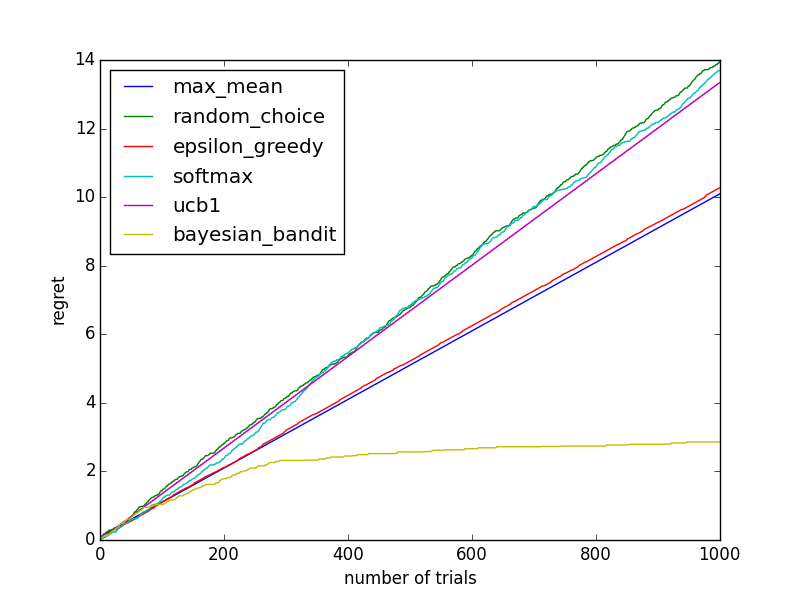
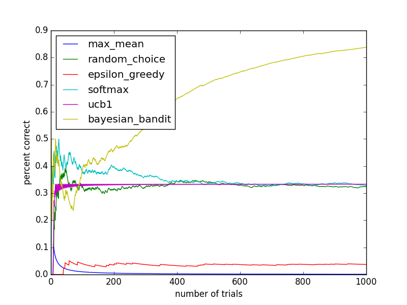

## Multi-Arm Bandit

1. Fill in the code stubs in `banditstrategy.py`.

    In [banditstrategy.py](banditstrategy.py)

2. See how many wins you have of the 1000 trials using each of the six strategies (two already implemented) with the starting bandits given above.

    ```python
    from bandits import Bandits
    from banditstrategy import BanditStrategy, max_mean, random_choice, \
                               epsilon_greedy, softmax, ucb1, \
                               bayesian_bandit

    p_arrays = ([0.1, 0.1, 0.1, 0.1, 0.9],
                [0.1, 0.1, 0.1, 0.1, 0.12],
                [0.1, 0.2, 0.3, 0.4, 0.5])
    functions = max_mean, random_choice, epsilon_greedy, softmax, ucb1, \
                bayesian_bandit
    for i, p_array in enumerate(p_arrays):
        print "%d: %r" % (i, p_array)
        for func in functions:
            bandits = Bandits(p_array)
            strat = BanditStrategy(bandits, func)
            strat.sample_bandits(1000)
            print "    %d wins with %s" % (strat.wins.sum(), func.__name__)
        print
    ```

    Results should be something like this:

    ```
    0: [0.1, 0.1, 0.1, 0.1, 0.9]
        900 wins with max_mean
        238 wins with random_choice
        816 wins with epsilon_greedy
        108 wins with softmax
        850 wins with ucb1
        892 wins with bayesian_bandit

    1: [0.1, 0.1, 0.1, 0.1, 0.12]
        103 wins with max_mean
        95 wins with random_choice
        101 wins with epsilon_greedy
        105 wins with softmax
        108 wins with ucb1
        89 wins with bayesian_bandit

    2: [0.1, 0.2, 0.3, 0.4, 0.5]
        508 wins with max_mean
        306 wins with random_choice
        386 wins with epsilon_greedy
        400 wins with softmax
        424 wins with ucb1
        473 wins with bayesian_bandit
    ```

    `max_mean` actually does pretty well every time. `bayesian_bandit` does well in the first and last one. `softmax` only does well in the second one. It totally bombs on the first!

3. Use matplotlib to plot the total regret over time of each algorithm.

    ```python
    import numpy as np
    import matplotlib.pyplot as plt
    from bandits import Bandits
    from banditstrategy import BanditStrategy, max_mean, random_choice, \
                               epsilon_greedy, softmax, ucb1, \
                               bayesian_bandit

    def regret(probabilities, choices):
        '''
        INPUT: array of floats (0 to 1), array of ints
        OUTPUT: array of floats

        Take an array of the true probabilities for each machine and an
        array of the indices of the machine played at each round.
        Return an array giving the total regret after each round.
        '''
        p_opt = np.max(probabilities)
        return np.cumsum(p_opt - probabilities[choices])

    p_array = np.array([0.05, 0.03, 0.06])
    functions = max_mean, random_choice, epsilon_greedy, softmax, ucb1, \
                bayesian_bandit

    for func in functions:
        bandits = Bandits(p_array)
        strat = BanditStrategy(bandits, func)
        strat.sample_bandits(1000)
        theregret = regret(p_array, strat.choices.astype(int))
        plt.plot(theregret, label=func.__name__)

    plt.legend(loc=2)  # This loc of 2 means 'upper left'
    plt.xlabel('number of trials')
    plt.ylabel('regret')
    plt.show()
    ```

    You should get results which look like this:
    

4. Now plot the percentage of time the optimal bandit was chosen over time.

    ```python
    import numpy as np
    import matplotlib.pyplot as plt
    from bandits import Bandits
    from banditstrategy import BanditStrategy, max_mean, random_choice, \
                               epsilon_greedy, softmax, ucb1, \
                               bayesian_bandit

    def optimal_percent(probabilities, choices):
        '''
        INPUT: array of floats (0 to 1), array of ints
        OUTPUT: array of floats

        Take an array of the true probabilities for each machine and an
        array of the indices of the machine played at each round.
        Return an array giving the percent correct after each round.
        '''
        p_opt = np.max(probabilities)
        count_correct = np.cumsum(probabilities[choices] == p_opt)
        # divide by the array [1, 2, ...] to get the average from the totals
        return count_correct / np.arange(1, len(choices) + 1).astype(float)

    p_array = np.array([0.05, 0.03, 0.06])
    functions = max_mean, random_choice, epsilon_greedy, softmax, ucb1, \
                bayesian_bandit

    for func in functions:
        bandits = Bandits(p_array)
        strat = BanditStrategy(bandits, func)
        strat.sample_bandits(1000)
        percents = optimal_percent(p_array, strat.choices.astype(int))
        plt.plot(percents, label=func.__name__)

    plt.legend(loc=2)  # This loc of 2 means 'upper left'
    plt.xlabel('number of trials')
    plt.ylabel('percent correct')
    plt.show()
    ```

    You should get results that look something like this:
    
