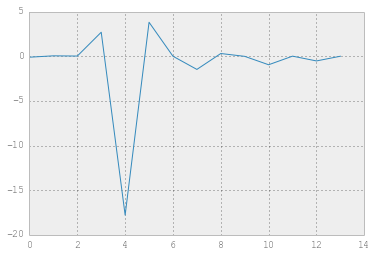
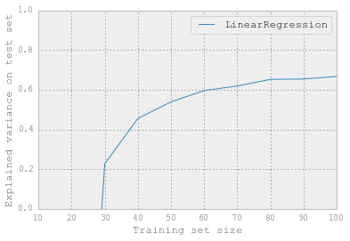
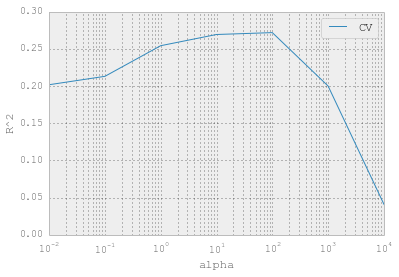
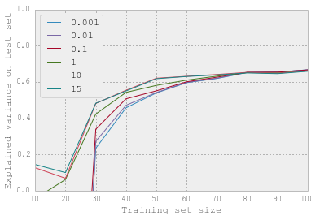
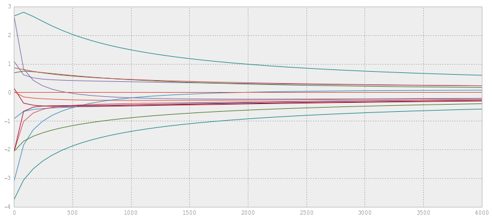
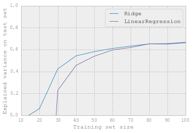
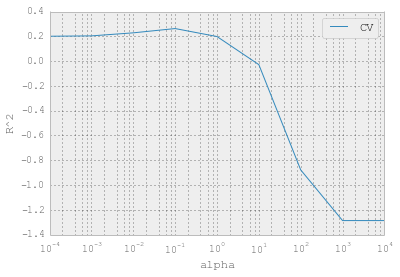
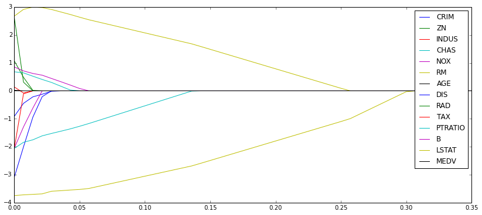
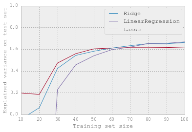

## Regression Regularization

For this exercise you will be comparing Ridge Regression and LASSO regression to
Ordinary Least Squares.  You will also get experience with techniques of cross
validation.  We will be using [scikit-learn](http://scikit-
learn.org/stable/supervised_learning.html#supervised-learning) to fit our
models, do not worry about the details of how the library works though.  We will
get into the details of this next week.  Look to the [lecture](lecture.ipynb]
notebook for an example of what functions to use with what parameters.


```python
%pylab inline

from sklearn.cross_validation import KFold
from sklearn.linear_model import LinearRegression, Lasso, Ridge, ElasticNet
from sklearn.linear_model import LassoCV, RidgeCV
from sklearn.cross_validation import train_test_split
import numpy as np
import pylab as pl

from sklearn.datasets import load_boston

boston = load_boston()
X = np.array([np.concatenate((v,[1])) for v in boston.data])
Y = boston.target
```

    Populating the interactive namespace from numpy and matplotlib


    WARNING: pylab import has clobbered these variables: ['test']
    `%matplotlib` prevents importing * from pylab and numpy


```python
features = boston.feature_names
```


```python
print Y[:10]
```

    [ 24.   21.6  34.7  33.4  36.2  28.7  22.9  27.1  16.5  18.9]


```python
print X[:2]
```

    [[  6.32000000e-03   1.80000000e+01   2.31000000e+00   0.00000000e+00
        5.38000000e-01   6.57500000e+00   6.52000000e+01   4.09000000e+00
        1.00000000e+00   2.96000000e+02   1.53000000e+01   3.96900000e+02
        4.98000000e+00   1.00000000e+00]
     [  2.73100000e-02   0.00000000e+00   7.07000000e+00   0.00000000e+00
        4.69000000e-01   6.42100000e+00   7.89000000e+01   4.96710000e+00
        2.00000000e+00   2.42000000e+02   1.78000000e+01   3.96900000e+02
        9.14000000e+00   1.00000000e+00]]


### Dataset

We will be using a [dataset](http://archive.ics.uci.edu/ml/datasets/Housing)
from the UCI machine learning Repository for this exercise.  Feel free to play
around with any of the others that are [suited](http://archive.ics.uci.edu/ml/da
tasets.html?format=&task=reg&att=&area=&numAtt=&numIns=&type=&sort=nameUp&view=t
able) for regression as well.  This dataset is actually containe in scikit-
learn's built in datasets.


```python
# EXERCISE: Create a new linear regression model and fit it using the dataset

# Create linear regression object
linear = LinearRegression()

# TODO: Fit the data
linear.fit(X,Y)
```


    LinearRegression(copy_X=True, fit_intercept=True, normalize=False)


```python
def rmse(y, y_fit):
    return np.sqrt(np.mean((y - y_fit) ** 2))
```


```python
# EXERCISE: Compute the RMSE on the training data
rmse(Y, linear.predict(X))
```


    4.6795063006355182


```python
# EXERCISE: Examine the coefficients return from your model.  Maybe make a plot of these.
# http://scikit-learn.org/stable/auto_examples/linear_model/plot_ols.html#example-linear-model-plot-ols-py

linear.coef_
```


    array([ -1.07170557e-01,   4.63952195e-02,   2.08602395e-02,
             2.68856140e+00,  -1.77957587e+01,   3.80475246e+00,
             7.51061703e-04,  -1.47575880e+00,   3.05655038e-01,
            -1.23293463e-02,  -9.53463555e-01,   9.39251272e-03,
            -5.25466633e-01,   0.00000000e+00])


```python
plt.plot(linear.coef_)
```


    [<matplotlib.lines.Line2D at 0x109e51150>]





```python
# EXERCISE: Split your data into a training and test set (hold-out set).

# Play around with the ratio of these (i.e. 70%/30% train/test, 80%/20% train/test, etc.)
# and compute the fit on only the training data. Test the RMSE of your results on the test data.

xtrain, xtest, ytrain, ytest = train_test_split(X, Y, test_size=0.1)
```


```python
res = linear.fit(xtrain, ytrain).predict(xtest)

rmse(ytest, res)
```


    5.2633738253138551


## K-fold Cross-validation

In **k-fold cross-validation**, the training set is split into *k* smaller sets.
Then, for each of the k "folds":

1. trained model on *k-1* of the folds as training data
2. validate this model the remaining fold, using an appropriate metric

The performance measure reported by k-fold CV is then the average of the *k*
computed values. This approach can be computationally expensive, but does not
waste too much data, which is an advantage over having a fixed test subset.


```python
# EXERCISE: Repeat the above but this time use K-fold cross validation.

k_fold_err_lin = 0
k = len(X)
n_folds = 10
kf = KFold(k, n_folds=n_folds)
error = np.empty(n_folds)
j = 0

for train,test in kf:
    linear.fit(X[train],Y[train])
    pred = linear.predict(X[test])
    error[j] = rmse(pred, Y[test])
    j += 1
    
k_fold_err_lin = error.mean()
```


```python
ridge = Ridge(alpha=0.5)

k_fold_err = 0
k = len(X)
n_folds = 10
kf = KFold(k, n_folds=n_folds)
error = np.empty(n_folds)
j = 0

for train,test in kf:
    ridge.fit(X[train],Y[train])
    pred = ridge.predict(X[test])
    error[j] = rmse(pred, Y[test])
    j += 1
    
k_fold_err = error.mean()
```


```python
lass = Lasso(0.1)

k_fold_err_lass = 0
k = len(X)
n_folds = 10
kf = KFold(k, n_folds=n_folds)
error = np.empty(n_folds)
j = 0

for train,test in kf:
    lass.fit(X[train],Y[train])
    pred = lass.predict(X[test])
    error[j] = rmse(pred, Y[test])
    j += 1
    
k_fold_err_lass = error.mean()
```


```python
k_fold_err
```


    5.1228290634067779


```python
k_fold_err_lass
```


    5.1130992760862997


```python
k_fold_err_lin
```


    5.1856464865670642


```python
from sklearn import cross_validation, linear_model

# Convenience funciton defined to plot the learning curve
def plot_learning_curve(estimator, label=None):
    scores = list()
    train_sizes = np.linspace(10, 100, 10).astype(np.int)
    for train_size in train_sizes:
        test_error = cross_validation.cross_val_score(estimator, X, Y,
                        cv=cross_validation.ShuffleSplit(train_size=train_size, 
                                                         test_size=200, 
                                                         n=len(Y),
                                                         random_state=0)
                        )
        scores.append(test_error)

    plt.plot(train_sizes, np.mean(scores, axis=1), label=label or estimator.__class__.__name__)
    plt.ylim(0, 1)
    plt.ylabel('Explained variance on test set')
    plt.xlabel('Training set size')
    plt.legend(loc='best')
```


```python
plot_learning_curve(linear)
```





```python
# EXERCISE: Now that you have experimented with linear regression we will begin exploring Ridge Regression

# Fit the same dataset but with a Ridge Regression with an alpha == 0.5 to start

ridge = Ridge(alpha=0.5)
ridge.fit(X, Y)
```


    Ridge(alpha=0.5, copy_X=True, fit_intercept=True, max_iter=None,
       normalize=False, solver='auto', tol=0.001)


```python
def plot_error(clf, params, X, y):
    cv_error = []
    
    for p in params:
        #X_train, X_test, y_train, y_test = train_test_split(X, y, test_size=0.5)
    
        cv_error.append(cross_validation.cross_val_score(clf(alpha=p), X, y=y, cv=10).mean())
        #test_error.append(cross_validation.cross_val_score(clf(alpha=p), X_test, y=y_test, cv=10).mean())
      
    plt.plot(params, cv_error, label='CV')
    #plt.plot(params, test_error, label='test')
    plt.legend()
    plt.xscale('log')
    plt.xlabel('alpha')
    plt.ylabel('R^2')
```


```python
plot_error(Ridge, [0.01, 0.1, 1, 10, 100, 1000, 10000], X, Y)
```





Notice the linear regression is not defined for scenarios where the number of
features/parameters exceeds the number of observations. It performs poorly as
long as the number of sample is not several times the number of features.

One approach for dealing with overfitting is to **regularize** the regession
model.

The **ridge estimator** is a simple, computationally efficient regularization
for linear regression.

$$\hat{\beta}^{ridge} = \text{argmin}_{\beta}\left\{\sum_{i=1}^N (y_i - \beta_0
- \sum_{j=1}^k x_{ij} \beta_j)^2 + \alpha \sum_{j=1}^k \beta_j^2 \right\}$$

Typically, we are not interested in shrinking the mean, and coefficients are
standardized to have zero mean and unit L2 norm. Hence,

$$\hat{\beta}^{ridge} = \text{argmin}_{\beta} \sum_{i=1}^N (y_i - \sum_{j=1}^k
x_{ij} \beta_j)^2$$

$$\text{subject to } \sum_{j=1}^k \beta_j^2 < \alpha$$

Note that this is *equivalent* to a Bayesian model $y \sim N(X\beta, I)$ with a
Gaussian prior on the $\beta_j$:

$$\beta_j \sim \text{N}(0, \alpha)$$

The estimator for the ridge regression model is:

$$\hat{\beta}^{ridge} = (X'X + \alpha I)^{-1}X'y$$


```python
# EXERCISE: Make a plot of the training error and the testing error as a function of the alpha paramter

for a in [0.001, 0.01, 0.1, 1, 10, 15]:
    plot_learning_curve(Ridge(a), a)
```





The regularization of the ridge is a *shrinkage*: the coefficients learned are
shrunk towards zero.

The amount of regularization is set via the `alpha` parameter of the ridge,
which is tunable. The `RidgeCV` method in `scikits-learn` automatically tunes
this parameter via cross-validation.


```python
# EXERCISE: Plot the parameters (coefficients) of the Ridge regression (y-axis) versus the value of the alpha parameter.  
# There will be as many lines as there are parameters.

from sklearn import preprocessing

k = X.shape[1]
alphas = np.linspace(0, 4000)
params = np.zeros((len(alphas), k))
for i,a in enumerate(alphas):
    X_data = preprocessing.scale(X)
    y = Y
    fit = Ridge(alpha=a).fit(X_data, y)
    params[i] = fit.coef_

figure(figsize=(14,6))
for param in params.T:
    plt.plot(alphas, param)
```





```python
preprocessing.scale(preprocessing.scale(X))
```


    array([[-0.41771335,  0.28482986, -1.2879095 , ...,  0.44105193,
            -1.0755623 ,  0.        ],
           [-0.41526932, -0.48772236, -0.59338101, ...,  0.44105193,
            -0.49243937,  0.        ],
           [-0.41527165, -0.48772236, -0.59338101, ...,  0.39642699,
            -1.2087274 ,  0.        ],
           ..., 
           [-0.41137448, -0.48772236,  0.11573841, ...,  0.44105193,
            -0.98304761,  0.        ],
           [-0.40568883, -0.48772236,  0.11573841, ...,  0.4032249 ,
            -0.86530163,  0.        ],
           [-0.41292893, -0.48772236,  0.11573841, ...,  0.44105193,
            -0.66905833,  0.        ]])


```python
preprocessing.scale(X)
```


    array([[-0.41771335,  0.28482986, -1.2879095 , ...,  0.44105193,
            -1.0755623 ,  0.        ],
           [-0.41526932, -0.48772236, -0.59338101, ...,  0.44105193,
            -0.49243937,  0.        ],
           [-0.41527165, -0.48772236, -0.59338101, ...,  0.39642699,
            -1.2087274 ,  0.        ],
           ..., 
           [-0.41137448, -0.48772236,  0.11573841, ...,  0.44105193,
            -0.98304761,  0.        ],
           [-0.40568883, -0.48772236,  0.11573841, ...,  0.4032249 ,
            -0.86530163,  0.        ],
           [-0.41292893, -0.48772236,  0.11573841, ...,  0.44105193,
            -0.66905833,  0.        ]])


```python
ridge.coef_
```


    array([ -1.04941233e-01,   4.70136803e-02,   2.52527006e-03,
             2.61395134e+00,  -1.34372897e+01,   3.83587282e+00,
            -3.09303986e-03,  -1.41150803e+00,   2.95533512e-01,
            -1.26816221e-02,  -9.05375752e-01,   9.61814775e-03,
            -5.30553855e-01,   0.00000000e+00])


```python
# EXERCISE: Plot the learning curves of the Ridge Regression and Ordinary Least Squares Regression.  Compare these two.
plot_learning_curve(Ridge())
plot_learning_curve(LinearRegression())
```





**The Lasso estimator** is useful to impose sparsity on the coefficients. In
other words, it is to be prefered if we believe that many of the features are
not relevant.

$$\hat{\beta}^{lasso} = \text{argmin}_{\beta}\left\{\frac{1}{2}\sum_{i=1}^N (y_i
- \beta_0 - \sum_{j=1}^k x_{ij} \beta_j)^2 + \lambda \sum_{j=1}^k |\beta_j|
\right\}$$

or, similarly:

$$\hat{\beta}^{lasso} = \text{argmin}_{\beta} \frac{1}{2}\sum_{i=1}^N (y_i -
\sum_{j=1}^k x_{ij} \beta_j)^2$$
$$\text{subject to } \sum_{j=1}^k |\beta_j| < \lambda$$

Note that this is *equivalent* to a Bayesian model $y \sim N(X\beta, I)$ with a
**Laplace** prior on the $\beta_j$:

$$\beta_j \sim \text{Laplace}(\lambda) =
\frac{\lambda}{2}\exp(-\lambda|\beta_j|)$$

Note how the Lasso imposes sparseness on the parameter coefficients:

### Repeat the above steps with LASSO Regression


```python
plot_error(Lasso, [0.0001, 0.001, 0.01, 0.1, 1, 10, 100, 1000, 10000], X, Y)
```





```python
cross_validation.cross_val_score(LinearRegression(), X, Y, cv=10).mean()
```


    0.20013786735418285


```python
# EXERCISE: Plot the parameter curve of the LASSO regression with different alpha parameters

k = X.shape[1]
alphas = np.linspace(0, .35)
params = np.zeros((len(alphas), k))
for i,a in enumerate(alphas):
    X_data = preprocessing.scale(X)
    y = Y
    fit = Lasso(alpha=a, normalize=True).fit(X_data, y)
    params[i] = fit.coef_

figure(figsize=(14,6))
for i, param in enumerate(params.T):
    plt.plot(alphas, param, label=features[i])
    
legend()
```


    <matplotlib.legend.Legend at 0x10bcbd190>





```python
# EXERCISE: Plot the learning curves of the Ridge Regression, LASSO Regression, and 
# Ordinary Least Squares Regression.  Compare these all.
plot_learning_curve(Ridge())
plot_learning_curve(LinearRegression())
plot_learning_curve(Lasso())
```





```python

```
