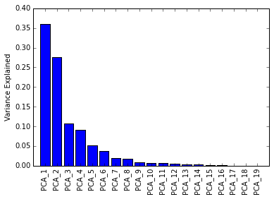
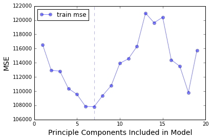

Importing all the necessary libraries
```python
from sklearn.decomposition import PCA
from sklearn.linear_model import LinearRegression
from sklearn.cross_validation import cross_val_score
from sklearn.cross_validation import train_test_split
from sklearn.metrics import mean_squared_error, r2_score
from sklearn.preprocessing import scale
import sklearn as skl
import pandas as pd
import matplotlib.pyplot as plt
import numpy as np
%matplotlib inline
```

Cleaning the data

```python
hitters = pd.read_csv('data/hitters.csv')

# Dropping NAs
hitters.dropna(inplace=True)

# Binarizing columns
def map_binary(df, col):
    vals = df[col].unique()
    df[col] = df[col].apply(lambda x: 0 if x == vals[0] else 1)

map_binary(hitters, 'League')
map_binary(hitters, 'NewLeague')
map_binary(hitters, 'Division')
```

Making train test split.

```python
salary = hitters['Salary'].values
feature_names = hitters.columns - ['Salary']
features = hitters[feature_names].astype(float).values
scaled_features = scale(features)
train_feat, test_feat, train_target, test_target = \
train_test_split(scaled_features, salary, test_size=0.2, random_state=42)
```

See how much variance the principal components explain.

```python
n_col = train_feat.shape[1]
pca = PCA(n_components=n_col)
train_components = pca.fit_transform(train_feat)
test_components = pca.fit_transform(test_feat)


pca_range = np.arange(n_col) + 1
xbar_names = ['PCA_%s' % xtick for xtick in pca_range]
plt.bar(pca_range, pca.explained_variance_ratio_, align='center')
xticks = plt.xticks(pca_range, xbar_names, rotation=90)
plt.ylabel('Variance Explained')
```
<div align="center">
  
</div>


Get train error with K-Fold cross validation.

```python
train_mse_arr = np.array([])

for i in pca_range:

    train_subset = train_components[:, :i]

    pca_linear = LinearRegression()

    pca_linear.fit(train_subset, y=train_target)

    # Get train error
    train_mse = cross_val_score(pca_linear, train_subset, y=train_target,
                                scoring='mean_squared_error', cv=10) * -1
    train_mse_arr = np.append(train_mse_arr, train_mse.mean())
```


```python
plt.plot(pca_range, train_mse_arr, marker='o', color='b', alpha=.5, label='train mse')
plt.ylabel('MSE', fontsize=14)
plt.xlabel('Principal Components Included in Model', fontsize=14)
plt.legend(loc='best')

best_train_mse_pca, min_train_mse = np.argmin(train_mse_arr) + 1, np.min(train_mse_arr)

plt.axvline(best_train_mse_pca, color='b', ls='--', alpha=.3)

print '# of PCs that gives lowest train MSE:', best_train_mse_pca, '@', min_train_mse


# of PCs that gives lowest train MSE: 7 @ 107809.535791
```

<div align="center">
  
</div>
