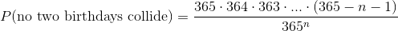
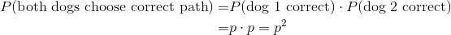
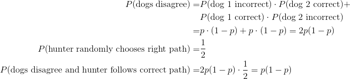
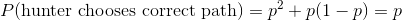

1. *Consider n people who are attending a party. We assume that every person has an equal probability of being born on any day during the year, independent of everyone else, and ignore leap years (i.e. year has 365 days). What is the probability that each person has a distinct birthday? How many people are necessary to obtain a 99% probability of at least one birthday collision (i.e. 2 people with the same birthday).*

    **Solution:** The sample space consists of all possible choices for the birthday of each person. Since there are *n* people, and each has 365 possible birthdays, the sample space has 365*n* elements. To get no two people to have the same birthday, there are 365 choices for the birthday of the first person, 364 for the second, 363 for the third, etc. Thus:

    

    Note that this assumes that *n* is smaller than 365. Of course if it is at least 365, the probability will be 1.

2. *A hunter has two hunting dogs. One day, on the trail of some animal, the hunter comes to a place where the road diverges into two paths. He knows that each dog, independent of the other, will choose the correct path with probability p. The hunter decides to let each dog choose a path, and they agree, take that one, and if they disagree, to randomly pick a path. Is his strategy better than just letting one of the two dogs decide on a path? Explain why or why not.*

    These are the events that lead to a correct choice of path:

    1. Both dogs agree on the correct path.

        

    2. The dogs disagree. The hunter follows the correct path.

        

    The total probability of the hunter being correct is the sum of the above two probabilities.

    

    This is the same as the strategy of just letting one of the dogs decide on a path.
