## Part 1: ROC Curve

1. Write a ROC curve function to compute the above in `roc_curve.py`.

    *In [roc_curve.py](roc_curve.py)*

2. Run the above code to verify that it's working correctly.

    *You should get a graph like this:*

    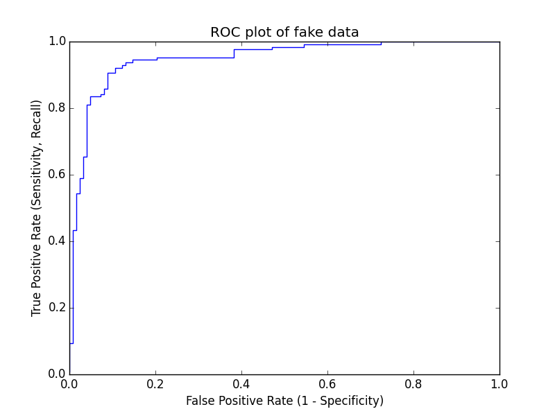

3. Let's see how the roc curve looks on a real dataset.

    *You should get a graph like this*

    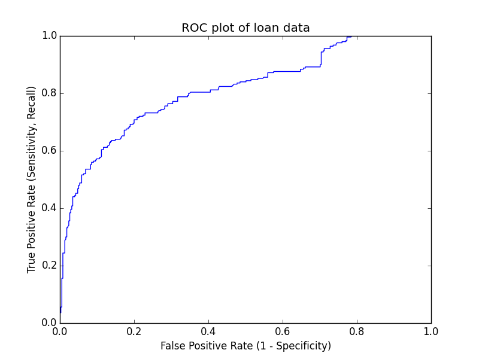

## Part 2: Data Exploration: Graduate School Admissions

1. Load in the dataset into pandas: `data/grad.csv`.

    ```python
    import pandas as pd

    df = pd.read_csv('data/grad.csv')
    ```

    The data looks like this:

    |       | admit |  gre |  gpa | rank |
    | ----- | ----- | ---- | ---- | ---- |
    | **0** |     0 |  380 | 3.61 |    3 |
    | **1** |     1 |  660 | 3.67 |    3 |
    | **2** |     1 |  800 | 4.00 |    1 |

2. Use the pandas `describe` method to get some preliminary summary statistics on the data.

    ```python
    print df.describe()
    ```

    Results:

    ```
                admit         gre         gpa       rank
    count  400.000000  400.000000  400.000000  400.00000
    mean     0.317500  587.700000    3.389900    2.48500
    std      0.466087  115.516536    0.380567    0.94446
    min      0.000000  220.000000    2.260000    1.00000
    25%      0.000000  520.000000    3.130000    2.00000
    50%      0.000000  580.000000    3.395000    2.00000
    75%      1.000000  660.000000    3.670000    3.00000
    max      1.000000  800.000000    4.000000    4.00000
    ```

3. Make a bar plot of the percent of applicants from each rank who were accepted.

    ```python
    import matplotlib.pyplot as plt

    admit = pd.crosstab(df['admit'], df['rank'], rownames=['admit'])
    (admit / admit.apply(sum)).plot(kind="bar")
    plt.show()
    ```

    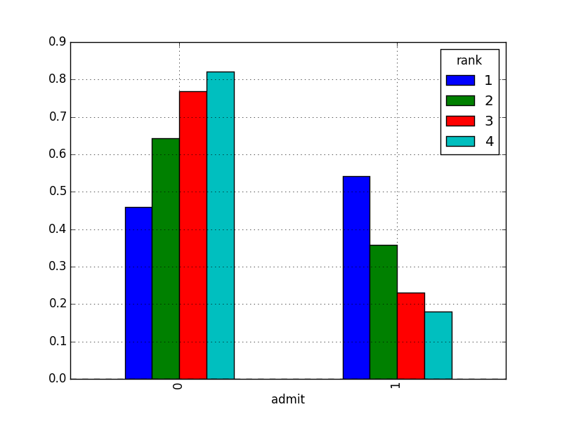

    *It looks like the rank (or prestige) of a school that the applicant went to linearly correlates with acceptance numbers.**

4. What does the distribution of the GPA and GRE scores look like? Do the distributions differ much?

    ```python
    df.hist()
    plt.show()
    ```

    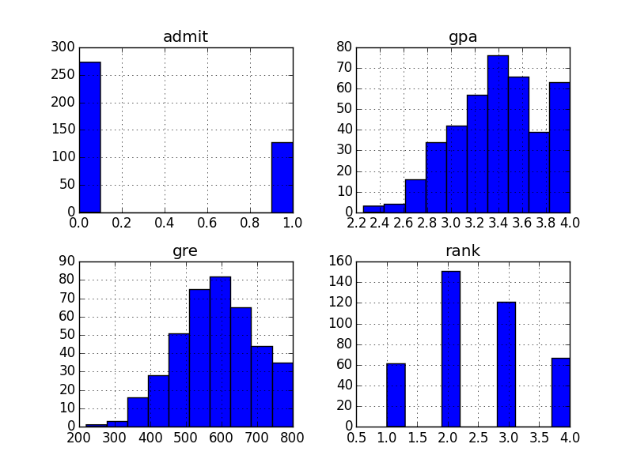
    
    *The distributions of GPA and GRE actually look quite similar, possibly normally distributed slightly skewed to the left (negative skew) centered around the means of GPA and GRE computed above. And for GPAs there is an anomolous bump near 4.0s.*

5. One of the issues with classification can be unbalanced classes. What percentage of the data was admitted? Do you think this will be a problem?

    ```python
    print df['admit'].value_counts() / len(df)
    ```

    Results:
    ```
    0    0.6825
    1    0.3175
    ```

    *Classes aren't too imbalanced so you should be fine.
    When dealing with data where the label could potentially be something that is biased one way or the other (such as acceptance, fraud, signups, anything where one label is more preferential to the other or deals with some measure of "success") you should verify. Actually you should most always verify.*

## Part 3: Predicting Graduate School Admissions

1. Use statsmodels to fit a Logistic Regression.

    ```python
    from statsmodels.discrete.discrete_model import Logit
    from statsmodels.tools import add_constant

    X = df[['gre', 'gpa', 'rank']].values
    X_const = add_constant(X, prepend=True)
    y = df['admit'].values

    logit_model = Logit(y, X).fit()
    ```

2. Use the `summary` method to see your results.

    ```python
    logit_model.summary()
    ```

    ```
                               Logit Regression Results
    ==============================================================================
    Dep. Variable:                      y   No. Observations:                  400
    Model:                          Logit   Df Residuals:                      396
    Method:                           MLE   Df Model:                            3
    Date:                Tue, 20 Jan 2015   Pseudo R-squ.:                 0.08107
    Time:                        15:41:33   Log-Likelihood:                -229.72
    converged:                       True   LL-Null:                       -249.99
                                            LLR p-value:                 8.207e-09
    ==============================================================================
                     coef    std err          z      P>|z|      [95.0% Conf. Int.]
    ------------------------------------------------------------------------------
    const         -3.4495      1.133     -3.045      0.002        -5.670    -1.229
    x1             0.0023      0.001      2.101      0.036         0.000     0.004
    x2             0.7770      0.327      2.373      0.018         0.135     1.419
    x3            -0.5600      0.127     -4.405      0.000        -0.809    -0.311
    ==============================================================================
    ```

    Note that the p-values are all smaller than 0.05, so we are very happy with this model.

3. Use sklearn's [KFold cross validation](http://scikit-learn.org/stable/modules/generated/sklearn.cross_validation.KFold.html) to calculate the average accuracy, precision and recall.

    ```python
    import numpy as np
    from sklearn.cross_validation import KFold
    from sklearn.linear_model import LogisticRegression
    from sklearn.metrics import accuracy_score, precision_score, recall_score

    kfold = KFold(len(y))

    accuracies = []
    precisions = []
    recalls = []

    for train_index, test_index in kfold:
        model = LogisticRegression()
        model.fit(X[train_index], y[train_index])
        y_predict = model.predict(X[test_index])
        y_true = y[test_index]
        accuracies.append(accuracy_score(y_true, y_predict))
        precisions.append(precision_score(y_true, y_predict))
        recalls.append(recall_score(y_true, y_predict))

    print "accuracy:", np.average(accuracies)
    print "precision:", np.average(precisions)
    print "recall:", np.average(recalls)
    ```

    Results:

    ```
    accuracy: 0.714921632439
    precision: 0.661513924672
    recall: 0.219144057234
    ```

    *Note that the accuracy and precision are pretty good, but the recall is not.*

4. The `rank` column is numerical, but as it has 4 buckets, we could also consider it to be categorical. Use panda's [get_dummies](http://pandas.pydata.org/pandas-docs/stable/generated/pandas.core.reshape.get_dummies.html) to binarize the column.

    ```python
    dummies = pd.get_dummies(df['rank'], prefix='rank')
    X2 = df[['gre','gpa']].join(dummies.ix[:,'rank_2':]).values
    ```

5. Compute the same metrics as above. Does it do better or worse with the rank column binarized?

    ```python
    # we use the same kfold as from above

    accuracies = []
    precisions = []
    recalls = []

    for train_index, test_index in kfold:
        model = LogisticRegression()
        model.fit(X2[train_index], y[train_index])
        y_predict = model.predict(X2[test_index])
        y_true = y[test_index]
        accuracies.append(accuracy_score(y_true, y_predict))
        precisions.append(precision_score(y_true, y_predict))
        recalls.append(recall_score(y_true, y_predict))

    print "accuracy:", np.average(accuracies)
    print "precision:", np.average(precisions)
    print "recall:", np.average(recalls)
    ```

    Results:

    ```
    accuracy: 0.702390304119
    precision: 0.590598290598
    recall: 0.164717310021
    ```

    *It seems to perform worse.*

6. Make a plot of the ROC curve (using your function defined in Part 1).

    ```python
    from roc_curve import roc_curve
    from sklearn.cross_validation import train_test_split
    import matplotlib.pyplot as plt

    X_train, X_test, y_train, y_test = train_test_split(X, y)
    model = LogisticRegression()
    model.fit(X_train, y_train)
    probabilities = model.predict_proba(X_test)[:, 1]
    tpr, fpr, thresholds = roc_curve(probabilities, y_test)
    plt.plot(fpr, tpr)
    plt.xlabel("False Positive Rate (1 - Specificity)")
    plt.ylabel("True Positive Rate (Sensitivity, Recall)")
    plt.title("ROC plot of admissions data")
    plt.show()
    ```

    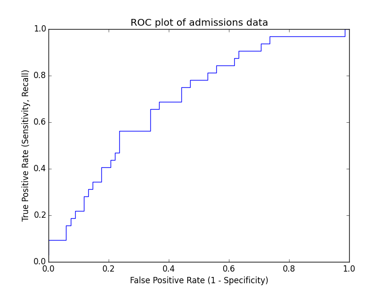

7. Is it possible to pick a threshold where TPR > 60% and FPR < 40%? What is the threshold?

    *Yes. We can get a TPR of 62.5% and FPR of 33.8% with a threshold of 0.3617.*

    *Answers may vary!*

8. Say we are using this as a first step in the application process. We want to weed out clearly unqualified candidates, but not reject too many candidates. What might be a good choice of threshold?

    *We want to maximize the TPR and don't care as much about the FPR. With a threshold of 0.222, we can get a TPR of 96.9%. THe FPR will be 73.5%, but we are okay with this sacrifice in order to avoid false negatives.*

## Part 4: Interpreting the beta coefficients with the Odds Ratio

1. Fit a Logistic Regression model on all the data. What are the beta coefficients? You should have 3 values.

    ```python
    from itertools import izip

    model = LogisticRegression()
    model.fit(X, y)

    for name, coef in izip(df.columns[1:], model.coef_[0]):
        print "%s: %.4f" % (name, coef)
    ```

    Results:

    ```
    gre: 0.0019
    gpa: 0.2156
    rank: -0.5984
    ```

2. Compute the change in odds ratio from a one unit change in each feature.

    ```python
    from math import exp

    for i, coef in enumerate(model.coef_[0]):
        print "beta%d: %.5f" % (i + 1, exp(coef))
    ```

    Results:

    ```
    beta1: 1.00192
    beta2: 1.24066
    beta3: 0.54968
    ```

3. Write a sentence for each of the three features.

    *Increasing the GRE score by 1 point increases the chance of getting in by a factor of 1.00174.*

    *Increasing the GPA score by 1 point increases the chance of getting in by a factor of 1.47499.*

    *Improving the school's rank by 1 point (means decreasing the number) increases the chance of getting in by a factor of 1/0.47904=2.08751.*

4. What change is required to double my chances of admission?

    ```python
    from math import log

    for i, coef in enumerate(model.coef_[0]):
        print "beta%d: %.5f" % (i + 1, log(2) / coef)
    ```

    Results:

    ```
    beta1: 361.81037
    beta2: 3.21433
    beta3: -1.15830
    ```

    *Increasing the GRE score by 399 points doubles the chance of getting in.*

    *Increasing the GPA score by 1.78 points doubles the chance of getting in.*

    *Decreasing (improving) the school rank by 0.94 doubles the chance of getting in.*

## Part 5: Predicted Probabilities

Now let's actually play with our data to verify what we calculated above with the Odds Ratio.

1. Create a new feature matrix which has four rows. It should have each of the four possible values for the rank and keep the GRE and GPA values fixed. Use the mean value as a reasonable value to fix them at.

    ```python
    gre = df['gre'].mean()
    gpa = df['gpa'].mean()
    feature_matrix = []
    ranks = [1, 2, 3, 4]
    for rank in ranks:
        feature_matrix.append([gre, gpa, rank])
    X_rank = np.array(feature_matrix)
    ```

2. Fit the Logistic Regression model on all the data and then use the model's `predict_proba` method to compute the predicted probabilities of this fake feature matrix. Also include the odds ratio (`p/(1-p)`).

    ```python
    probabilities_rank = model.predict_proba(X_rank)[:, 1]
    for rank, prob in izip(ranks, probabilities_rank):
        print "rank: %d, probability: %f, odds: %f" % (rank, prob, prob / (1 - prob))
    ```

    Results:

    ```
    rank: 1, probability: 0.517495, odds: 1.072519
    rank: 2, probability: 0.370888, odds: 0.589541
    rank: 3, probability: 0.244747, odds: 0.324059
    rank: 4, probability: 0.151196, odds: 0.178128
    ```

    Verify results:

    ```
    0.178128 / 0.324059 = .549678
    ```

    This is the same thing we got above.

3. Make a plot of the rank vs the probability.

    ```python
    plt.plot(ranks, probabilities_rank)
    plt.xlabel("rank")
    plt.ylabel("probability")
    plt.title("Affect of modifying the rank on probability of acceptance")
    plt.show()
    ```

    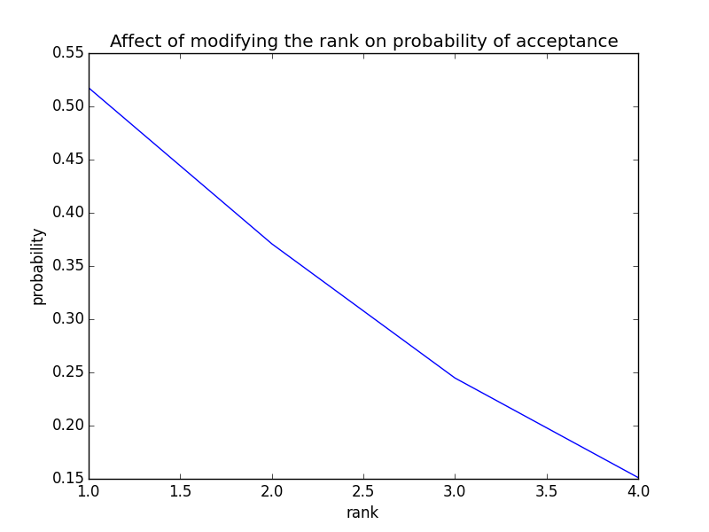

4. Make a plot of the rank vs the odds.

    ```python
    odds_rank = probabilities_rank / (1 - probabilities_rank)
    plt.plot(ranks, odds_rank)
    plt.xlabel("rank")
    plt.ylabel("odds")
    plt.title("Affect of modifying the rank on odds of acceptance")
    plt.show()
    ```

    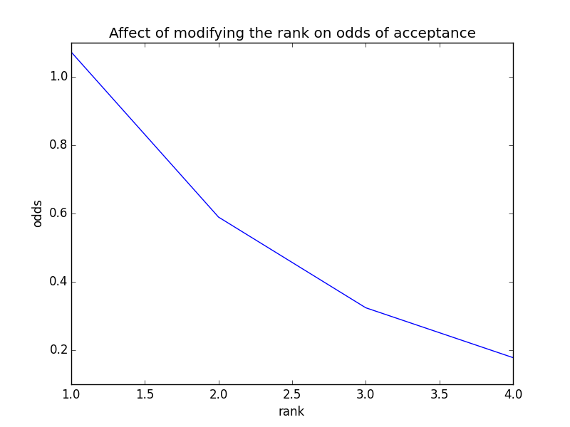

5. Since we really care about how a linear change in rank changes the probability by a multiplicative factor, we should do a graph of the rank vs the log of the odds.

    ```python
    plt.plot(ranks, np.log(odds_rank))
    plt.xlabel("rank")
    plt.ylabel("log probability")
    plt.title("Affect of modifying the rank on log of odds of acceptance")
    plt.show()
    ```

    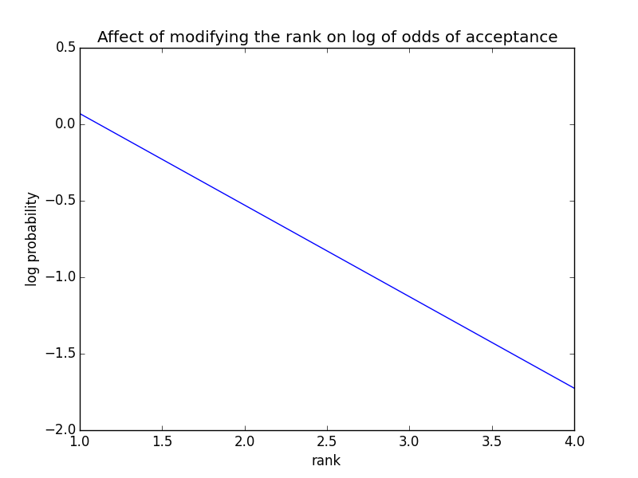

    Note that the slope of this line is approximately `(0 + 1.7) / (4 - 1) = -0.567`, which is approximately the beta coefficient.

6. Do the same analysis (#1-5) with the GRE and GPA scores. Each time, create a feature matrix with the other two columns fixed at the mean and every possible value of the column in question.

    ***Measuring the affect of modifying the GRE score on the probability of acceptance***

    ```python
    gpa = df['gpa'].mean()
    rank = df['rank'].mean()
    feature_matrix = []
    gres = range(df['gre'].min(), df['gre'].max() + 1)
    for gre in gres:
        feature_matrix.append([gre, gpa, rank])
    X_gre = np.array(feature_matrix)

    probabilities_gre = model.predict_proba(X_gre)[:, 1]
    for gre, prob in izip(gres, probabilities_gre):
        print "gre: %d, probability: %f, odds: %f" % (gre, prob, prob / (1 - prob))
    ```

    Results:
    ```
    ....
    gre: 797, probability: 0.397074, odds: 0.658578
    gre: 798, probability: 0.397533, odds: 0.659841
    gre: 799, probability: 0.397992, odds: 0.661106
    gre: 800, probability: 0.398451, odds: 0.662374
    ```

    Odds ratio = `0.662374 / 0.661106 = 1.00192`. Same as above.

    ```python
    plt.plot(gres, probabilities_gre)
    plt.xlabel("gre")
    plt.ylabel("probability")
    plt.title("Affect of modifying the GRE on probability of acceptance")
    plt.show()
    ```

    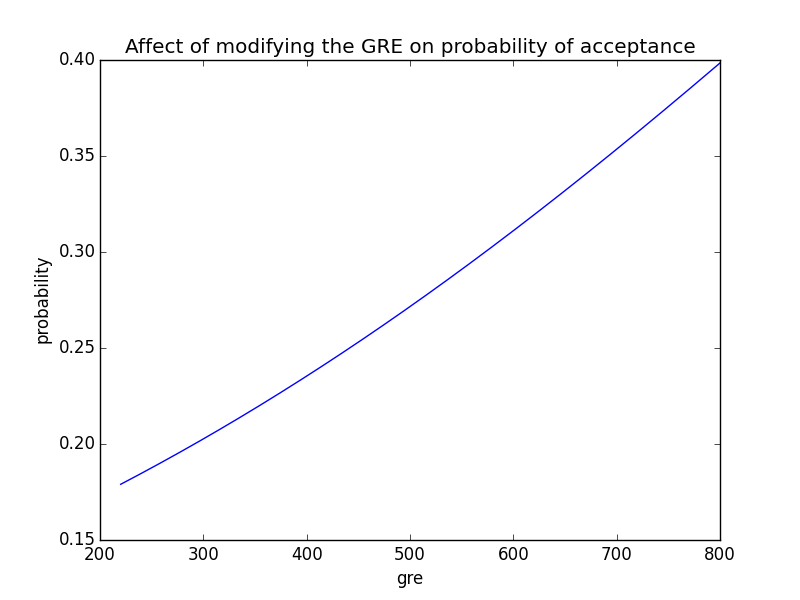

    ```python
    odds_gre = probabilities_gre / (1 - probabilities_gre)
    plt.plot(gres, odds_gre)
    plt.xlabel("gre")
    plt.ylabel("odds")
    plt.title("Affect of modifying the GRE on odds of acceptance")
    plt.show()
    ```

    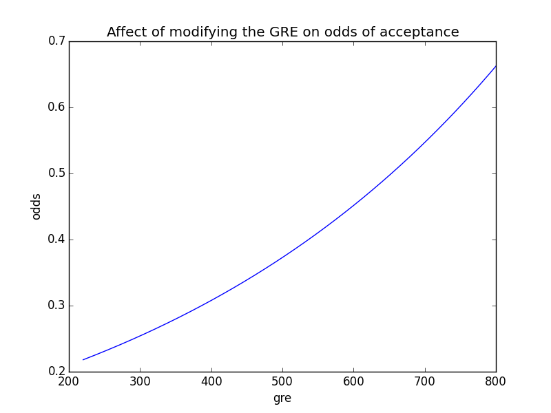

    ```python
    plt.plot(gres, np.log(odds_gre))
    plt.xlabel("gre")
    plt.ylabel("log odds")
    plt.title("Affect of modifying the GRE on log of odds of acceptance")
    plt.show()
    ```

    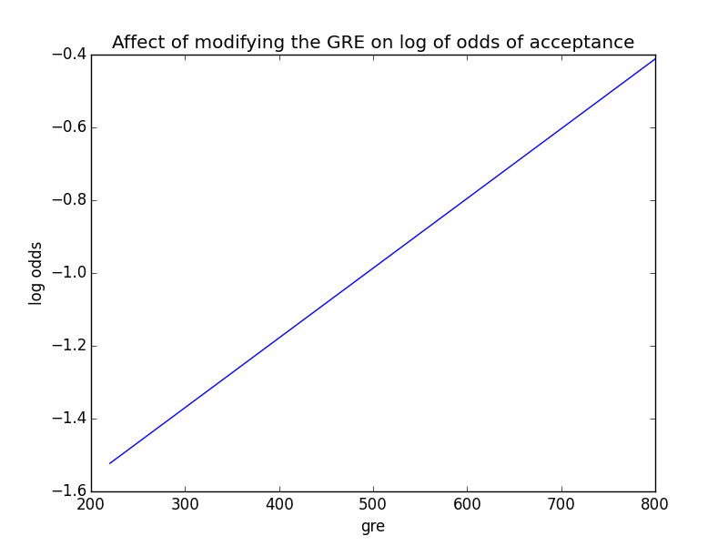

    Note that the slope of this line is approximately `(-.4 + 1.55) / (800 - 220) = -0.00198`, which is approximately the beta coefficient.

    ***Measuring the affect of modifying the GPA score on the probability of acceptance***

    ```python
    gre = df['gre'].mean()
    rank = df['rank'].mean()
    feature_matrix = []
    gpas = range(int(np.floor(df['gpa'].min())), int(np.ceil(df['gpa'].max() + 1)))
    for gpa in gpas:
        feature_matrix.append([gre, gpa, rank])
    X_gpa = np.array(feature_matrix)

    probabilities_gpa = model.predict_proba(X_gpa)[:, 1]
    for gpa, prob in izip(gpas, probabilities_gpa):
        print "gpa: %d, probability: %f, odds: %f" % (gpa, prob, prob / (1 - prob))
    ```

    Results:

    ```
    gpa: 2, probability: 0.246314, odds: 0.326813
    gpa: 3, probability: 0.288491, odds: 0.405464
    gpa: 4, probability: 0.334683, odds: 0.503043
    ```

    Odds ratio = `0.503043 / 0.405464 = 1.24066`. Same as above (minus rounding errors).


    ```python
    plt.plot(gpas, probabilities_gpa)
    plt.xlabel("GPA")
    plt.ylabel("probability")
    plt.title("Affect of modifying the GPA on probability of acceptance")
    plt.show()
    ```

    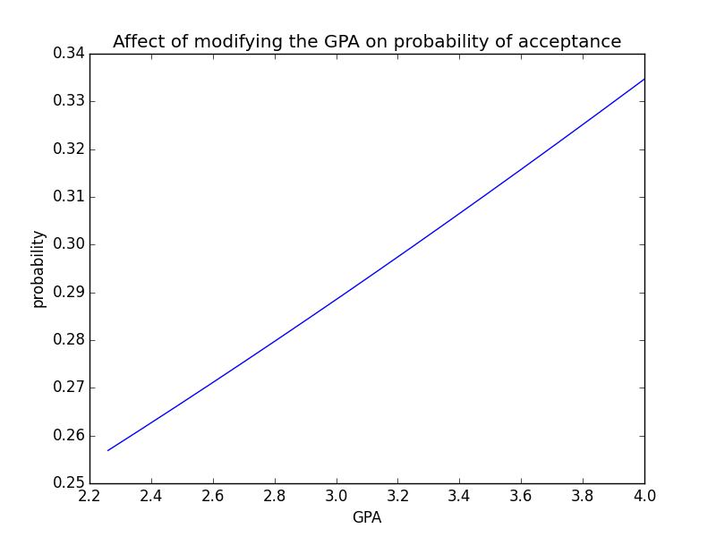

    ```python
    odds_gpa = probabilities_gpa / (1 - probabilities_gpa)
    plt.plot(gpas, odds_gpa)
    plt.xlabel("gpa")
    plt.ylabel("odds")
    plt.title("Affect of modifying the GPA on odds of acceptance")
    plt.show()
    ```

    

    ```python
    plt.plot(gpas, np.log(odds_gpa))
    plt.xlabel("gpa")
    plt.ylabel("log odds")
    plt.title("Affect of modifying the GPA on log of odds of acceptance")
    plt.show()
    ```

    

    The slope is `(-1.38 + 1.59) / (4 - 2.2) = 0.11667`, which matches the beta coefficient.
