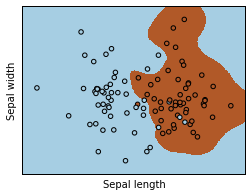

#Preprocessing
1.
	separable = np.genfromtxt('data/non_sep.csv', delimiter=',')
	X = separable[:,1:3]
	y = separable[:,3]

	clf = SVC(kernel='linear').fit(X, y)

	#Scale the data
	scale_factor = np.array([10,1])
	X_scale = X * scale_factor
	clf_scale = SVC(kernel='linear').fit(X_scale, y)
	
	#See if coefficients are different or just scaled?
	clf.coef_ - clf_scale.coef_*scale_factor

2. Though it's hard to see in the plots there is some difference between the coefficients and their 
scaled values. So the solution actually is different.

3. The scale-invariant difference between coefficients in the two cases is: array([[ 1.46612178,  0.00993991]]), 
clearly different, especially in the scaled dimension.

4. 
    s = SVC(kernel='linear')
    s.fit(X, y)
    s.score(X, y)
Yields `0.92079207920792083`
    ss = Pipeline([('scale', StandardScaler()), ('model', SVC(kernel='linear'))])
    ss.fit(X, y)
    ss.score(X, y)
Yields `0.92079207920792083`. In this case there aren't substantial differences between the scaled data and the unscaled data.

5. 
    def model_cv(clf, X, y):
    	return cross_val_score(clf, X, y, scoring='accuracy', cv=10).mean()

#Hyperparameter C
1.
    Cs = np.linspace(.001,.01, 10)
    accuracy = [model_cv(SVC(kernel='linear', C=x), X, y) for x in Cs]
    plt.plot(Cs, accuracy)

![] (images/cv-accuracy-c.png)

Your plot for differing C values should look like:

![] (images/different_c.png)

#Kernel Tricks
Performance is similar, but solutions look different:

#Grid Search
1. 
    s = SVC(kernel='poly')
    g = GridSearchCV(s, {'C':np.linspace(.001, 3, 20), 'degree':[1,2,3,4]}, cv=10).fit(X,y)
    g.best_params_
1. The best params are `{'C': 0.1588421052631579, 'degree': 3}`
1.
    s = SVC(kernel='rbf')
    g = GridSearchCV(s, {'C':np.linspace(.001, 3, 20), 'gamma':np.linspace(0,5,20)}, cv=10).fit(X,y)
    g.best_params_
The best params are `{'C': 2.2107894736842106, 'gamma': 3.9473684210526314}`
1. The optimized solutions look like something this--depending on the parameter space: 
 

#Unbalanced Classes

1.
    df = pd.read_csv('data/imbalanced.csv', names=['x1','x2', 'y'], 
                 index_col=0, skiprows=1)
    y = df.pop('y')
    unweighted = LinearSVC()
    weighted = LinearSVC(class_weight='auto')
    params = {'C':np.linspace(.001, 3, 20)}
    do_search = lambda x: GridSearchCV(x, params, cv=3).fit(df,y)

    unw = do_search(unweighted)
    w = do_search(weighted)
    decision_boundary(unw, df.as_matrix(), y)
    decision_boundary(w, df.as_matrix(), y)

2. 

Accuracy for these two classes is a little different too:
    w.best_score_ - unw.best_score_
    Out[32]:
    0.0025999999999999357

#Real-World Modeling
    df = pd.read_csv('data/dataset_1.csv')
    df.head()
    y = df.pop('y')
    p = Pipeline([('scale', StandardScaler()),
                  ('svm', SVC())])
    params = {'svm__kernel':['linear', 'poly', 'rbf'],
              'svm__C':[0.001, 0.01, 0.1, 1, 10],
             'svm__gamma':[0.001, 0.01, 0.1, 1, 10],
              'svm__degree':[2,3]}
    g = GridSearchCV(p, params, cv=3, n_jobs=3).fit(df, y)
This model gives a CV score of .97.

#SVM Applications to Wide and Tall Data
##Wide
    make_p = lambda x: Pipeline([('scale', StandardScaler()), 
                  ('model', x)])
    lsvc = LinearSVC()
    rbfsvc = SVC(kernel='rbf')
    lg = GridSearchCV(make_p(lsvc), 
                      {'model__C':np.linspace(.001, 1, 10)}).fit(X_train, y_train)
    rg = GridSearchCV(make_p(rbfsvc), 
                      {'model__C':np.linspace(.001,3,10), 
                      'model__gamma':(.01, 3, 10)}).fit(X_train, y_train)
The linear search is much faster to fit and performs better, RBF can really overfit in this case.

##Tall
    df = pd.read_csv('data/dataset_3_1.csv')
    y = df.pop('0')
    X = df.iloc[:,0:-2]
    X_train, X_test, y_train, y_test = train_test_split(X, y, train_size=20000, test_size=10000)
    lg = GridSearchCV(make_p(lsvc), 
                      {'model__C':np.linspace(.001, 1, 10)}).fit(X_train, y_train)
    rg = GridSearchCV(make_p(rbfsvc), 
                      {'model__C':np.linspace(.001,1,3), 
                       'model__gamma':(.01, 3, 3)}).fit(X_train, y_train)
In tall data, the kernel has a big positive impact.

##Multi-Class Data

    digits = datasets.load_digits()
    X = digits.data
    y = digits.target
    svm = GridSearchCV(LinearSVC(), {'C':np.linspace(.001, 3, 20)}, cv=10)
    svm_ovo = OneVsOneClassifier(svm).fit(X,y)
    svm_ovr = OneVsOneClassifier(svm).fit(X,y)
    logit = GridSearchCV(LogisticRegression(), {'C':np.linspace(.001, 3, 20)}, cv=10)
    log_ovo = OneVsOneClassifier(logit).fit(X,y)
