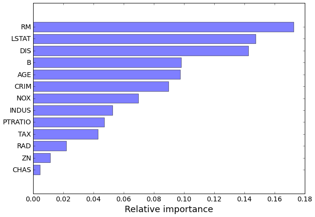

## Solutions to Boosting morning exercise

1. Loading in libraries

    ```python
    from sklearn.tree import DecisionTreeRegressor
    from sklearn.ensemble import RandomForestRegressor
    from sklearn.ensemble import GradientBoostingRegressor
    from sklearn.ensemble import AdaBoostRegressor
    from sklearn.datasets import load_boston
    from sklearn.cross_validation import train_test_split, cross_val_score
    from sklearn.grid_search import GridSearchCV
    from sklearn.metrics import mean_squared_error, r2_score
    from sklearn.ensemble.partial_dependence import plot_partial_dependence
    import matplotlib.pyplot as plt
    import numpy as np
    ```

2. Loading in data

   ```python
   boston = load_boston()


   y = boston.target
   x = boston.data
   train_x, test_x, train_y, test_y = train_test_split(x, y, test_size=.2, random_state=1)

   print 'Train x Shape:', train_x.shape
   print 'Test x Shape:', test_x.shape
   col_names = boston.feature_names
   print col_names
   ```

   ```
   # Code output
   Train x Shape: (404, 13)
   Test x Shape: (102, 13)
   ['CRIM' 'ZN' 'INDUS' 'CHAS' 'NOX' 'RM' 'AGE' 'DIS' 'RAD' 'TAX' 'PTRATIO'
    'B' 'LSTAT']
   ```

3. Doing K-Fold for each of the models we have defined

   ```python
    def cross_val(estimator, train_x, train_y):
        # n_jobs=-1 uses all the cores on your machine
        mse = cross_val_score(estimator, train_x, train_y,
                               scoring='mean_squared_error',
                               cv=10, n_jobs=-1) * -1
        r2 = cross_val_score(estimator, train_x, train_y,
                               scoring='r2', cv=10, n_jobs=-1)Y

        mean_mse = mse.mean()
        mean_r2 = r2.mean()

        params = estimator.get_params()
        name = estimator.__class__.__name__
        print '%s Train CV | MSE: %.3f | R2: %.3f' % (name, mean_mse, mean_r2)
        return mean_mse, mean_r2


    rf = RandomForestRegressor(n_estimators=100, n_jobs=-1, random_state=1)

    gdbr = GradientBoostingRegressor(learning_rate=0.1, loss='ls',
                                     n_estimators=100, random_state=1)

    abr = AdaBoostRegressor(DecisionTreeRegressor(), learning_rate=0.1,
                            loss='linear', n_estimators=100, random_state=1)


    cross_val(rf, train_x, train_y)
    cross_val(gdbr, train_x, train_y)
    cross_val(abr, train_x, train_y)
   ```

   ```
   # Script output
   RandomForestRegressor Train CV | MSE: 9.881 | R2: 0.866
   GradientBoostingRegressor Train CV | MSE: 21.006 | R2: 0.727
   AdaBoostRegressor Train CV | MSE: 10.335 | R2: 0.861
   ```


4. Fitting data to models

   ```python
   rf.fit(train_x, train_y)
   gdbr.fit(train_x, train_y)
   abr.fit(train_x, train_y)
   ```

5. Stage plots for AdaBoostRegressor and GradientBoostingRegressor

    ```python
    def rf_score_plot():
        rf_test_y_pred = rf.predict(test_x)
        test_mse = mean_squared_error(rf_test_y_pred, test_y)
        plt.axhline(test_mse, alpha=.7, c='y' , lw=3, ls='-.', label='Random Forest Test')


    def stage_score_plot(estimator, train_x, train_y, test_x, test_y):
        name = estimator.__class__.__name__.replace('Regressor', '')
        learn_rate = estimator.learning_rate

        train_scores = np.zeros((estimator.n_estimators,), dtype=np.float64)
        test_scores = np.zeros((estimator.n_estimators,), dtype=np.float64)

        # Get train score from each boost
        for i, train_y_pred in enumerate(estimator.staged_predict(train_x)):
            train_scores[i] = mean_squared_error(train_y, train_y_pred)

        # Get test score from each boost
        for i, test_y_pred in enumerate(estimator.staged_predict(test_x)):
            test_scores[i] = mean_squared_error(test_y, test_y_pred)

        plt.plot(train_scores, alpha=.5, label='%s Train - Rate %s' % (name, learn_rate))
        plt.plot(test_scores, alpha=.5, label='%s Test - Rate %s' % (name, learn_rate), ls='--')
        plt.title(name, fontsize=16, fontweight='bold')
        plt.ylabel('MSE', fontsize=14)
        plt.xlabel('Iterations', fontsize=14)


    fig = plt.figure()
    stage_score_plot(gdbr, train_x, train_y, test_x, test_y)
    rf_score_plot()
    plt.legend(loc='best')

    fig = plt.figure()
    stage_score_plot(abr, train_x, train_y, test_x, test_y)
    rf_score_plot()
    plt.legend(loc='best')
    ```

    


    


6. Learning rate of 1 instead of 0.1. We can see the test error is lowered
   faster for learning rate 1 than 0.1, but error remained higher than
   learning rate 0.1.

   ```python
    gdbr_high_learn = GradientBoostingRegressor(learning_rate=1, loss='ls',
                                               n_estimators=100, random_state=1)
    gdbr_high_learn.fit(train_x, train_y)

    fig = plt.figure()
    stage_score_plot(gdbr, train_x, train_y, test_x, test_y)
    stage_score_plot(gdbr_high_learn, train_x, train_y, test_x, test_y)
    plt.legend(loc='best')
   ```

   


##GridSearch

1. Defining the grid for GradientBoostingRegressor and RandomForestRegressor

    ```python
    rf_grid = {'max_depth': [3, None],
               'max_features': [1, 3, 10],
               'min_samples_split': [1, 3, 10],
               'min_samples_leaf': [1, 3, 10],
               'bootstrap': [True, False],
               'n_estimators': [25, 40, 50],
               'random_state': [1]}

    gd_grid = {'learning_rate': [0.1, 0.05, 0.02, 0.01],
               'max_depth': [4, 6],
               'min_samples_leaf': [3, 5, 9, 17],
               'max_features': [1.0, 0.3, 0.1],
               'n_estimators': [500],
               'random_state': [1]}
    ```

2. Grid search for RandomForestRegressor

    ```python
    def grid_search(est, grid):
        grid_cv = GridSearchCV(est, grid, n_jobs=-1, verbose=True,
                               scoring='mean_squared_error').fit(train_x, train_y)
        return grid_cv


    rf_grid_search = grid_search(RandomForestRegressor(), rf_grid)
    ```

    ```
    # Script output
    Fitting 3 folds for each of 324 candidates, totalling 972 fits


    [Parallel(n_jobs=-1)]: Done   1 jobs       | elapsed:    0.1s
    [Parallel(n_jobs=-1)]: Done  50 jobs       | elapsed:    0.6s
    [Parallel(n_jobs=-1)]: Done 200 jobs       | elapsed:    2.5s
    [Parallel(n_jobs=-1)]: Done 450 jobs       | elapsed:    7.8s
    [Parallel(n_jobs=-1)]: Done 800 jobs       | elapsed:   13.4s
    [Parallel(n_jobs=-1)]: Done 966 out of 972 | elapsed:   17.7s remaining:    0.1s
    [Parallel(n_jobs=-1)]: Done 972 out of 972 | elapsed:   18.0s finished
    ```

3. Grid search for GradientBoostingRegressor

    ```python
    gd_grid_search = grid_search(GradientBoostingRegressor(), gd_grid)
    ```

    ```
    # Script output

    Fitting 3 folds for each of 96 candidates, totalling 288 fits


    [Parallel(n_jobs=-1)]: Done   1 jobs       | elapsed:    0.7s
    [Parallel(n_jobs=-1)]: Done  50 jobs       | elapsed:    4.6s
    [Parallel(n_jobs=-1)]: Done 200 jobs       | elapsed:   22.8s
    [Parallel(n_jobs=-1)]: Done 282 out of 288 | elapsed:   30.1s remaining:    0.6s
    [Parallel(n_jobs=-1)]: Done 288 out of 288 | elapsed:   30.3s finished
    ```

4. Get the best models from grid search

    ```python
    rf_best = rf_grid_search.best_estimator_
    gd_best = gd_grid_search.best_estimator_


    gd_grid_search.best_params_


    """
    {'learning_rate': 0.02,
     'max_depth': 4,
     'max_features': 0.3,
     'min_samples_leaf': 3,
     'n_estimators': 500,
     'random_state': 1}
    """


    rf_grid_search.best_params_

    """
    {'bootstrap': False,
     'max_depth': None,
     'max_features': 3,
     'min_samples_leaf': 1,
     'min_samples_split': 3,
     'n_estimators': 25,
     'random_state': 1}
    """
    ```

5. Compare with previous MSE

    ```
    ###Previously
    GradientBoostingRegressor Train CV | MSE: 8.453 | R2: 0.886
    RandomForestRegressor Train CV | MSE: 9.881 | R2: 0.866
    ```

    ```python
    cross_val(gd_best, train_x, train_y)
    cross_val(rf_best, train_x, train_y)
    ```

    ```
    # After Grid Search
    GradientBoostingRegressor Train CV | MSE: 8.331 | R2: 0.889
    RandomForestRegressor Train CV | MSE: 9.490 | R2: 0.877
    ```


6. Test Error for the selected model (GradientBoosting)

    ```python
    test_ypred = gd_best.predict(test_x)
    print 'Gradient Boost Test MSE:', mean_squared_error(test_ypred, test_y)
    print 'Gradient Boost Test R2:',r2_score(test_ypred, test_y)
    ```

    ```
    # Script output
    Gradient Boost Test MSE: 8.57257583844
    Gradient Boost Test R2: 0.884070234717
    ```

## Extras

1. Feature Importance

    ```python
    # sort importances
    indices = np.argsort(gd_best.feature_importances_)
    # plot as bar chart
    figure = plt.figure(figsize=(10,7))
    plt.barh(np.arange(len(col_names)), gd_best.feature_importances_[indices],
             align='center', alpha=.5)
    plt.yticks(np.arange(len(col_names)), np.array(col_names)[indices], fontsize=14)
    plt.xticks(fontsize=14)
    _ = plt.xlabel('Relative importance', fontsize=18)
    ```

    ```
    1. CRIM: per capita crime rate by town
    2. ZN: proportion of residential land zoned for lots over 25,000 sq.ft.
    3. INDUS: proportion of non-retail business acres per town
    4. CHAS: Charles River dummy variable (= 1 if tract bounds river; 0 otherwise)
    5. NOX: nitric oxides concentration (parts per 10 million)
    6. RM: average number of rooms per dwelling
    7. AGE: proportion of owner-occupied units built prior to 1940
    8. DIS: weighted distances to five Boston employment centres
    9. RAD: index of accessibility to radial highways
    10. TAX: full-value property-tax rate per $10,000
    11. PTRATIO: pupil-teacher ratio by town
    12. B: 1000(Bk - 0.63)^2 where Bk is the proportion of blacks by town
    13. LSTAT: % lower status of the population'''

    1. CRIM: per capita crime rate by town
    2. ZN: proportion of residential land zoned for lots over 25,000 sq.ft.
    3. INDUS: proportion of non-retail business acres per town
    4. CHAS: Charles River dummy variable (= 1 if tract bounds river; 0 otherwise)
    5. NOX: nitric oxides concentration (parts per 10 million)
    6. RM: average number of rooms per dwelling
    7. AGE: proportion of owner-occupied units built prior to 1940
    8. DIS: weighted distances to five Boston employment centres
    9. RAD: index of accessibility to radial highways
    10. TAX: full-value property-tax rate per $10,000
    11. PTRATIO: pupil-teacher ratio by town
    12. B: 1000(Bk - 0.63)^2 where Bk is the proportion of blacks by town
    13. LSTAT: % lower status of the population
    ```

    


2. Partial Dependency Plots

    ```python
    fig, axs = plot_partial_dependence(gd_best, train_x, range(x.shape[1]) ,
                                       feature_names=col_names, figsize=(15, 10))
    fig.tight_layout()
    ```


    


