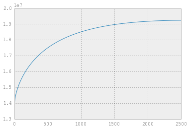

```python
from sklearn import (cluster, datasets, decomposition, ensemble, lda, manifold, random_projection, preprocessing)
import numpy as np
import matplotlib.pyplot as plt
digits = datasets.load_digits(n_class=6)
all_digits = datasets.load_digits()
%pylab inline

```

Populating the interactive namespace from numpy and matplotlib
    
Show the first 100 images in a 10-by-10 grid

```python
def show_images(digits, n=2):
    import pylab as pl
    pl.gray()
    fig = pl.figure(figsize=(n,n))
    for i in xrange(n):
        for j in xrange(n):
            pl.subplot(n, n, n * j + i + 1)
            pl.imshow(digits.images[n * j + i]) 
            pl.xticks([])
            pl.yticks([])
            pl.axis('off')
    pl.show()
show_images(all_digits, 10)
```

```python
def scree_plot(num_components, pca):
    ind = np.arange(num_components)
    vals = pca.explained_variance_ratio_
    plt.figure(figsize=(10, 6), dpi=250)
    ax = plt.subplot(111)
    ax.bar(ind, vals, 0.35, 
           color=[(0.949, 0.718, 0.004),
                  (0.898, 0.49, 0.016),
                  (0.863, 0, 0.188),
                  (0.694, 0, 0.345),
                  (0.486, 0.216, 0.541),
                  (0.204, 0.396, 0.667),
                  (0.035, 0.635, 0.459),
                  (0.486, 0.722, 0.329),
                 ])
    for i in xrange(num_components):
        ax.annotate(r"%s%%" % ((str(vals[i]*100)[:4])), (ind[i]+0.2, vals[i]), va="bottom", ha="center", fontsize=12)

    ax.set_xticklabels(ind, 
                       fontsize=12)

    ax.set_ylim(0, max(vals)+0.05)
    ax.set_xlim(0-0.45, 8+0.45)

    ax.xaxis.set_tick_params(width=0)
    ax.yaxis.set_tick_params(width=2, length=12)

    ax.set_xlabel("Principal Component", fontsize=12)
    ax.set_ylabel("Variance Explained (%)", fontsize=12)

    plt.title("Scree Plot for the Digits Dataset", fontsize=16)
    plt.savefig("scree.png", dpi= 100)
```


```python
X_centered = preprocessing.scale(digits.data)
```


```python
# you can also use the StandardScaler
ss = preprocessing.StandardScaler()
```


```python
ss.fit_transform(digits.data)
```


    array([[ 0.        , -0.39943855, -0.16703526, ..., -1.14434334,
            -0.48218707, -0.24520445],
           [ 0.        , -0.39943855, -1.14805039, ...,  0.62132675,
            -0.48218707, -0.24520445],
           [ 0.        , -0.39943855, -1.14805039, ...,  1.68072881,
             1.54537005, -0.24520445],
           ..., 
           [ 0.        , -0.39943855, -1.14805039, ...,  0.44475974,
            -0.48218707, -0.24520445],
           [ 0.        , -0.39943855, -1.14805039, ..., -0.4380753 ,
            -0.48218707, -0.24520445],
           [ 0.        , -0.39943855,  0.02916776, ..., -0.08494129,
            -0.48218707, -0.24520445]])


```python
len(X_centered)
```


    1083


```python
pca = decomposition.PCA(n_components=10)
X_pca = pca.fit_transform(X_centered)
```


```python
scree_plot(10, pca)
```


```python
def plot_embedding(X, y, title=None):
    x_min, x_max = np.min(X, 0), np.max(X, 0)
    X = (X - x_min) / (x_max - x_min)
    plt.figure(figsize=(10, 6), dpi=250)
    ax = plt.subplot(111)
    ax.axis('off')
    ax.patch.set_visible(False)
    for i in range(X.shape[0]):
        plt.text(X[i, 0], X[i, 1], str(y[i]), color=plt.cm.Set1(y[i] / 10.), fontdict={'weight': 'bold', 'size': 12})

    plt.xticks([]), plt.yticks([])
    plt.ylim([-0.1,1.1])
    plt.xlim([-0.1,1.1])

    if title is not None:
        plt.title(title, fontsize=16)
```


```python
pca = decomposition.PCA(n_components=2)
X_pca = pca.fit_transform(X_centered)
plot_embedding(X_pca, digits.target)
```


```python
import pandas as pd
```


```python
ratings = pd.read_csv('data/book_reviews.csv')
```


```python
ratings.head()
```


<div style="max-height:1000px;max-width:1500px;overflow:auto;">
<table border="1" class="dataframe">
  <thead>
    <tr style="text-align: right;">
      <th></th>
      <th>Unnamed: 0</th>
      <th>User-ID</th>
      <th>ISBN</th>
      <th>Book-Rating</th>
    </tr>
  </thead>
  <tbody>
    <tr>
      <th>0</th>
      <td> 1083</td>
      <td> 277195</td>
      <td> 0060391626</td>
      <td> 10</td>
    </tr>
    <tr>
      <th>1</th>
      <td> 1084</td>
      <td> 277195</td>
      <td> 0060502258</td>
      <td>  0</td>
    </tr>
    <tr>
      <th>2</th>
      <td> 1089</td>
      <td> 277195</td>
      <td> 0060987561</td>
      <td>  0</td>
    </tr>
    <tr>
      <th>3</th>
      <td> 1098</td>
      <td> 277195</td>
      <td> 0316666343</td>
      <td>  0</td>
    </tr>
    <tr>
      <th>4</th>
      <td> 1099</td>
      <td> 277195</td>
      <td> 0316734837</td>
      <td>  0</td>
    </tr>
  </tbody>
</table>
</div>


```python
ratings.shape
```


    (220995, 4)


```python
sub_sam = ratings[ratings['ISBN'].isin(ratings['ISBN'].value_counts()[:6100].index)]
sub_sam2 = sub_sam[sub_sam['User-ID'].isin(sub_sam['User-ID'].value_counts()[:2500].index)]
sub_sam2.head()
```


<div style="max-height:1000px;max-width:1500px;overflow:auto;">
<table border="1" class="dataframe">
  <thead>
    <tr style="text-align: right;">
      <th></th>
      <th>Unnamed: 0</th>
      <th>User-ID</th>
      <th>ISBN</th>
      <th>Book-Rating</th>
    </tr>
  </thead>
  <tbody>
    <tr>
      <th>0</th>
      <td> 1083</td>
      <td> 277195</td>
      <td> 0060391626</td>
      <td> 10</td>
    </tr>
    <tr>
      <th>1</th>
      <td> 1084</td>
      <td> 277195</td>
      <td> 0060502258</td>
      <td>  0</td>
    </tr>
    <tr>
      <th>2</th>
      <td> 1089</td>
      <td> 277195</td>
      <td> 0060987561</td>
      <td>  0</td>
    </tr>
    <tr>
      <th>3</th>
      <td> 1098</td>
      <td> 277195</td>
      <td> 0316666343</td>
      <td>  0</td>
    </tr>
    <tr>
      <th>4</th>
      <td> 1099</td>
      <td> 277195</td>
      <td> 0316734837</td>
      <td>  0</td>
    </tr>
  </tbody>
</table>
</div>


```python
pv = sub_sam2.pivot(index='User-ID', columns='ISBN', values='Book-Rating').fillna(-1)
```


```python
U,Sigma,VT = np.linalg.svd(pv.as_matrix())
```


```python
plt.plot(Sigma ** 2)
```


    [<matplotlib.lines.Line2D at 0x10a9a1350>]


```python
plt.plot((Sigma ** 2)[:20])
```


    [<matplotlib.lines.Line2D at 0x10cf87b50>]


```python
cumulative = np.cumsum(Sigma ** 2)
plt.plot(cumulative)
```


    [<matplotlib.lines.Line2D at 0x10c0a3690>]





```python
total_energy = np.sum(Sigma ** 2)
```


```python
total_energy * .9
```


    17314294.500000101


```python
# looks like ~440
cumulative[425:445]
```


    array([ 17261873.92349744,  17265354.08239691,  17268816.13136254,
            17272273.69115406,  17275722.03438535,  17279165.46728183,
            17282599.88202253,  17286020.70480279,  17289440.27780605,
            17292852.5622697 ,  17296256.79602876,  17299656.24063951,
            17303052.33343224,  17306439.78265795,  17309814.71885885,
            17313189.45027931,  17316559.90856218,  17319922.37561765,
            17323274.23944462,  17326613.64580781])


```python
# keep 10 topics

V_10 = VT[:10,:]
```


```python
U_10 = U[:,:10]
```


```python
books = pd.read_csv('data/book_meta.csv', sep=';', error_bad_lines=False)
```

    Skipping line 227933: expected 10 fields, saw 11
    


```python
books = books.set_index('ISBN')
```


```python
books.head()
```


<div style="max-height:1000px;max-width:1500px;overflow:auto;">
<table border="1" class="dataframe">
  <thead>
    <tr style="text-align: right;">
      <th></th>
      <th>Book-Title</th>
      <th>Book-Author</th>
      <th>Year-Of-Publication</th>
      <th>Publisher</th>
      <th>Image-URL-S</th>
      <th>Image-URL-M</th>
      <th>Image-URL-L</th>
      <th>two</th>
      <th>three</th>
    </tr>
    <tr>
      <th>ISBN</th>
      <th></th>
      <th></th>
      <th></th>
      <th></th>
      <th></th>
      <th></th>
      <th></th>
      <th></th>
      <th></th>
    </tr>
  </thead>
  <tbody>
    <tr>
      <th>0195153448</th>
      <td>                               Classical Mythology</td>
      <td>   Mark P. O. Morford</td>
      <td> 2002</td>
      <td>    Oxford University Press</td>
      <td> http://images.amazon.com/images/P/0195153448.0...</td>
      <td> http://images.amazon.com/images/P/0195153448.0...</td>
      <td> http://images.amazon.com/images/P/0195153448.0...</td>
      <td> NaN</td>
      <td> NaN</td>
    </tr>
    <tr>
      <th>0002005018</th>
      <td>                                      Clara Callan</td>
      <td> Richard Bruce Wright</td>
      <td> 2001</td>
      <td>      HarperFlamingo Canada</td>
      <td> http://images.amazon.com/images/P/0002005018.0...</td>
      <td> http://images.amazon.com/images/P/0002005018.0...</td>
      <td> http://images.amazon.com/images/P/0002005018.0...</td>
      <td> NaN</td>
      <td> NaN</td>
    </tr>
    <tr>
      <th>0060973129</th>
      <td>                              Decision in Normandy</td>
      <td>         Carlo D'Este</td>
      <td> 1991</td>
      <td>            HarperPerennial</td>
      <td> http://images.amazon.com/images/P/0060973129.0...</td>
      <td> http://images.amazon.com/images/P/0060973129.0...</td>
      <td> http://images.amazon.com/images/P/0060973129.0...</td>
      <td> NaN</td>
      <td> NaN</td>
    </tr>
    <tr>
      <th>0374157065</th>
      <td> Flu: The Story of the Great Influenza Pandemic...</td>
      <td>     Gina Bari Kolata</td>
      <td> 1999</td>
      <td>       Farrar Straus Giroux</td>
      <td> http://images.amazon.com/images/P/0374157065.0...</td>
      <td> http://images.amazon.com/images/P/0374157065.0...</td>
      <td> http://images.amazon.com/images/P/0374157065.0...</td>
      <td> NaN</td>
      <td> NaN</td>
    </tr>
    <tr>
      <th>0393045218</th>
      <td>                            The Mummies of Urumchi</td>
      <td>      E. J. W. Barber</td>
      <td> 1999</td>
      <td> W. W. Norton &amp;amp; Company</td>
      <td> http://images.amazon.com/images/P/0393045218.0...</td>
      <td> http://images.amazon.com/images/P/0393045218.0...</td>
      <td> http://images.amazon.com/images/P/0393045218.0...</td>
      <td> NaN</td>
      <td> NaN</td>
    </tr>
  </tbody>
</table>
</div>


```python
def print_titles(topic, n):
    indx = np.argsort(topic)
    rv_indx = indx[::-1]
    for idx in pv.columns[rv_indx[:n]]:
        try:
            print books.loc[idx]['Book-Title'] + " : " + books.loc[idx]['Book-Author']
        except Exception:
            continue
```


```python
for i in range(len(V_10)):
    print "Topic #%d :" % i
    print "\n"
    print_titles(V_10[i], 10)
    print "\n"
```

    Topic #0 :
    
    
    Name Der Rose : Umberto Eco
    Monsieur Ibrahim und die Blumen des Koran. Erz�?¤hlung. : Eric-Emmanuel Schmitt
    Artemis Fowl. : Eoin Colfer
    Novocento, Un Monologo : Alessandro Baricco
    Schlafes Bruder : Robert Schneider
    New Vegetarian: Bold and Beautiful Recipes for Every Occasion : Celia Brooks Brown
    Der Alchimist. : Paulo Coelho
    Die Weiss Lowin / Contemporary German Lit : Henning Mankell
    Crazy : Benjamin Lebert
    Free : Paul Vincent
    
    
    Topic #1 :
    
    
    The Red Tent (Bestselling Backlist) : Anita Diamant
    The Lovely Bones: A Novel : Alice Sebold
    The Da Vinci Code : Dan Brown
    Where the Heart Is (Oprah's Book Club (Paperback)) : Billie Letts
    Two for the Dough : Janet Evanovich
    Snow Falling on Cedars : David Guterson
    Harry Potter and the Sorcerer's Stone (Harry Potter (Paperback)) : J. K. Rowling
    1st to Die: A Novel : James Patterson
    Good in Bed : Jennifer Weiner
    Tuesdays with Morrie: An Old Man, a Young Man, and Life's Greatest Lesson : MITCH ALBOM
    
    
    Topic #2 :
    
    
    Dance upon the Air (Three Sisters Island Trilogy) : Nora Roberts
    Face the Fire (Three Sisters Island Trilogy) : Nora Roberts
    Heart of the Sea (Irish Trilogy) : Nora Roberts
    Jewels of the Sun (Irish Trilogy) : Nora Roberts
    Key of Valor (Roberts, Nora. Key Trilogy, 3.) : Nora Roberts
    Tears of the Moon (Irish Trilogy) : Nora Roberts
    Key of Light (Key Trilogy (Paperback)) : Nora Roberts
    Heaven and Earth (Three Sisters Island Trilogy) : Nora Roberts
    Key of Knowledge (Key Trilogy (Paperback)) : Nora Roberts
    Purity in Death : J.D. Robb
    
    
    Topic #3 :
    
    
    The Lovely Bones: A Novel : Alice Sebold
    The Red Tent (Bestselling Backlist) : Anita Diamant
    A Time to Kill : JOHN GRISHAM
    The Pilot's Wife : A Novel : Anita Shreve
    Divine Secrets of the Ya-Ya Sisterhood: A Novel : Rebecca Wells
    The Pelican Brief : John Grisham
    Where the Heart Is (Oprah's Book Club (Paperback)) : Billie Letts
    The Secret Life of Bees : Sue Monk Kidd
    Harry Potter and the Sorcerer's Stone (Harry Potter (Paperback)) : J. K. Rowling
    
    
    Topic #4 :
    
    
    The Firm : John Grisham
    The Pelican Brief : John Grisham
    A Time to Kill : JOHN GRISHAM
    Silence of the Lambs : Thomas Harris
    The Chamber : John Grisham
    The Client : John Grisham
    The Dark Half : Stephen King
    The Tommyknockers : Stephen King
    The Rainmaker : JOHN GRISHAM
    Cruel &amp; Unusual (Kay Scarpetta Mysteries (Paperback)) : Patricia D. Cornwell
    
    
    Topic #5 :
    
    
    The Lovely Bones: A Novel : Alice Sebold
    The Da Vinci Code : Dan Brown
    To the Nines: A Stephanie Plum Novel : Janet Evanovich
    The Five People You Meet in Heaven : Mitch Albom
    1st to Die: A Novel : James Patterson
    The Last Juror : John Grisham
    2nd Chance : James Patterson
    Four Blind Mice : James Patterson
    No Second  Chance : Harlan Coben
    Full House (Janet Evanovich's Full Series) : Janet Evanovich
    
    
    Topic #6 :
    
    
    Harry Potter and the Order of the Phoenix (Book 5) : J. K. Rowling
    Harry Potter and the Prisoner of Azkaban (Book 3) : J. K. Rowling
    Harry Potter and the Chamber of Secrets (Book 2) : J. K. Rowling
    Harry Potter and the Goblet of Fire (Book 4) : J. K. Rowling
    Harry Potter and the Sorcerer's Stone (Book 1) : J. K. Rowling
    The Da Vinci Code : Dan Brown
    Harry Potter and the Sorcerer's Stone (Harry Potter (Paperback)) : J. K. Rowling
    Interview with the Vampire : Anne Rice
    The Vampire Lestat (Vampire Chronicles, Book II) : ANNE RICE
    The Hobbit : The Enchanting Prelude to The Lord of the Rings : J.R.R. TOLKIEN
    
    
    Topic #7 :
    
    
    The Tommyknockers : Stephen King
    Insomnia : Stephen King
    Gerald's Game : Stephen King
    The Da Vinci Code : Dan Brown
    Bag of Bones : Stephen King
    The Lovely Bones: A Novel : Alice Sebold
    Dolores Claiborne : Stephen King
    The Green Mile : Stephen King
    Watchers : Dean R. Koontz
    Nightmares &amp; Dreamscapes : Stephen King
    
    
    Topic #8 :
    
    
    Harry Potter and the Chamber of Secrets (Book 2) : J. K. Rowling
    Harry Potter and the Prisoner of Azkaban (Book 3) : J. K. Rowling
    Harry Potter and the Sorcerer's Stone (Book 1) : J. K. Rowling
    Harry Potter and the Goblet of Fire (Book 4) : J. K. Rowling
    Harry Potter and the Order of the Phoenix (Book 5) : J. K. Rowling
    Where the Heart Is (Oprah's Book Club (Paperback)) : Billie Letts
    The Bad Beginning (A Series of Unfortunate Events, Book 1) : Lemony Snicket
    The Notebook : Nicholas Sparks
    Melody (Logan) : V.C. Andrews
    Flowers In The Attic (Dollanganger) : V.C. Andrews
    
    
    Topic #9 :
    
    
    Harry Potter and the Sorcerer's Stone (Harry Potter (Paperback)) : J. K. Rowling
    Left Behind: A Novel of the Earth's Last Days (Left Behind No. 1) : Tim Lahaye
    Nicolae: The Rise of Antichrist (Left Behind No. 3) : Tim F. Lahaye
    The Divine Secrets of the Ya-Ya Sisterhood: A Novel : Rebecca Wells
    Harry Potter and the Chamber of Secrets (Book 2) : J. K. Rowling
    Seven Up (A Stephanie Plum Novel) : Janet Evanovich
    The Client : John Grisham
    Fahrenheit 451 : RAY BRADBURY
    Two for the Dough : Janet Evanovich
    The Mark: The Beast Rules the World (Left Behind #8) : Tim LaHaye
    
    


```python
U_10[0]
```


    array([-0.02033966,  0.00327259, -0.0055954 ,  0.00288085, -0.0019582 ,
            0.00617848, -0.01451267,  0.00338496, -0.00870693,  0.00158482])


```python
# User likes topic 5 

print_titles(V_10[5], 15)
```

    The Lovely Bones: A Novel : Alice Sebold
    The Da Vinci Code : Dan Brown
    To the Nines: A Stephanie Plum Novel : Janet Evanovich
    The Five People You Meet in Heaven : Mitch Albom
    1st to Die: A Novel : James Patterson
    The Last Juror : John Grisham
    2nd Chance : James Patterson
    Four Blind Mice : James Patterson
    No Second  Chance : Harlan Coben
    Full House (Janet Evanovich's Full Series) : Janet Evanovich
    Seven Up (A Stephanie Plum Novel) : Janet Evanovich
    The Lake House : James Patterson
    Blow Fly: A Scarpetta Novel : Patricia Cornwell
    Hard Eight : A Stephanie Plum Novel (A Stephanie Plum Novel) : Janet Evanovich
    From a Buick 8 : A Novel : Stephen King


```python
user_0 = pv.iloc[1]
```


```python
user_0
```


    ISBN
    0006493580   -1
    000649840X   -1
    0006512135   -1
    0006513204   -1
    0006514855   -1
    0006547834   -1
    0006550576   -1
    0006550681   -1
    0006550789   -1
    0007110928   -1
    0007141076   -1
    0007154615   -1
    0020198817   -1
    0020198906   -1
    0020199600   -1
    ...
    8423310353   -1
    8433925180   -1
    8466307125   -1
    8472236552   -1
    8495501198   -1
    8495618605   -1
    8497593588   -1
    8804342838   -1
    8806142100   -1
    8806143042   -1
    8807813025   -1
    8817106100   -1
    8845205118   -1
    8873122933   -1
    8885989403   -1
    Name: 254, Length: 6092, dtype: float64


```python
user_0[:, np.newaxis].T.shape
```


    (1, 6092)


```python
V_10.T.shape
```


    (6092, 10)


```python
user_0[:, np.newaxis].T.dot(V_10.T)
```


    array([[-74.48573226,   1.67002897,  -2.92122717,   3.05927665,
             -0.7472915 ,  -9.71899507,  12.29754934,  -5.01674738,
              7.20088403,  -0.49011984]])


```python
import math
import pandas as pd
import matplotlib.pyplot as plt
import statsmodels.api as sm

cars = pd.read_table("data/cars.tsv", header=None)
```


```python
# expand first column into many
new_df = pd.concat([pd.DataFrame(cars.iloc[:,0].str.split().tolist()), pd.DataFrame(cars.iloc[:,1])], axis=1, ignore_index=True)
```


```python
# remove problematic rows/columns where there are non-numeric data
car_df = new_df[new_df[3] != '?'].iloc[:,:8]
```


```python
car_df.head()
```


<div style="max-height:1000px;max-width:1500px;overflow:auto;">
<table border="1" class="dataframe">
  <thead>
    <tr style="text-align: right;">
      <th></th>
      <th>0</th>
      <th>1</th>
      <th>2</th>
      <th>3</th>
      <th>4</th>
      <th>5</th>
      <th>6</th>
      <th>7</th>
    </tr>
  </thead>
  <tbody>
    <tr>
      <th>0</th>
      <td> 18.0</td>
      <td> 8</td>
      <td> 307.0</td>
      <td> 130.0</td>
      <td> 3504.</td>
      <td> 12.0</td>
      <td> 70</td>
      <td> 1</td>
    </tr>
    <tr>
      <th>1</th>
      <td> 15.0</td>
      <td> 8</td>
      <td> 350.0</td>
      <td> 165.0</td>
      <td> 3693.</td>
      <td> 11.5</td>
      <td> 70</td>
      <td> 1</td>
    </tr>
    <tr>
      <th>2</th>
      <td> 18.0</td>
      <td> 8</td>
      <td> 318.0</td>
      <td> 150.0</td>
      <td> 3436.</td>
      <td> 11.0</td>
      <td> 70</td>
      <td> 1</td>
    </tr>
    <tr>
      <th>3</th>
      <td> 16.0</td>
      <td> 8</td>
      <td> 304.0</td>
      <td> 150.0</td>
      <td> 3433.</td>
      <td> 12.0</td>
      <td> 70</td>
      <td> 1</td>
    </tr>
    <tr>
      <th>4</th>
      <td> 17.0</td>
      <td> 8</td>
      <td> 302.0</td>
      <td> 140.0</td>
      <td> 3449.</td>
      <td> 10.5</td>
      <td> 70</td>
      <td> 1</td>
    </tr>
  </tbody>
</table>
</div>


```python
car_df.columns = ['mpg', 'cylinders','displacement','horsepower','weight','acceleration','model_year', 'origin']

# convert numeric values to numeric datatype
float_df = car_df.convert_objects(convert_numeric=True)
float_df
```


<div style="max-height:1000px;max-width:1500px;overflow:auto;">
<table border="1" class="dataframe">
  <thead>
    <tr style="text-align: right;">
      <th></th>
      <th>mpg</th>
      <th>cylinders</th>
      <th>displacement</th>
      <th>horsepower</th>
      <th>weight</th>
      <th>acceleration</th>
      <th>model_year</th>
      <th>origin</th>
    </tr>
  </thead>
  <tbody>
    <tr>
      <th>0  </th>
      <td> 18</td>
      <td> 8</td>
      <td> 307</td>
      <td> 130</td>
      <td> 3504</td>
      <td> 12.0</td>
      <td> 70</td>
      <td> 1</td>
    </tr>
    <tr>
      <th>1  </th>
      <td> 15</td>
      <td> 8</td>
      <td> 350</td>
      <td> 165</td>
      <td> 3693</td>
      <td> 11.5</td>
      <td> 70</td>
      <td> 1</td>
    </tr>
    <tr>
      <th>2  </th>
      <td> 18</td>
      <td> 8</td>
      <td> 318</td>
      <td> 150</td>
      <td> 3436</td>
      <td> 11.0</td>
      <td> 70</td>
      <td> 1</td>
    </tr>
    <tr>
      <th>3  </th>
      <td> 16</td>
      <td> 8</td>
      <td> 304</td>
      <td> 150</td>
      <td> 3433</td>
      <td> 12.0</td>
      <td> 70</td>
      <td> 1</td>
    </tr>
    <tr>
      <th>4  </th>
      <td> 17</td>
      <td> 8</td>
      <td> 302</td>
      <td> 140</td>
      <td> 3449</td>
      <td> 10.5</td>
      <td> 70</td>
      <td> 1</td>
    </tr>
    <tr>
      <th>5  </th>
      <td> 15</td>
      <td> 8</td>
      <td> 429</td>
      <td> 198</td>
      <td> 4341</td>
      <td> 10.0</td>
      <td> 70</td>
      <td> 1</td>
    </tr>
    <tr>
      <th>6  </th>
      <td> 14</td>
      <td> 8</td>
      <td> 454</td>
      <td> 220</td>
      <td> 4354</td>
      <td>  9.0</td>
      <td> 70</td>
      <td> 1</td>
    </tr>
    <tr>
      <th>7  </th>
      <td> 14</td>
      <td> 8</td>
      <td> 440</td>
      <td> 215</td>
      <td> 4312</td>
      <td>  8.5</td>
      <td> 70</td>
      <td> 1</td>
    </tr>
    <tr>
      <th>8  </th>
      <td> 14</td>
      <td> 8</td>
      <td> 455</td>
      <td> 225</td>
      <td> 4425</td>
      <td> 10.0</td>
      <td> 70</td>
      <td> 1</td>
    </tr>
    <tr>
      <th>9  </th>
      <td> 15</td>
      <td> 8</td>
      <td> 390</td>
      <td> 190</td>
      <td> 3850</td>
      <td>  8.5</td>
      <td> 70</td>
      <td> 1</td>
    </tr>
    <tr>
      <th>10 </th>
      <td> 15</td>
      <td> 8</td>
      <td> 383</td>
      <td> 170</td>
      <td> 3563</td>
      <td> 10.0</td>
      <td> 70</td>
      <td> 1</td>
    </tr>
    <tr>
      <th>11 </th>
      <td> 14</td>
      <td> 8</td>
      <td> 340</td>
      <td> 160</td>
      <td> 3609</td>
      <td>  8.0</td>
      <td> 70</td>
      <td> 1</td>
    </tr>
    <tr>
      <th>12 </th>
      <td> 15</td>
      <td> 8</td>
      <td> 400</td>
      <td> 150</td>
      <td> 3761</td>
      <td>  9.5</td>
      <td> 70</td>
      <td> 1</td>
    </tr>
    <tr>
      <th>13 </th>
      <td> 14</td>
      <td> 8</td>
      <td> 455</td>
      <td> 225</td>
      <td> 3086</td>
      <td> 10.0</td>
      <td> 70</td>
      <td> 1</td>
    </tr>
    <tr>
      <th>14 </th>
      <td> 24</td>
      <td> 4</td>
      <td> 113</td>
      <td>  95</td>
      <td> 2372</td>
      <td> 15.0</td>
      <td> 70</td>
      <td> 3</td>
    </tr>
    <tr>
      <th>15 </th>
      <td> 22</td>
      <td> 6</td>
      <td> 198</td>
      <td>  95</td>
      <td> 2833</td>
      <td> 15.5</td>
      <td> 70</td>
      <td> 1</td>
    </tr>
    <tr>
      <th>16 </th>
      <td> 18</td>
      <td> 6</td>
      <td> 199</td>
      <td>  97</td>
      <td> 2774</td>
      <td> 15.5</td>
      <td> 70</td>
      <td> 1</td>
    </tr>
    <tr>
      <th>17 </th>
      <td> 21</td>
      <td> 6</td>
      <td> 200</td>
      <td>  85</td>
      <td> 2587</td>
      <td> 16.0</td>
      <td> 70</td>
      <td> 1</td>
    </tr>
    <tr>
      <th>18 </th>
      <td> 27</td>
      <td> 4</td>
      <td>  97</td>
      <td>  88</td>
      <td> 2130</td>
      <td> 14.5</td>
      <td> 70</td>
      <td> 3</td>
    </tr>
    <tr>
      <th>19 </th>
      <td> 26</td>
      <td> 4</td>
      <td>  97</td>
      <td>  46</td>
      <td> 1835</td>
      <td> 20.5</td>
      <td> 70</td>
      <td> 2</td>
    </tr>
    <tr>
      <th>20 </th>
      <td> 25</td>
      <td> 4</td>
      <td> 110</td>
      <td>  87</td>
      <td> 2672</td>
      <td> 17.5</td>
      <td> 70</td>
      <td> 2</td>
    </tr>
    <tr>
      <th>21 </th>
      <td> 24</td>
      <td> 4</td>
      <td> 107</td>
      <td>  90</td>
      <td> 2430</td>
      <td> 14.5</td>
      <td> 70</td>
      <td> 2</td>
    </tr>
    <tr>
      <th>22 </th>
      <td> 25</td>
      <td> 4</td>
      <td> 104</td>
      <td>  95</td>
      <td> 2375</td>
      <td> 17.5</td>
      <td> 70</td>
      <td> 2</td>
    </tr>
    <tr>
      <th>23 </th>
      <td> 26</td>
      <td> 4</td>
      <td> 121</td>
      <td> 113</td>
      <td> 2234</td>
      <td> 12.5</td>
      <td> 70</td>
      <td> 2</td>
    </tr>
    <tr>
      <th>24 </th>
      <td> 21</td>
      <td> 6</td>
      <td> 199</td>
      <td>  90</td>
      <td> 2648</td>
      <td> 15.0</td>
      <td> 70</td>
      <td> 1</td>
    </tr>
    <tr>
      <th>25 </th>
      <td> 10</td>
      <td> 8</td>
      <td> 360</td>
      <td> 215</td>
      <td> 4615</td>
      <td> 14.0</td>
      <td> 70</td>
      <td> 1</td>
    </tr>
    <tr>
      <th>26 </th>
      <td> 10</td>
      <td> 8</td>
      <td> 307</td>
      <td> 200</td>
      <td> 4376</td>
      <td> 15.0</td>
      <td> 70</td>
      <td> 1</td>
    </tr>
    <tr>
      <th>27 </th>
      <td> 11</td>
      <td> 8</td>
      <td> 318</td>
      <td> 210</td>
      <td> 4382</td>
      <td> 13.5</td>
      <td> 70</td>
      <td> 1</td>
    </tr>
    <tr>
      <th>28 </th>
      <td>  9</td>
      <td> 8</td>
      <td> 304</td>
      <td> 193</td>
      <td> 4732</td>
      <td> 18.5</td>
      <td> 70</td>
      <td> 1</td>
    </tr>
    <tr>
      <th>29 </th>
      <td> 27</td>
      <td> 4</td>
      <td>  97</td>
      <td>  88</td>
      <td> 2130</td>
      <td> 14.5</td>
      <td> 71</td>
      <td> 3</td>
    </tr>
    <tr>
      <th>...</th>
      <td>...</td>
      <td>...</td>
      <td>...</td>
      <td>...</td>
      <td>...</td>
      <td>...</td>
      <td>...</td>
      <td>...</td>
    </tr>
    <tr>
      <th>367</th>
      <td> 28</td>
      <td> 4</td>
      <td> 112</td>
      <td>  88</td>
      <td> 2605</td>
      <td> 19.6</td>
      <td> 82</td>
      <td> 1</td>
    </tr>
    <tr>
      <th>368</th>
      <td> 27</td>
      <td> 4</td>
      <td> 112</td>
      <td>  88</td>
      <td> 2640</td>
      <td> 18.6</td>
      <td> 82</td>
      <td> 1</td>
    </tr>
    <tr>
      <th>369</th>
      <td> 34</td>
      <td> 4</td>
      <td> 112</td>
      <td>  88</td>
      <td> 2395</td>
      <td> 18.0</td>
      <td> 82</td>
      <td> 1</td>
    </tr>
    <tr>
      <th>370</th>
      <td> 31</td>
      <td> 4</td>
      <td> 112</td>
      <td>  85</td>
      <td> 2575</td>
      <td> 16.2</td>
      <td> 82</td>
      <td> 1</td>
    </tr>
    <tr>
      <th>371</th>
      <td> 29</td>
      <td> 4</td>
      <td> 135</td>
      <td>  84</td>
      <td> 2525</td>
      <td> 16.0</td>
      <td> 82</td>
      <td> 1</td>
    </tr>
    <tr>
      <th>372</th>
      <td> 27</td>
      <td> 4</td>
      <td> 151</td>
      <td>  90</td>
      <td> 2735</td>
      <td> 18.0</td>
      <td> 82</td>
      <td> 1</td>
    </tr>
    <tr>
      <th>373</th>
      <td> 24</td>
      <td> 4</td>
      <td> 140</td>
      <td>  92</td>
      <td> 2865</td>
      <td> 16.4</td>
      <td> 82</td>
      <td> 1</td>
    </tr>
    <tr>
      <th>375</th>
      <td> 36</td>
      <td> 4</td>
      <td> 105</td>
      <td>  74</td>
      <td> 1980</td>
      <td> 15.3</td>
      <td> 82</td>
      <td> 2</td>
    </tr>
    <tr>
      <th>376</th>
      <td> 37</td>
      <td> 4</td>
      <td>  91</td>
      <td>  68</td>
      <td> 2025</td>
      <td> 18.2</td>
      <td> 82</td>
      <td> 3</td>
    </tr>
    <tr>
      <th>377</th>
      <td> 31</td>
      <td> 4</td>
      <td>  91</td>
      <td>  68</td>
      <td> 1970</td>
      <td> 17.6</td>
      <td> 82</td>
      <td> 3</td>
    </tr>
    <tr>
      <th>378</th>
      <td> 38</td>
      <td> 4</td>
      <td> 105</td>
      <td>  63</td>
      <td> 2125</td>
      <td> 14.7</td>
      <td> 82</td>
      <td> 1</td>
    </tr>
    <tr>
      <th>379</th>
      <td> 36</td>
      <td> 4</td>
      <td>  98</td>
      <td>  70</td>
      <td> 2125</td>
      <td> 17.3</td>
      <td> 82</td>
      <td> 1</td>
    </tr>
    <tr>
      <th>380</th>
      <td> 36</td>
      <td> 4</td>
      <td> 120</td>
      <td>  88</td>
      <td> 2160</td>
      <td> 14.5</td>
      <td> 82</td>
      <td> 3</td>
    </tr>
    <tr>
      <th>381</th>
      <td> 36</td>
      <td> 4</td>
      <td> 107</td>
      <td>  75</td>
      <td> 2205</td>
      <td> 14.5</td>
      <td> 82</td>
      <td> 3</td>
    </tr>
    <tr>
      <th>382</th>
      <td> 34</td>
      <td> 4</td>
      <td> 108</td>
      <td>  70</td>
      <td> 2245</td>
      <td> 16.9</td>
      <td> 82</td>
      <td> 3</td>
    </tr>
    <tr>
      <th>383</th>
      <td> 38</td>
      <td> 4</td>
      <td>  91</td>
      <td>  67</td>
      <td> 1965</td>
      <td> 15.0</td>
      <td> 82</td>
      <td> 3</td>
    </tr>
    <tr>
      <th>384</th>
      <td> 32</td>
      <td> 4</td>
      <td>  91</td>
      <td>  67</td>
      <td> 1965</td>
      <td> 15.7</td>
      <td> 82</td>
      <td> 3</td>
    </tr>
    <tr>
      <th>385</th>
      <td> 38</td>
      <td> 4</td>
      <td>  91</td>
      <td>  67</td>
      <td> 1995</td>
      <td> 16.2</td>
      <td> 82</td>
      <td> 3</td>
    </tr>
    <tr>
      <th>386</th>
      <td> 25</td>
      <td> 6</td>
      <td> 181</td>
      <td> 110</td>
      <td> 2945</td>
      <td> 16.4</td>
      <td> 82</td>
      <td> 1</td>
    </tr>
    <tr>
      <th>387</th>
      <td> 38</td>
      <td> 6</td>
      <td> 262</td>
      <td>  85</td>
      <td> 3015</td>
      <td> 17.0</td>
      <td> 82</td>
      <td> 1</td>
    </tr>
    <tr>
      <th>388</th>
      <td> 26</td>
      <td> 4</td>
      <td> 156</td>
      <td>  92</td>
      <td> 2585</td>
      <td> 14.5</td>
      <td> 82</td>
      <td> 1</td>
    </tr>
    <tr>
      <th>389</th>
      <td> 22</td>
      <td> 6</td>
      <td> 232</td>
      <td> 112</td>
      <td> 2835</td>
      <td> 14.7</td>
      <td> 82</td>
      <td> 1</td>
    </tr>
    <tr>
      <th>390</th>
      <td> 32</td>
      <td> 4</td>
      <td> 144</td>
      <td>  96</td>
      <td> 2665</td>
      <td> 13.9</td>
      <td> 82</td>
      <td> 3</td>
    </tr>
    <tr>
      <th>391</th>
      <td> 36</td>
      <td> 4</td>
      <td> 135</td>
      <td>  84</td>
      <td> 2370</td>
      <td> 13.0</td>
      <td> 82</td>
      <td> 1</td>
    </tr>
    <tr>
      <th>392</th>
      <td> 27</td>
      <td> 4</td>
      <td> 151</td>
      <td>  90</td>
      <td> 2950</td>
      <td> 17.3</td>
      <td> 82</td>
      <td> 1</td>
    </tr>
    <tr>
      <th>393</th>
      <td> 27</td>
      <td> 4</td>
      <td> 140</td>
      <td>  86</td>
      <td> 2790</td>
      <td> 15.6</td>
      <td> 82</td>
      <td> 1</td>
    </tr>
    <tr>
      <th>394</th>
      <td> 44</td>
      <td> 4</td>
      <td>  97</td>
      <td>  52</td>
      <td> 2130</td>
      <td> 24.6</td>
      <td> 82</td>
      <td> 2</td>
    </tr>
    <tr>
      <th>395</th>
      <td> 32</td>
      <td> 4</td>
      <td> 135</td>
      <td>  84</td>
      <td> 2295</td>
      <td> 11.6</td>
      <td> 82</td>
      <td> 1</td>
    </tr>
    <tr>
      <th>396</th>
      <td> 28</td>
      <td> 4</td>
      <td> 120</td>
      <td>  79</td>
      <td> 2625</td>
      <td> 18.6</td>
      <td> 82</td>
      <td> 1</td>
    </tr>
    <tr>
      <th>397</th>
      <td> 31</td>
      <td> 4</td>
      <td> 119</td>
      <td>  82</td>
      <td> 2720</td>
      <td> 19.4</td>
      <td> 82</td>
      <td> 1</td>
    </tr>
  </tbody>
</table>
<p>392 rows × 8 columns</p>
</div>


```python
from sklearn.preprocessing import scale

multi_regress = float_df.copy()

y = multi_regress.pop('mpg')
features = multi_regress

X = sm.add_constant(features)
est = sm.OLS(y, X).fit()

est.summary()
```


<table class="simpletable">
<caption>OLS Regression Results</caption>
<tr>
  <th>Dep. Variable:</th>           <td>mpg</td>       <th>  R-squared:         </th> <td>   0.821</td> 
</tr>
<tr>
  <th>Model:</th>                   <td>OLS</td>       <th>  Adj. R-squared:    </th> <td>   0.818</td> 
</tr>
<tr>
  <th>Method:</th>             <td>Least Squares</td>  <th>  F-statistic:       </th> <td>   252.4</td> 
</tr>
<tr>
  <th>Date:</th>             <td>Mon, 09 Feb 2015</td> <th>  Prob (F-statistic):</th> <td>2.04e-139</td>
</tr>
<tr>
  <th>Time:</th>                 <td>10:42:53</td>     <th>  Log-Likelihood:    </th> <td> -1023.5</td> 
</tr>
<tr>
  <th>No. Observations:</th>      <td>   392</td>      <th>  AIC:               </th> <td>   2063.</td> 
</tr>
<tr>
  <th>Df Residuals:</th>          <td>   384</td>      <th>  BIC:               </th> <td>   2095.</td> 
</tr>
<tr>
  <th>Df Model:</th>              <td>     7</td>      <th>                     </th>     <td> </td>    
</tr>
</table>
<table class="simpletable">
<tr>
        <td></td>          <th>coef</th>     <th>std err</th>      <th>t</th>      <th>P>|t|</th> <th>[95.0% Conf. Int.]</th> 
</tr>
<tr>
  <th>const</th>        <td>  -17.2184</td> <td>    4.644</td> <td>   -3.707</td> <td> 0.000</td> <td>  -26.350    -8.087</td>
</tr>
<tr>
  <th>cylinders</th>    <td>   -0.4934</td> <td>    0.323</td> <td>   -1.526</td> <td> 0.128</td> <td>   -1.129     0.142</td>
</tr>
<tr>
  <th>displacement</th> <td>    0.0199</td> <td>    0.008</td> <td>    2.647</td> <td> 0.008</td> <td>    0.005     0.035</td>
</tr>
<tr>
  <th>horsepower</th>   <td>   -0.0170</td> <td>    0.014</td> <td>   -1.230</td> <td> 0.220</td> <td>   -0.044     0.010</td>
</tr>
<tr>
  <th>weight</th>       <td>   -0.0065</td> <td>    0.001</td> <td>   -9.929</td> <td> 0.000</td> <td>   -0.008    -0.005</td>
</tr>
<tr>
  <th>acceleration</th> <td>    0.0806</td> <td>    0.099</td> <td>    0.815</td> <td> 0.415</td> <td>   -0.114     0.275</td>
</tr>
<tr>
  <th>model_year</th>   <td>    0.7508</td> <td>    0.051</td> <td>   14.729</td> <td> 0.000</td> <td>    0.651     0.851</td>
</tr>
<tr>
  <th>origin</th>       <td>    1.4261</td> <td>    0.278</td> <td>    5.127</td> <td> 0.000</td> <td>    0.879     1.973</td>
</tr>
</table>
<table class="simpletable">
<tr>
  <th>Omnibus:</th>       <td>31.906</td> <th>  Durbin-Watson:     </th> <td>   1.309</td>
</tr>
<tr>
  <th>Prob(Omnibus):</th> <td> 0.000</td> <th>  Jarque-Bera (JB):  </th> <td>  53.100</td>
</tr>
<tr>
  <th>Skew:</th>          <td> 0.529</td> <th>  Prob(JB):          </th> <td>2.95e-12</td>
</tr>
<tr>
  <th>Kurtosis:</th>      <td> 4.460</td> <th>  Cond. No.          </th> <td>8.59e+04</td>
</tr>
</table>


```python
import statsmodels.formula.api as smf

est = smf.ols(formula="mpg ~ C(cylinders) + displacement + horsepower + weight + acceleration + C(model_year) + C(origin)", data=float_df).fit()

est.summary()
```


<table class="simpletable">
<caption>OLS Regression Results</caption>
<tr>
  <th>Dep. Variable:</th>           <td>mpg</td>       <th>  R-squared:         </th> <td>   0.874</td> 
</tr>
<tr>
  <th>Model:</th>                   <td>OLS</td>       <th>  Adj. R-squared:    </th> <td>   0.867</td> 
</tr>
<tr>
  <th>Method:</th>             <td>Least Squares</td>  <th>  F-statistic:       </th> <td>   116.8</td> 
</tr>
<tr>
  <th>Date:</th>             <td>Mon, 09 Feb 2015</td> <th>  Prob (F-statistic):</th> <td>2.64e-151</td>
</tr>
<tr>
  <th>Time:</th>                 <td>10:42:53</td>     <th>  Log-Likelihood:    </th> <td> -954.59</td> 
</tr>
<tr>
  <th>No. Observations:</th>      <td>   392</td>      <th>  AIC:               </th> <td>   1955.</td> 
</tr>
<tr>
  <th>Df Residuals:</th>          <td>   369</td>      <th>  BIC:               </th> <td>   2047.</td> 
</tr>
<tr>
  <th>Df Model:</th>              <td>    22</td>      <th>                     </th>     <td> </td>    
</tr>
</table>
<table class="simpletable">
<tr>
           <td></td>              <th>coef</th>     <th>std err</th>      <th>t</th>      <th>P>|t|</th> <th>[95.0% Conf. Int.]</th> 
</tr>
<tr>
  <th>Intercept</th>           <td>   30.9168</td> <td>    2.361</td> <td>   13.095</td> <td> 0.000</td> <td>   26.274    35.559</td>
</tr>
<tr>
  <th>C(cylinders)[T.4]</th>   <td>    6.9399</td> <td>    1.537</td> <td>    4.516</td> <td> 0.000</td> <td>    3.918     9.962</td>
</tr>
<tr>
  <th>C(cylinders)[T.5]</th>   <td>    6.6377</td> <td>    2.337</td> <td>    2.840</td> <td> 0.005</td> <td>    2.042    11.234</td>
</tr>
<tr>
  <th>C(cylinders)[T.6]</th>   <td>    4.2973</td> <td>    1.706</td> <td>    2.519</td> <td> 0.012</td> <td>    0.943     7.652</td>
</tr>
<tr>
  <th>C(cylinders)[T.8]</th>   <td>    6.3668</td> <td>    1.969</td> <td>    3.234</td> <td> 0.001</td> <td>    2.495    10.238</td>
</tr>
<tr>
  <th>C(model_year)[T.71]</th> <td>    0.9104</td> <td>    0.816</td> <td>    1.116</td> <td> 0.265</td> <td>   -0.693     2.514</td>
</tr>
<tr>
  <th>C(model_year)[T.72]</th> <td>   -0.4903</td> <td>    0.804</td> <td>   -0.610</td> <td> 0.542</td> <td>   -2.071     1.090</td>
</tr>
<tr>
  <th>C(model_year)[T.73]</th> <td>   -0.5529</td> <td>    0.721</td> <td>   -0.766</td> <td> 0.444</td> <td>   -1.972     0.866</td>
</tr>
<tr>
  <th>C(model_year)[T.74]</th> <td>    1.2420</td> <td>    0.855</td> <td>    1.453</td> <td> 0.147</td> <td>   -0.439     2.923</td>
</tr>
<tr>
  <th>C(model_year)[T.75]</th> <td>    0.8704</td> <td>    0.837</td> <td>    1.039</td> <td> 0.299</td> <td>   -0.776     2.517</td>
</tr>
<tr>
  <th>C(model_year)[T.76]</th> <td>    1.4967</td> <td>    0.802</td> <td>    1.866</td> <td> 0.063</td> <td>   -0.080     3.074</td>
</tr>
<tr>
  <th>C(model_year)[T.77]</th> <td>    2.9987</td> <td>    0.820</td> <td>    3.657</td> <td> 0.000</td> <td>    1.386     4.611</td>
</tr>
<tr>
  <th>C(model_year)[T.78]</th> <td>    2.9738</td> <td>    0.779</td> <td>    3.816</td> <td> 0.000</td> <td>    1.442     4.506</td>
</tr>
<tr>
  <th>C(model_year)[T.79]</th> <td>    4.8962</td> <td>    0.825</td> <td>    5.936</td> <td> 0.000</td> <td>    3.274     6.518</td>
</tr>
<tr>
  <th>C(model_year)[T.80]</th> <td>    9.0589</td> <td>    0.875</td> <td>   10.351</td> <td> 0.000</td> <td>    7.338    10.780</td>
</tr>
<tr>
  <th>C(model_year)[T.81]</th> <td>    6.4582</td> <td>    0.864</td> <td>    7.477</td> <td> 0.000</td> <td>    4.760     8.157</td>
</tr>
<tr>
  <th>C(model_year)[T.82]</th> <td>    7.8376</td> <td>    0.849</td> <td>    9.228</td> <td> 0.000</td> <td>    6.167     9.508</td>
</tr>
<tr>
  <th>C(origin)[T.2]</th>      <td>    1.6933</td> <td>    0.516</td> <td>    3.280</td> <td> 0.001</td> <td>    0.678     2.708</td>
</tr>
<tr>
  <th>C(origin)[T.3]</th>      <td>    2.2929</td> <td>    0.497</td> <td>    4.616</td> <td> 0.000</td> <td>    1.316     3.270</td>
</tr>
<tr>
  <th>displacement</th>        <td>    0.0118</td> <td>    0.007</td> <td>    1.745</td> <td> 0.082</td> <td>   -0.001     0.025</td>
</tr>
<tr>
  <th>horsepower</th>          <td>   -0.0392</td> <td>    0.013</td> <td>   -3.010</td> <td> 0.003</td> <td>   -0.065    -0.014</td>
</tr>
<tr>
  <th>weight</th>              <td>   -0.0052</td> <td>    0.001</td> <td>   -8.300</td> <td> 0.000</td> <td>   -0.006    -0.004</td>
</tr>
<tr>
  <th>acceleration</th>        <td>    0.0036</td> <td>    0.087</td> <td>    0.042</td> <td> 0.967</td> <td>   -0.167     0.174</td>
</tr>
</table>
<table class="simpletable">
<tr>
  <th>Omnibus:</th>       <td>32.560</td> <th>  Durbin-Watson:     </th> <td>   1.574</td>
</tr>
<tr>
  <th>Prob(Omnibus):</th> <td> 0.000</td> <th>  Jarque-Bera (JB):  </th> <td>  55.829</td>
</tr>
<tr>
  <th>Skew:</th>          <td> 0.528</td> <th>  Prob(JB):          </th> <td>7.53e-13</td>
</tr>
<tr>
  <th>Kurtosis:</th>      <td> 4.518</td> <th>  Cond. No.          </th> <td>7.95e+04</td>
</tr>
</table>


```python
multi_regress = float_df.copy()

y = multi_regress.pop('mpg')
y = y.reset_index(drop=True)

pca = decomposition.PCA(n_components=4)
X_pca = pca.fit_transform(multi_regress.as_matrix())
```


```python
X_pca
```


    array([[ -5.36444929e+02,  -5.08331283e+01,   1.07101731e+01,
              4.40272934e+00],
           [ -7.30341402e+02,  -7.91354392e+01,  -9.02960285e+00,
              2.75012240e+00],
           [ -4.70981585e+02,  -7.54476722e+01,  -5.17209667e+00,
              3.27925312e+00],
           ..., 
           [  6.85179083e+02,  -2.01042948e+01,  -3.21304132e-01,
             -5.82507721e+00],
           [  3.59516281e+02,   3.56658117e+01,   1.22198959e+00,
             -4.56428734e+00],
           [  2.65210829e+02,   4.72162167e+01,  -1.63275177e+00,
             -4.49547964e+00]])


```python
features = pd.DataFrame(X_pca)

X = sm.add_constant(features)
X  =X.reset_index(drop=True)

est = sm.OLS(y, X).fit()

est.summary()
```


<table class="simpletable">
<caption>OLS Regression Results</caption>
<tr>
  <th>Dep. Variable:</th>           <td>mpg</td>       <th>  R-squared:         </th> <td>   0.808</td> 
</tr>
<tr>
  <th>Model:</th>                   <td>OLS</td>       <th>  Adj. R-squared:    </th> <td>   0.806</td> 
</tr>
<tr>
  <th>Method:</th>             <td>Least Squares</td>  <th>  F-statistic:       </th> <td>   407.1</td> 
</tr>
<tr>
  <th>Date:</th>             <td>Mon, 09 Feb 2015</td> <th>  Prob (F-statistic):</th> <td>3.39e-137</td>
</tr>
<tr>
  <th>Time:</th>                 <td>10:42:55</td>     <th>  Log-Likelihood:    </th> <td> -1037.8</td> 
</tr>
<tr>
  <th>No. Observations:</th>      <td>   392</td>      <th>  AIC:               </th> <td>   2086.</td> 
</tr>
<tr>
  <th>Df Residuals:</th>          <td>   387</td>      <th>  BIC:               </th> <td>   2105.</td> 
</tr>
<tr>
  <th>Df Model:</th>              <td>     4</td>      <th>                     </th>     <td> </td>    
</tr>
</table>
<table class="simpletable">
<tr>
    <td></td>       <th>coef</th>     <th>std err</th>      <th>t</th>      <th>P>|t|</th> <th>[95.0% Conf. Int.]</th> 
</tr>
<tr>
  <th>const</th> <td>   23.4459</td> <td>    0.174</td> <td>  135.025</td> <td> 0.000</td> <td>   23.105    23.787</td>
</tr>
<tr>
  <th>0</th>     <td>    0.0076</td> <td>    0.000</td> <td>   37.383</td> <td> 0.000</td> <td>    0.007     0.008</td>
</tr>
<tr>
  <th>1</th>     <td>    0.0174</td> <td>    0.004</td> <td>    3.887</td> <td> 0.000</td> <td>    0.009     0.026</td>
</tr>
<tr>
  <th>2</th>     <td>    0.0391</td> <td>    0.011</td> <td>    3.633</td> <td> 0.000</td> <td>    0.018     0.060</td>
</tr>
<tr>
  <th>3</th>     <td>   -0.7468</td> <td>    0.052</td> <td>  -14.229</td> <td> 0.000</td> <td>   -0.850    -0.644</td>
</tr>
</table>
<table class="simpletable">
<tr>
  <th>Omnibus:</th>       <td>43.422</td> <th>  Durbin-Watson:     </th> <td>   1.231</td>
</tr>
<tr>
  <th>Prob(Omnibus):</th> <td> 0.000</td> <th>  Jarque-Bera (JB):  </th> <td>  73.143</td>
</tr>
<tr>
  <th>Skew:</th>          <td> 0.685</td> <th>  Prob(JB):          </th> <td>1.31e-16</td>
</tr>
<tr>
  <th>Kurtosis:</th>      <td> 4.613</td> <th>  Cond. No.          </th> <td>    855.</td>
</tr>
</table>


While PCA does not increase our R-squared or Adjusted-R-squared, it does make a
model that is potentially more generalizable.  I haven't run a cross validation
test on this model, but you may see better performance on unseen data after
having first performed Dimensionality Reduction.  Also there is comparable
performance of PCA reduced to 4 features and with the model using all the
original 7.


```python

```


```python

```
