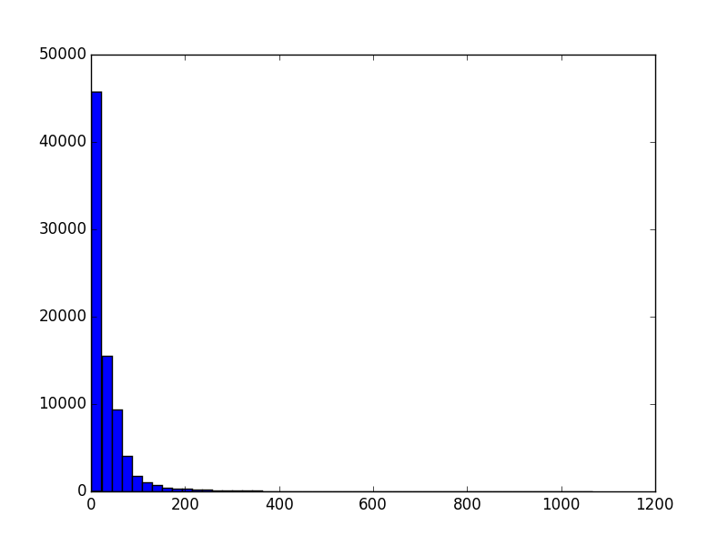

## Intro to networkx


1. Import the module:

    ```python
    import networkx as nx
    ```

2. Load in the graph:

    ```python
    G = nx.read_edgelist('data/imdb_edges.tsv', delimiter='\t')
    ```

3. How many nodes and edges are there in the graph?

    ```python
    G.number_of_nodes()  ## 97945
    G.number_of_edges()  ## 154796
    ```

4. Using networkx, find the shortest path between two actors.

    ```python
    nx.shortest_path(G, "Kevin Bacon", "Julia Roberts")
    ```

    Results:
    ```python
    ['Kevin Bacon', u'R.I.P.D.', u"Mike O'Malley", u'Eat Pray Love', 'Julia Roberts']
    ```

## Measures of Centrality and Connected Components

1. We're going to work with the graph that only has actors. Run the `make_edges_files.py` script and then load in the `actor_edges.tsv` into a networkx graph.

    ```python
    G = nx.read_edgelist('data/actor_edges.tsv', delimiter='\t')
    ```

2. Use networkx to get the *degree* of all the nodes and make a histogram to get an understanding of the distribution of degrees.

    ```python
    import matplotlib.pyplot as plt

    degrees = G.degree()
    plt.hist(degrees.values(), bins=50)
    plt.show()
    ```

    

3. Who is the most important actor according to degree centrality?

    ```python
    from collections import Counter

    Counter(degrees).most_common(5)
    ```

    ```
    1: Danny Trejo (1067)
    2: Richard Riehle (829)
    3: Keith David (813)
    4: Tom Arnold (799)
    5: Eric Roberts (777)
    ```

4. How many connected components are there?

    ```python
    nx.number_connected_components(G)  ## 1390
    ```

5. Make a histogram of the sizes of the connected components.

    ```python
    comps = list(nx.connected_components(G))
    comp_sizes = Counter({i: len(comps[i]) for i in xrange(len(comps))})
    largest = comp_sizes.most_common(1)[0][0]
    comp_sizes.pop(largest)
    plt.hist(comp_sizes.values(), bins=50)
    plt.show()
    ```

    

6. Load in the newly created `small_actor_edges.tsv` into a networkx graph.

    ```python
    smallG = nx.read_edgelist('data/small_actor_edges.tsv', delimiter='\t')
    ```

7. How many connected components are there in this graph?

    ```python
    nx.number_connected_components(smallG)  ## 1
    ```

8. Who is the most important actor in this subgraph according to degree centrality?

    ```python
    Counter(smallG.degree()).most_common(5)
    ```

    Results:
    ```
    1: David Koechner (91)
    2: Justin Long (89)
    3: Danny Trejo (80)
    4: Paul Rudd (77)
    5: Jason Bateman (74)
    ```

9. Who is the most important actor according to betweenness centrality?

    ```python
    Counter(nx.betweenness_centrality(smallG)).most_common(5)
    ```

    Results:
    ```
    1: Danny Trejo (0.0174)
    2: Justin Long (0.0124)
    3: David Koechner (0.0118)
    4: John Goodman (0.0117)
    5: Samuel L. Jackson (0.0109)
    ```

10. Who is the most important actor according to eigenvector centrality?

    ```python
    Counter(nx.eigenvector_centrality(smallG)).most_common(5)
    ```

    Results:
    ```
    1: David Koechner (0.1405)
    2: Justin Long (0.1312)
    3: Paul Rudd (0.1284)
    4: Will Ferrell (0.1255)
    5: Seth Rogen (0.1165)
    ```
