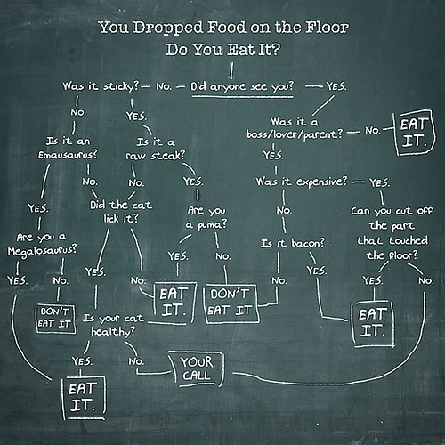
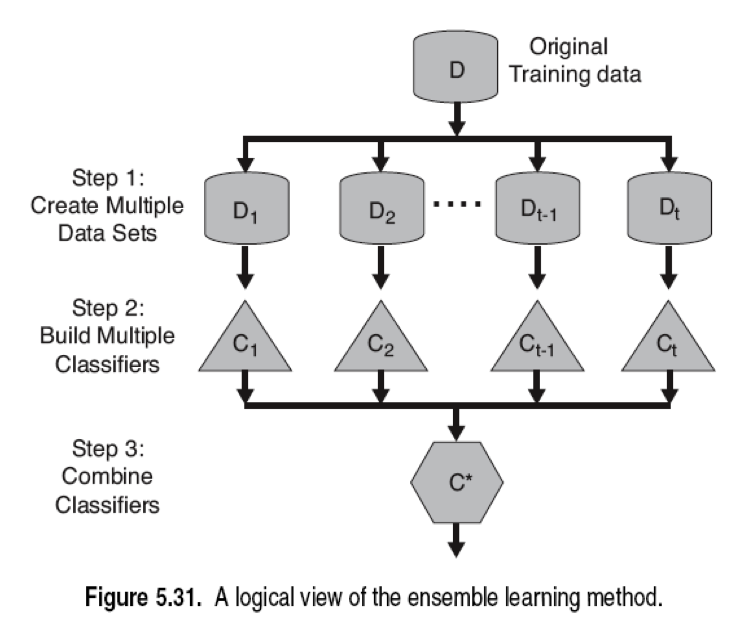
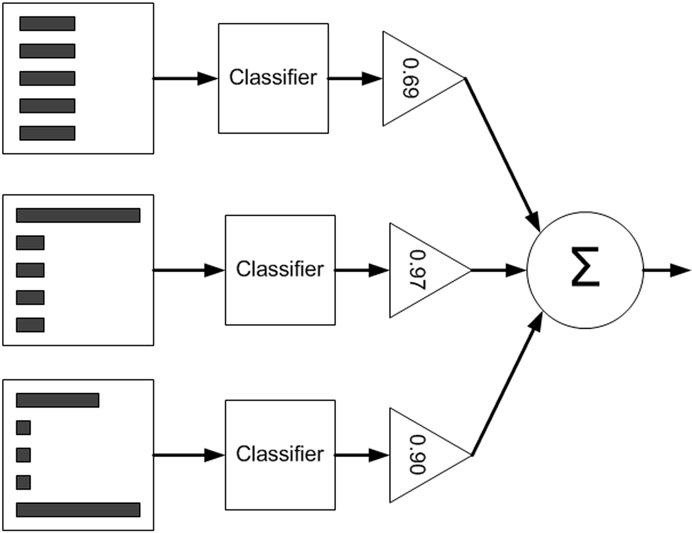
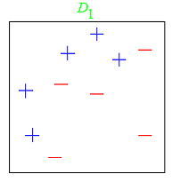
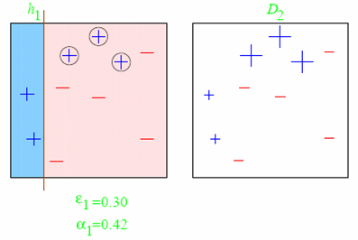
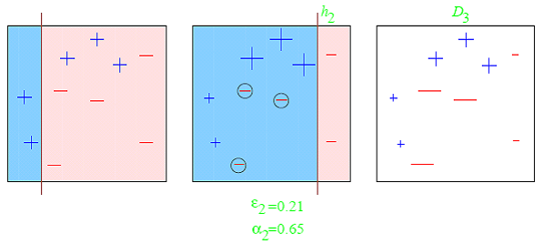
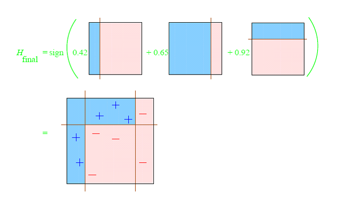

# Model Comparison Solution

Some high level comments: more data usually beat a better model. Better features
usually beat a better model. So data collection and feature engineering
typically trump model selection. Keep that in mind whenever you're tackling a
new problem.

The data are usually messy: the inputs tend to be mixtures of quantitative, binary, and categorical variables, the latter often with many levels. There are generally many missing values, complete observations being rare. Distributions of numeric predictor and response variables are often long-tailed and highly skewed. 

Usually only a small fraction of the large number of predictor variables that have been included in the analysis are actually relevant to prediction. 

Futhermore, when doing model selection, trying out several models is one of the
best ways to determine which model to use. And you may ultimately find that an
ensemble works the best. 

Things like speed, simplicity, and interpretability will often guide your choice
of model on the job. 

## Classification 

Many of the answers are shared amongst the supervised learning algorithms so be
sure to at least read the answers for logistic regression.

Questions:

* High dimensionality
* Large data
* Training speed
* Prediction speed
* Interpretability
* Communication
* Visualization
* Evaluation
* Nonlinearity/power
* n << p
* Outliers
* Overfitting
* Hyperparameters
* Generative
* Online
* Unique attributes
* Special use cases

#### Logistic Regression

* Most widely used general-purpose classifier
* In linear regression, features are used to predict the value of a continuous outcome. The coefficient vector represents the change in the predicted value for one unit of change in the feature
* In logistic regression, features are used to predict the probabilities of incoming data belonging to a particular class. The coefficient vector represents the change in the logit function for one unit of change in the feature
* The odds ratio tells you how much 1-unit increase of a feature increases the odds of being classified in the positive class. The coefficients of the logistic regression can be interpreted similarly to that of linear regression
* High dimensionality
	* Large data
	* Logistic regression can handle large datasets reasonably well if you
    train the algorithm with stochastic gradient descent (i.e. you can train the
    algorithm partially on small batches of training data at a time). In
    scikit-learn, you can use the `SGDClassifier` to do a logistic regression
    with stochastic gradient descent; use the `partial_fit` method.
	* If you're using the analytical solution (normal equations), the problem
    becomes intractable either as the number of examples or features grows too
    large (~ >10k) because you have to take the inverse of a large matrix and
    solve a system of linear equations.
* Training speed is dependent on the size of the training data, and the amount of memory needed allocated to do the stochastic gradient descent
* Prediction speed
  * Very fast: `threshold(sigmoid(dot_product(weights, input)))`
  * Very scalable, fast to train at runtime. Store the coefficient vector and do a single dot product against the feature vector of new data. 
* Interpretability
  * Similar to linear regression, the coefficients could be interpreted to
    indicate the importance of the factors, but you have to be careful about
    putting the data on a uniform scale and about the explaining away effect.  
    Note most of the time we don't put things on a uniform scale, in which case you can't interpret importance via magnitude of the coefficients. Note also that it's nearly impossible to explain away the entire effect, so interpret with caution.
* Communication
  * Logistic regression is finding a decision boundary that's a linear
    combination of the features (i.e. linear hyperplane). In 2-dimensional space, a hyperplane is fitted such that everything on one side of the dataset is classified as class 1, and on the other side, class 2.
* Visualization
  * Visualization in high-dimensional space is always tricky, but if you use PCA
    to reduce the number of dimensions down to 2 or 3, train the logistic
    regression on the reduced feature space, and visualize the decision boundary
    (`y = dot(weights, x)`). If you reduced to 2 dimensions, the boundary will
    be a line, in 3 dimensions, it will be a hyperplane.
* Evaluation (these apply to all classification algorithms)
	* For all supervised learning algorithms, we care most of all about generalization on unseen data. That means that during prototyping and model iteration, k-fold cross validation should be what we're aiming to optimize, and in the end, the evaluation metric we care about is performance on hold-out test data.
  * F1 - great for a single performance evaluation metric
  * Precision/Recall
  * Misclassification rate - problematic when you have unbalanced classes
  * Receiver Operator Characteristic (ROC) plot - good to see sensitivity to
    threshold parameter
    * Area under the curve
  * Learning curves (performance on training and cross validation data as a
    function of training set size) reveal bias-variance performance
  * Bias-variance (applies to all supervised models)
    * High bias (i.e. underfitting): use a more powerful (nonlinear) model, add
      more features, add nonlinear interactions between features, reduce
      regularization
    * High variance (i.e. overfitting): use a simpler model, use regularization,
      collect more data, reduce features
  * Akaike/Bayesian information criterion (AIC/BIC) - good for understanding the
    tradeoff between error and model complexity
* Nonlinearity/power
  * Logistic regression can model nonlinearities in the dataset if you include feature
    interactions in the feature space (i.e. add a feature that is a non-linear
    interaction of two other features - x1 * x2, or x1^2). You can increase the
    degree arbitrarily but this will exponentially increase your feature
    space. This is the same for polynomial regression.
* n << p (more features than examples)
  * This is equivalent to having more feature columns than data rows. 
  * With any model where you have a small training set, you're liable to overfit
    so simple models with regularization are key. Logistic regression with L1
    regularization fits the bill nicely. Because the training set is small, you
    can use Bayesian logistic regression and avoid the problem of overfitting
    altogether - you'd build a probabilistic graphical model using PyMC with all
    the parameters and run MCMC to get the posterior distribution of the
    parameters given the data. For forward estimates, you'd use the expected
    value of each of the parameters.
* Outliers
  * Logistic regression is quite susceptible to outliers, especially as the
    number of outliers increases. Outliers can increase training time and reduce
    model performance by warping the decision boundary. It's important in many
    supervised learning algorithms to look for outliers up front and decide how
    to handle them. In the case of unbalanced classes or anomaly detection,
    those data points may be valuable and are not truly outliers. Other times,
    those outliers might clearly be corrupt or irrelevant data and can be
    removed without harm. There is no clear cut rule for how to deal with
    outliers; you'll have to use your good judgment when it comes up.
* Overfitting
	* As with most of the machine learning algorithms we've learned, logistic
    regression tries to find the maximum likelihood decision boundary, which
    leaves us open to overfitting to the training data. Cross-validation is your
    first line of defense against overfitting - i.e. it'll let you know if you
    are overfitting, which is always what you want to find out before taking any
    other actions. Learning curves will give you more insight.
	* How to prevent overfitting: reduce model complexity by removing features,
    increase regularization parameter (L1 or L2). If you've added polynomial
    terms, remove them.
	* It can overfit on very sparse data, so is often used with regularization (L1).    
* [Hyperparameters](http://scikit-learn.org/stable/modules/generated/sklearn.linear_model.LogisticRegression.html)
  * Regularization parameter
  * Degree d polynomial terms (for polynomial logistic regression)
  * Threshold for positive classification (typically 0.5)
  * Class weighting for unbalanced classes  
  * Parameters for gradient descent:
    * Step size
    * Stopping criterion: minimum change in error or number of iterations
* Generative
  * Logistic regression is a discriminative model, not a generative one.
* Online
  * You can use logistic regression online with stochastic gradient descent.
* Unique attributes
  * The output of logistic regression can be interpreted as a probability of
    classification.
  * Scale the data if you want the coefficients to give you some indication of
    feature importance. 
* Special use cases
  * Logistic regression probably has the best combination of simplicity and
    generalizability out of all the classification models and should probably be
    your first stop in any classification task. You may want to upgrade to more
    sophisticated models like SVMs, random forests, or AdaBoost, but the simple
    logistic regression should probably serve as your baseline classifier since
    it's so simple and produces pretty good results.

#### Support Vector Machine

* High dimensionality
	* Works well in high dimensional, nonlinear space, partially due to the kernel
    method that removes the need to compute the coordinates of the data points
    in the new feature space.
* Large data / Online
  * Using hinge loss with sklearn's SGDClassifier allows you to do
    `partial_fit`, but it'll be the equivalent of a linear SVM (i.e. without the
    use of a non-linear kernel).
* Training speed
  * Long
* Prediction speed
  * Fast as it only uses a subset of the dataset (the support vectors) to
    determine the decision boundary. 
  * `predict_proba` is slower than Logistic Regression in computing probabilities
* Interpretability
  * SVMs don't output a probability of classification nor do they have
    coefficients to interpret and so are less interpretable than logistic
    regression or random forests.
* Communication
  * Simply, SVMs find a decision boundary between classes, similar to the hyperplane in logistic regression. Explaining the large-margin aspect is a bit more difficult but a simple diagram that shows maximum separability between classes will usually be sufficient.
* Evaluation
  * Same classifier evaluation metrics as logistic regression
* Nonlinearity/power
  * Using nonlinear kernels allow nonlinear decision boundaries without
    dramatically increasing training time.
* n << p
* Outliers
  * Because of the use of support vectors to build the decision boundary, SVMs
    are robust to outliers.
* Overfitting
  * The large-margin nature of SVMs produces a model that is inherently resistant to overfitting
* Hyperparameters
  * SVM's are relatively black box models requiring little tuning but there are
    some knobs you can turn
  * Error penalty term C controls the tradeoff between margin and error. You will rarely encounter a dataset that is linearly separable. When this is the case, SVMs have a tradeoff between maximizing the margin and minimizing the classification error. The hyperparameter C controls this tradeoff. It is equivalent to 1/λ (the regularization term from Ridge/Lasso).
  * Nonlinear kernel choice - degree d polynomial, *Gaussian* (aka radial basis function)
    * Each kernel has its own hyperparameters    
* Class weighting for unbalanced classes
	* Sometimes our data is unbalanced across classes (i.e. 90% of our data is class 1
and only 10% class 2). SVMs don't deal with this regime well and we need to take
action to correct it.
	* One method used to correct for class imbalance is weighting the training
examples by the inverse frequency of their class. That is, if a certain class is
only a small part of the dataset, we'd weight those examples more heavily so
that they have relatively equal weight to the more dominant class.
	* You can use the keyword argument `class_weight` in SVC's constructor to specify
the class weights manually. Or you can have scikit-learn do it automatically for
you by passing in `class_weight='auto'`.
* Generative
  * SVM's are discriminative models
* Unique attributes
  * Large margin classifier    
  * Ability to generate non-linear decision boundaries

##### Decision Tree
CART models are popular for several reasons: they are easy to interpret, they can easily handle mixed discrete and continuous inputs, they are insensitive to monotone transformations of the inputs (because the split points are based on ranking the data points), they perform automatic variable selection, they are relatively robust to outliers, they scale well to large data sets, and they can be modified to handle missing inputs.
Of all the well-known learning methods, decision trees come closest to
meeting the requirements for serving as an off-the-shelf procedure for data
mining. They are relatively fast to construct and they produce interpretable
models (if the trees are small). 

* High dimensionality
* Large data
* Training speed
	* Computationally _expensive_ to ___train___
	* Greedy algorithm (local optima)
	* If the trees are small, Decision Trees are relatively fast to construct
* Prediction speed 
	* Computationally _cheap_ to ___predict___
* Interpretability
	* Easy to interpret, easy to understand and communicate to non-technical audiences
* Communication
	* Decision Trees have one aspect that prevents them from being the ideal tool for predictive learning, namely inaccuracy. They seldom provide predictive ac-
curacy comparable to the best that can be achieved with the data at hand.
Boosting decision trees improves their accuracy dramatically. At the same time it maintains most of their desirable
properties for data mining. 
* Visualization
	* The dendrogram visually captures the decision criterions at each feature split
	
* Evaluation
	* The trees are unstable: small changes to the input data can have large effects on the structure of the tree, due to the greedy / hierarchical nature of the tree-growing process, causing errors at the top to affect the rest of the tree. Do not predict very accurately compared to other algorithms. 
	* In frequentist terminology, we say that trees are high variance estimators. 
* Nonlinearity/power
	* Decision trees are non-parametric and able to perform non-linear classification. 
* n << p
	* When there is less data (n is small), the decision tree can fit to noise and result in high variance. This is because Decision Trees are dependent on the training data quality in terms of predictive accuracy. 
* Outliers
	* Decision trees are non-parametric, thereby taking care of outliers For example, decision trees takes care of cases where you have class A at the low end of some feature x, class B in the mid-range of feature x, and A again at the high end.
	* Decision Trees are invariant under (strictly monotone) transforma-
tions of the individual predictors. As a result, scaling and/or more general
transformations are not an issue, and they are immune to the effects of predictor outliers.
	* A single tree can be led astray by outliers, however an ensemble using bootstrap bagging such as Random Forestcan diminish the effects of the outlier
* Overfitting
	* In terms of predictive power, Decision Trees are very prone to overfitting, so it would be good to implement pruning
	* By design, the algorithm gets weaker and weaker as you build the tree, and it’s well known that if you build the entire tree, it’s often less accurate (with
new data) than if you prune it.
* Hyperparameters
	* In `sklearn` ([documentation](http://scikit-learn.org/stable/modules/generated/sklearn.tree.DecisionTreeClassifier.html#sklearn.tree.DecisionTreeClassifier)), pruning with `max_depth`, `min_samples_split`, `min_samples_leaf` or `max_leaf_nodes`
* Generative
* Unique attributes
	* Decision Trees perform internal feature selection as an integral part
of the procedure. They are thereby resistant, if not completely immune, to the inclusion of many irrelevant predictor variables through information gain.
	* This is an example of an embedded feature selection algorithm. You don’t need to use a filter features because the information gain method is doing your feature selection for you.
	* Naturally incorporate mixtures of numeric and categorical predictor variables and missing values
* Special use cases
	* Packages that already implement decision trees can handle continuous variables for you. So you can provide continuous features, and it will determine an optimal threshold for turning the continuous variable into a binary predictor. 
	* If you are building a decision tree algorithm yourself, then in the case of continuous variables, you need to determine the correct threshold of a value so that it can be thought of as a binary variable. So you could partition a user’s number of dragon slays into “< 10” and “>= 10”. In this case, it takes some extra work to decide on the information gain because it depends on the threshold as well
as the feature.
	* In fact, you could think of the decision of where the threshold should live as a separate submodel. It’s possible to optimize to this choice by maximizing the entropy on individual attributes, but that’s not clearly the best way to deal with continuous variables. Indeed, this kind of question can be as complicated as feature selection itself—instead of a single threshold, you might want to create bins of the value of your attribute, for example. 

#####Random Forest
Bagging or bootstrap aggregation is a technique for reducing the variance of an estimated prediction function. Bagging seems to work especially well for high-variance, low-bias procedures, such as trees. For regression, we simply fit the same regression tree many times to bootstrap-sampled versions of the training data, and average the result. For classification, a committee of trees each cast a vote for the predicted class.

Boosting in was initially proposed as a committee method as well, although unlike bagging, the committee of weak learners evolves over time, and the members cast a weighted vote. Boosting appears to dominate bagging on most problems, and became the preferred choice. Random forests is a substantial modification of bagging
that builds a large collection of de-correlated trees, and then averages them.
On many problems the performance of random forests is very similar to
boosting, and they are simpler to train and tune. 

* High dimensionality
	* In high dimensionality, use a subset of features for each tree in the random forest. This allows you to fully randomize and generalize the test cases. 
* Large data
* Training speed
	* Random Forests can be very fast to train, however becomes slow when you have a large number of features
	* It is a highly parallel algorithm, so speedup could come from the use of multiple cores. This is because unlike nonlinear estimators (AdaBoost),  random forests can be fit in one sequence.
* Prediction speed
	* Slow to create predictions once trained. More accurate ensembles require more trees, which means using the model becomes slower.
	* Random Forest has better runtime than other ensemble methods because the feature space is reduced in some cases.
* Interpretability
	* Random forests generalize decision trees with bagging, otherwise known as bootstrap aggregating. While your models more accurate and more robust, it is at the cost of interpretability. Compared to a single decision tree random forests are harder to interpret.
	* This ease of use also makes Random Forests great for non-technical audiences
* Communication
	* In order for Random Forest to perform well, its base classifier must have the following attributes: 
		* be accurate, aka low bias
		* be diverse, aka uncorrelated
	* Random forests leverage the significant instability of trees by the injecting of a strong stochastic component (permuting a small number of features at each decision node within a tree) to create diversity within the ensemble. Because each node of a tree is presented with a new random selection of features the trees are highly diverse. The ensemble then has the effect of averaging out the variance and bias of the diverse collection of trees.
* Visualization
* Evaluation
	* The predictive accuracy of Random Forest is very good. Random Forest reduces variance by decorrelating the base learner by learning trees based on a randomly chosen subset of input variables, as well as randomly chosen subset of data cases. 
	* It is much more accurate than its base classifier, the Decision Tree
* Nonlinearity/power
	* Random forest reduces the correlation beween the trees without increasing the variance too much through a random selection of the input variables. However, not all estimators can be improved by shaking up the data like this. It seems that highly nonlinear estimators, such as trees, benefit the most.
* n << p
	* In case of a sparse feature vector, a random selection of features may not work all the time as uninformative or correlated features might be selected which might degrade the performance of the classifier
* Outliers
	* Random forests are comparable in accuracy to AdaBoost, yet are more robust to
errors and outliers.
* Overfitting
	* Random forests (or boosted trees) address the overfitting seen in decision trees. For a large number of trees, it does not overfit due to the generalization error converging. 
	* However, when the number of relevant variables increases, the performance of random forests is surprisingly robust to an increase in the number of noise variables. This robustness is largely due to the relative insensitivity of misclassification cost to the bias and variance of the probability estimates in each tree.
* Hyperparameters
	* There are two hyperparameters for Random Forests:
		* num_trees:  number of trees to create in the forest
        * num_features:  the number of features to consider when choosing the best split for each node of the decision trees
	* Since they have very few parameters to tune and can be used quite efficiently with default parameter settings (i.e. they are effectively non-parametric)        
* Generative
* Unique attributes
	* Can be used for extracting feature importance 
* Special use cases* 

#### AdaBoost
A "weak" classifier does a better job than randomly guessing, but not by much. However, AdaBoost attempts to construct a strong classifier from multiple instances of a weak classifier. 

The AdaBoost algorithm repeats the training and weight-adjusting iterations until the training error is 0 or until the number of weak classifiers reaches a user-defined value.

Some advantages of trees that are sacrificed by boosting are speed, interpretability, and, for AdaBoost, robustness against overlapping class distributions and especially mislabeling of the training data. A gradient boosted model (GBM) is a generalization of tree boosting that attempts to mitigate these problems, so as to produce an accurate and effective off-the-shelf procedure for data mining.

* High dimensionality
* Large data
* Training speed
	* It is fast to perform thanks to the weakness of the classifiers, their linear aggregation, and the feature selection done by choosing the most performant dummy classifiers. However it is much slower than decision trees
	* AdaBoost is unparallelizable because the base classifier become a sequential and nonlinear combination due to constant updates to the sampling distribution.
* Prediction speed
	* Prediction is fast with weak learners such as decision stumps.
* Interpretability
	* While Decision Trees can often be inaccurate, AdaBoost improves accuracy dramatically while retaining the most desirable properties of decision trees. 
	* The downside is that it is lot less interpretable
	* AdaBoost training process selects only those features known to improve the predictive power of the model, thereby reducing dimensionality and potentially improving execution time as irrelevant features do not need to be computed.
* Communication
	* AdaBoost is a procedure that iteratively changes the sampling distribution of training records at each iteration. The first iteration uses uniform weights. In subsequent iterations, the weights are adjusted to enmphasize records that were misclassfied in previous iteration. The final prediction is constructed by a weighted vote. 
	* This is in sharp contrast to the lack of selection criteria resent in random forest ensemble construction. Each new base classifier is specifically required to focus on the weak points of the previous ensemble, with the result that boosting aggressively driving down subsequent training error.
* Visualization

* Evaluation
	* AdaBoost is about as accurate as Random Forest, but less robust to noise
	* The effect of Adaboost is reduce bias. As the weak classifier learns the accuracy improves. 
* Nonlinearity/power
* n << p
* Outliers
	* AdaBoost is sensitive to noisy data and outliers. 
* Overfitting
	* AdaBoost is a non-parametric model and quite robust to overfitting. Via cross-validation, the iteration will stop when the learner starts to overfit.
* Hyperparameters
    * n_estimator, the number of iterations to use in boosting
    * learning_rate, determines how fast the error would shrink, lower learning rate means more accurate decision boundary, but slower to converge
* Generative
* Unique attributes
* Special use cases

#### k-Nearest-Neighbors
* Training time
  * Training time is nil since there is no training phase - you only predict.
* High dimensional / large data
  * Performance will suffer in high dimensional space and with many examples since
    you'll have to compute pair-wise distance metrics for the entire dataset to
    find the k nearest neighbors. 
  * Limited to small and simple datasets for classification.
* Unique attributes / use cases
  * Can be used to fill in missing data by finding k nearest neighbors based on
    present features and then filling in the missing value based on the average of
    the nearest neighbors.
  * Make sure to scale your data so that the distance calculation makes sense.
  * Noisy features will reduce performance, just as they would with k-means, since
    typically each feature is an equally-weighted dimension in the distance
    calculation.
	* Naturally incorporate mixtures of numeric and categorical predictor variables and missing values    
* Hyperparameters
  * k - how many neighbors to use
  * neighbor weighting - you can choose to weight the values of the closer
    neighbors higher than more distant neighbors
* Outliers
	* Robustness to outliers
	
#### Naive Bayes

* Works really well in high dimensional space and with huge datasets; all
  precomputed
* Fast predictor
* Can be used in an online setting
* Handles unbalanced classes seamlessly (priors on labels)
* Generative model means you can generate example text
* Very interpretable because you can inspect the conditional probability tables
* Used to particularly good effect in natural language tasks because of the
  inherent high dimensionality
* Spam classification was the killer app for Naive Bayes
* Make sure you have Laplace smoothing

## Unsupervised Learning
### k-Means Clustering
* Topic modeling
* Anomaly detection
* Need to specify number of clusters
* The clusters will change based on initialization
* Doesn't deal well with high-dimensional datasets

### Hierarchical clustering
* You can get different partitionings depending on the level or resolution we're interested in
* Slow
* Don't need to specify number of clusters

## Featurization
[`scikit-learn`](http://scikit-learn.org/stable/modules/preprocessing.html#) outlines some great ways to pre-process your training data.

* Examples = documents
* Features
  * Bag of words
    * Binary - just captures presence, not frequency
    * Counts - captures frequency
    * Normalized counts - captures probability
    * tf-idf - captures word-document interaction (i.e. word importance to
      document)

Another way of featurizing text is through word embeddings. Consider it an
advanced method though.

**Rescaling** a vector means to add or subtract a
constant and then multiply or divide by a constant, as you would do to
change the units of measurement of the data, for example, to convert a
temperature from Celsius to Fahrenheit. 

**Normalizing** a vector most often means dividing by a norm of the vector,
for example, to make the Euclidean length of the vector equal to one. In the
NN literature, "normalizing" also often refers to rescaling by the minimum
and range of the vector, to make all the elements lie between 0 and 1. 

**Standardizing** a vector most often means subtracting a measure of location
and dividing by a measure of scale. For example, if the vector contains
random values with a Gaussian distribution, you might subtract the mean and
divide by the standard deviation, thereby obtaining a "standard normal"
random variable with mean 0 and standard deviation 1. 

Below are `scikit-learn`'s documentations on how to preprocess and featurize.

#####Standardization
* Standardization of datasets is a common requirement for many machine learning estimators implemented in the scikit: they might behave badly if the individual feature do not more or less look like standard normally distributed data: Gaussian with zero mean and unit variance.
* In practice we often ignore the shape of the distribution and just transform the data to center it by removing the mean value of each feature, then scale it by dividing non-constant features by their standard deviation.
* For instance, many elements used in the objective function of a learning algorithm (such as the RBF kernel of SVM or the L1 and L2 regularizers of linear models) assume that all features are centered around zero and have variance in the same order. If a feature has a variance that is orders of magnitude larger that others, it might dominate the objective function and make the estimator unable to learn from other features correctly as expected.

#####Scaling
* An alternative standardization is scaling features to lie between a given minimum and maximum value, often between zero and one. This can be achieved using `MinMaxScaler`.
* The motivation to use this scaling include robustness to very small standard deviations of features and preserving zero entries in sparse data.
* *Note*: In order for the same scaling and shifting operations to be consistent with test data, the same instance of the transformer must be applied. 

#####Normalizing
* Normalization is the process of scaling individual samples to have unit norm. This process can be useful if you plan to use a quadratic form such as the dot-product or any other kernel to quantify the similarity of any pair of samples.
* This assumption is the base of the Vector Space Model often used in text classification and clustering contexts.
* The function normalize provides a quick and easy way to perform this operation on a single array-like dataset, either using the L1 or L2 norms.
* Normalize and Normalizer accept both dense array-like and sparse matrices from `scipy.sparse` as input.

#####Binarizing
* Feature binarization is the process of thresholding numerical features to get boolean values.
* It is also common among the text processing community to use binary feature values (probably to simplify the probabilistic reasoning) even if normalized counts (a.k.a. term frequencies) or TF-IDF valued features often perform slightly better in practice.
* Binarize and Binarizer accept both dense array-like and sparse matrices from `scipy.sparse` as input.

