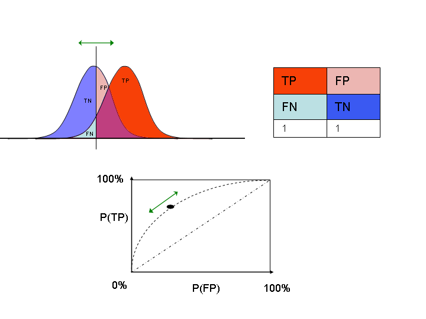
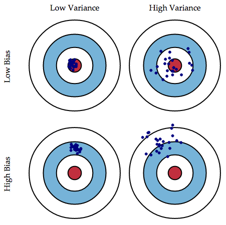
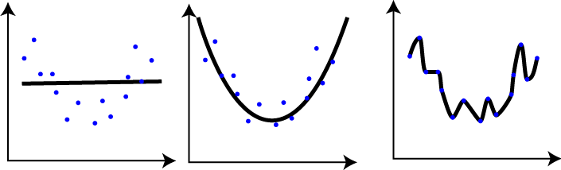
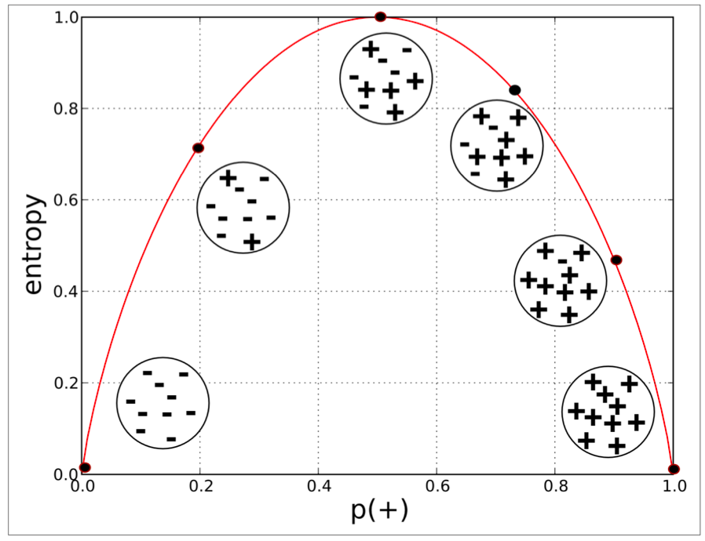
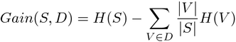

## Review of Concepts

#### Cross Validation

You should always, before you begin, split your dataset into a train dataset
and a test dataset. You will use the train dataset to build your model and the
test dataset to measure your success.

You should generally keep 10-50% of the data for the test set and use the rest
for training.

You should always randomly split your data. Data often is sorted in some way (
by date or even by the value you are trying to predict). *Never* just split your
data into the first 90% and the remaining 10%. Lucky for us, there is a nice
method implemented in scipy that splits the dataset randomly for us called
[test_train_split](http://scikit-learn.org/stable/modules/generated/sklearn.cross_validation.train_test_split.html).

#### KFold Cross Validation
One thing about doing standard cross validation is that your score can depend on the random split. We can get a more accurate value of the error by using *KFold Cross Validation*. Basically, we break the data into k groups. We take one of these groups and make it the test set. We then train the data on the remaining groups and calculate the error on the test group. We can repeat this process k times and average all the results. This gives us a more accurate picture of the error.

#### Evaluation (these apply to all classification algorithms) 
* The simplest measure is **accuracy**. This is the number of correct predictions over the total number of predictions. It's the percent you predicted correctly. In `sklearn`, this is what the `score` method calculates.
	
	
* Precision, a measure of how good your positive predictions are

* Recall, a measure of how well you predict positive cases

* F1, is the harmonic mean of precision and recall. Great for a single performance evaluation metric

	
* Accuracy is often a good first glance measure, but it has many shortcomings. If the classes are unbalanced, accuracy will not measure how well you did at predicting. Say you are trying to predict whether or not an email is spam. Only 2% of emails are in fact spam emails. You could get 98% accuracy by always predicting not spam. This is a great accuracy but a horrible model!  
* Generally, when you have unbalanced classes misclassification becomes problematic. For example, the minority will be small % of the majority class, resulting in the confusion matrix falsely misclassifying the minority class. 
* Akaike/Bayesian information criterion (AIC/BIC) - good for understanding the tradeoff between error and model complexity

#### Confusion Matrix
We can get a better picture our model but looking at the confusion matrix. We get the following four metrics:

* **True Positives (TP)**: Correct positive predictions
* **False Positives (FP)**: Incorrect positive predictions (false alarm)
* **True Negatives (TN)**: Correct negative predictions
* **False Negatives (FN)**: Incorrect negative predictions (a miss)
		
  

  * Receiver Operator Characteristic (ROC) plot, is a plot of the TPR against the FPR for a binary classification problem as you change the threshold. 
    * Area under the curve, a single number that captures the overall quality of the classifier. It should be between [0.5, 1], or between random classifier to perfectly classified.
  * Learning curves show the validation and training score of an estimator for varying numbers of traiing samples. More training data will not add addtional benefit at the point where the training score and cross-validation score converge. 
  
    
#### Bias and Variance (supervised models)  

There’s a well-known bias-variance tradeoff: a model is “high bias” if it is too simple (the features aren’t encoding enough information). In this case, lots more data doesn’t improve our model. On the other hand, if our model is too complicated, then “high variance” leads to overfitting. In this case we want to reduce the number of features we are using.

##### Error due to bias
Imagine that you construct your model with the same process several hundred times. A *biased* model would center around the incorrect solution. How you collect data can lead to bias (for example, you only get user data from San Francisco and try to use your model for your whole userbase).

##### Error due to variance
Again, imagine that you construct your model several hundred times. A model with high *variance* would have wildly different results each time. The main contributor to high variance is insufficient data or that what you're trying to predict isn't actually correlated to your features.

Note that both high bias or high variance are bad. Note that high variance is worse than it sounds since you will only be constructing the model once, so with high variance there's a low probability that your model will be near the optimal one.

    * High bias (i.e. underfitting): use a more powerful (nonlinear) model, add
      more features, add nonlinear interactions between features, reduce
      regularization
    * High variance (i.e. overfitting): use a simpler model, use regularization,
      collect more data, reduce features
##### Over- and Underfitting

Let's get back to fitting the polynomial. Take a look at the following example with three potential curves fit to the data.

In the first graph, we've fit a line to the data. It clearly doesn't fully represent the data. This is called *underfitting*. This represents high *bias* since the error will be consistently high. It also represents low *variance* since with new data, we would still construct approximately the same model.

In the third graph, we've fit a polynomial of high degree to the data. Notice how it accurately gets every point but we'd say this does not accurately represent the data. This is called *overfitting*. This represents high *variance*. If we got new data, we would construct a wildly different model. This also represents low *bias* since the error is very low.

The one in the middle is the optimal choice.

You can see this graphically:

Model complexity in our case is the degree of the polynomial.

Another way of viewing this is by comparing the error on the training set with the error on the test set. When you fit a model, it minimizes the error on the training set. An overfit model can reduce this to 0. However, what we really care about it how well it does on a new test set, since we want our model to perform well on unseen data. This paradigm is represented with the following graph.

You can see on the left side of the graph that the data is *underfit*: both the train error and the test error are high. On the right hand side of the graph, the data is *overfit*: the train error is low but the test error is high. The best model is where the train error is lowest, around a degree 5 polynomial.

#### Regularization: How to deal with overfitting

Having lots of features can lead to overfitting. When we make it into a polynomial, we are adding *a lot* of features. *Regularization* is a way of penalizing coefficients for being large.

##### L1 regularization 
[Lasso regression](http://statweb.stanford.edu/~tibs/lasso/simple.html)
Regularization adds a random variable (for L1, a Laplacian) to the hat matrix so that it can be inverted.

  1. Turns most regressors to zeros
  2. Uses a Laplacian prior

##### When to use: 
  1. Large sparse data sets, many regressors will become zero. 
  2. When you have many regressors but are unsure of the important ones.

<u>Pros</u>:
  1. Good for recovering sparse datasets
  2. Reduce overfitting

<u>Cons</u>:
  1. More difficult to interpret
  2. Loss of predictive power
  3. Large estimation error for non-sparse data.

##### L2 regularization (Ridge regression):
1. Ridge regression suppresses the influence of the leading regressors lightly and the lagging regressors  heavily. 
2. Uses a Gaussian prior

##### When to use: 
  1. When you have many regressors but are unsure of the important ones
  2. Non-sparse data. 

<u>Pros</u>:
  1. Good for recovering non-sparse signals. 
  2. Reduce overfitting.
  3. Less variance than the OLS estimator [reference](http://tamino.wordpress.com/2011/02/12/ridge-regression/)

<u>Cons</u>:
  1. The new estimates of the regressors are lower than the OLS estimates [reference](http://tamino.wordpress.com/2011/02/12/ridge-regression/)
  2. Loss of predictive power

##### Kernels

SVMs can use kernel functions to transform the features into a new feature
space. Thus far we've been using a linear kernel, but SVMs can use nonlinear
kernels.

Two of the most common nonlinear kernels arehe **polynomial knel** function andhe **Gaussian kernel funion** (also known ashe **Radial Basis Funion**, or RBF).

Both of these kernels transform the data into a new space where the
data may be (more) linearly separable.

### RBF Kernel

`K(x, z) = exp(gamma * (distance(x, z))^2)`

`gamma` is a hyperparameter that determines the spread of the Gaussian around each point. `distance` is Euclidean distance.

[Wikipedia - RBF
Kernel](http://en.wikipedia.org/wiki/Radial_basis_function_kernel)

### Polynomial Kernel

`K(x, z) = (1 + x.T.dot(z))^d`

`d` is a hyperparameter that determines the degree of the polynomial transform.

[Wikipedia - Polynomial Kernel](http://en.wikipedia.org/wiki/Polynomial_kernel)

In practice, RBF kernels are more often used (scikit learn uses the RBF as the
default kernel in SVC). The polynomial kernel at high degrees often leads to
overfitting.

1. Retrain your model using both the RBF kernel and the polynomial kernel. How
does each perform on this dataset compared to the linear kernel?

Check the docs to see how to set gamma and d for the RBF and polynomial kernels,
respectively.

#### Decision Tree
 
[Decision trees](http://en.wikipedia.org/wiki/Decision_tree_learning) to predict are one of the most popular and widely used algorithms. Most classifiers (SVM, kNN, Neural Nets) are great at giving you a (somewhat) accurate result, but are often black boxes. With these algorithms it can be hard to interpret their results and understand ___why___ a certain instance was assigned a label. Decision trees are unique in that they are very flexible and accurate while also being easily interpreted and communicated to non-technical audiences.

__INPUTS:__ Nominal (discrete) or Continuous

__OUTPUTS:__ Nominal (discrete) or Continuous

__(basically anything in and anything out)__

##### How to build a Decision Tree
How to predict with a decision tree it pretty clear: you just answer the questions and follow the path to the appropriate *leaf* node. But how do we build a decision tree? How do we determine which feature we should split on? This is the crux of the decision tree algorithm.

We will start by dealing with a particular type of decision tree, where we only do binary splits. To do a binary split:

* for a categorical variable, choose either value or not value (e.g. sunny or not sunny)
* for a continuous variable, choose a threshold and do > or <= the value (e.g. temperature <75 or >=75)

##### Information Gain
In order to pick which feature to split on, we need a way of measuring how good the split is. This is what *information gain* is for. The *gini impurity* is another alternative, which we'll discuss later.

First, we need to discuss *entropy*. The entropy of a set is a measure of the amount of disorder. Intuitively, if a set has all the same labels, that'll have low entropy and if it has a mix of labels, that's high entropy. We would like to create splits that minimize the entropy in each size. If our splits do a good job splitting along the boundary between classes, they have more predictive power.

The intuition of entropy is more important than the actual function, which follows.

Here, P(c) is the percent of the group that belongs to a given class.

If you have a collection of datapoints, the entropy will be large when they are evenly distributed across the classes and small when they are mostly the same class. Here's a graph to demonstrate what entropy looks like:

So we would like splits that minimize entropy. We use *information gain* to determine the best split:

Here, S is the original set and D is the splitting of the set (a partition). Each V is a subset of S. All of the V's are disjoint and make up S.

##### Gini impurity

The *Gini impurity* is another way of measuring which split is the best. It's a measure of this probability:

* Take a random element from the set
* Label it randomly according to the distribution of labels in the set
* What is the probability that it is labeled incorrectly?

This is the gini impurity:

##### Pruning
As is mentioned above, Decision Trees are prone to overfitting. If we have a lot of features and they all get used in building our tree, we will build a tree that perfectly represents our training data but is not general. A way to relax this is *pruning*. The idea is that we may not want to continue building the tree until all the leaves are pure (have only datapoints of one class). There are two main ways of pruning: *prepruning* and *postpruning*.

##### Prepruning
*Prepruning* is making the decision tree algorithm stop early. Here are a few ways that we preprune:

* leaf size: Stop when the number of data points for a leaf gets below a threshold
* depth: Stop when the depth of the tree (distance from root to leaf) reaches a threshold
* mostly the same: Stop when some percent of the data points are the same (rather than all the same)
* error threshold: Stop when the error reduction (information gain) isn't improved significantly.

##### Postpruning
As the name implies, *postpruning* involves building the tree first and then choosing to cut off some of the leaves (shorten some of the branches, the tree analogy really works well here).

##### Decision Tree Variants

As noted above, there are several decisions to be made when building a decision tree:

* Whether to split categorial features fully or binary
* Whether to use information gain or Gini impurity
* If and how to do pruning

There is some terminology to the different variants. Some of them are proprietary algorithms so we don't yet know all the parts.

#### ID3
Short for Iterative Dichotomiser 3, the original Decision Tree algorithm developed by Ross Quinlan (who's responsible for a lot of proprietary decision tree algorithms) in the 1980's.

* designed for only categorial features
* splits categorical features completely
* uses entropy and information gain to pick the best split

#### CART
Short for Classification and Regression Tree was invented about the same time as ID3 by Breiman, Friedman,, Olshen and Stone. The CART algorithm has the following properties:

* handles both categorial and continuous data
* always uses binary splits
* uses gini impurity to pick the best split

Algorithms will be called CART even if they don't follow all of the specifications of the original algorithm.

#### C4.5
This is Quinlan's first improvement on the ID3 algorithm. The main improvements are:

* handles continuous data
* implements pruning to reduce overfitting

There is now a **C5.0** which is supposedly better, but is propietary so we don't have access to the specifics of the improvements.

#### Ensembles

*Ensemble Methods* combine multiple machine learning algorithms to obtain better predictive performance. The idea is simple: run multiple models on the data and use their predictions to make a prediction that is better than any of the models could do alone.

##### Random Forest

Probably the most common ensemble method is a *Random Forest*, which consists of a collection of Decision Trees.

They were developed by Leo Breimen, who has the most extensive notes about them on his [webpage](http://www.stat.berkeley.edu/~breiman/RandomForests/cc_home.htm).

The idea is to repeatedly randomly select data from the dataset (*with replacement*) and build a Decision Tree with each new sample. The default is to have the randomly selected data be the same size as the initial dataset. Note that since we are sampling with replacement, many data points will be repeated in the sample and many won't be included.

Random Forests also limit each node of the Decision Tree to only consider splitting on a random subset of the features.

Here is the pseudocode for creating a Random Forest:

    CreateRandomForest(data, num_trees, num_features):
        Repeat num_trees times:
            Create a random sample of the test data with replacement
            Build a decision tree with that sample (only consider num_features features at each node)
        Return the list of the decision trees created

To classify a new document, use each tree to get a prediction. Choose the label that gets the most votes.

The default parameters that sklearn uses, which are also standard defaults, are *10* trees and only considering sqrt(m) features (where m is the total number of features).

##### Out of Bag Error

We can analyze a Random Forest using the standard cross validation method of splitting the dataset into a training set and a testing set. However, if we're clever, we notice that each tree doesn't see all of the training data, so we can use the skipped data to cross validate each tree individually.

We'll skip the mathematical proof, but when selecting from the dataset, about one third of the data is left out (discussed [here](http://math.stackexchange.com/questions/203491/expected-coverage-after-sampling-with-replacement-k-times) if you want to think about the math). So every data point can be tested with about 1/3 of the trees. We calculate the percent of these that we get correct, and this is the *out-of-bag error*.

It has been proven that this is sufficient and that cross validation is not strictly necessary for a random forest, but we often still use it as that makes it easier to compare with other models.

##### Feature Importance

We can use the random forest to determine which features are the most importance in predicting the class.

Breiman, the originator of random forests, uses out-of-bag error to determine feature importance, discussed [here](http://www.stat.berkeley.edu/~breiman/RandomForests/cc_home.htm#varimp). The idea is to compare the out-of-bag error of the trees with the out-of-bag error of the trees if you change the feature's value (basically, if we screw with the value of the feature, how much does that impact the total error?). Here is the pseudocode for calculating the feature importance for a single feature:

        For every tree:
            Take the data that is not covered by the tree.
            Randomly permute the values of the feature (i.e. keep the same values,
                but shuffle them around the data points).
            Calculate the OOB error on the data with the feature values permuted.
            Subtract the permutated OOB from the OOB of the original data to get the
                feature importance on this tree.
        Average all the individual feature importances to get the feature importance.

sklearn uses a different method, described [here](http://scikit-learn.org/stable/modules/ensemble.html#feature-importance-evaluation). Their method doesn't involve using the out-of-bag score. Basically, the higher in the tree the feature is, the more important it is in determining the result of a data point. The expected fraction of data points that reach a node is used as an estimate of that feature's importance for that tree. Then average those values across all trees to get the feature's importance.
