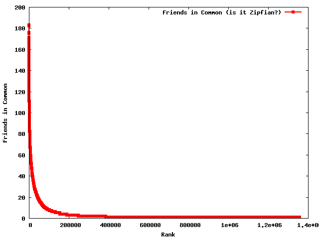

To graph your output with gnuplot:

```bash
python solution.py edges.txt | cut -f1 | sort -gr | cat -n | gnuplot -p -e "set term png; set output 'plot.png' ; set xlabel 'Rank'; set ylabel 'Friends in Common' ; set output 'plot.png'; plot '-' title 'Friends in Common (is it Zipfian?)' with linespoints lw 2 pt 4 ps 0.8"
```




If this seems like no big deal, just imagine what would be happening if we were running our mrjob on Amazon's EMR over Terabytes of data.  This is extremely powerful to interact with our data in this way.  I am happy to have a breakout about what is happening behind the scenes here if we were to run the mrjob in the cloud.

Also here are the top ten pairs I found (pairs that are already friends removed), if you want to check your results:

183 [1917, 2233]
182 [2088, 2369]
182 [1985, 2607]
176 [1985, 2593]
175 [2233, 2414]
171 [2323, 2369]
171 [2229, 2600]
169 [1979, 2244]
167 [2492, 2542]
167 [2104, 2324]

And the command I used to get them:

```bash
python solution.py edges.txt |  sort -gr -k1 | head -n 10
```
