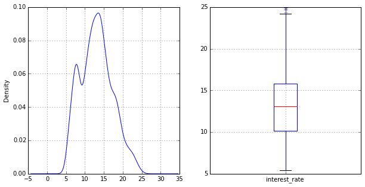
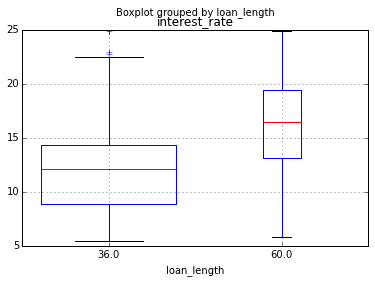
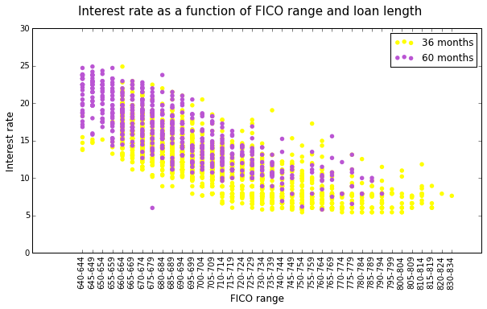

- **Import libraries**

  ```python
  import pandas as pd
  import statsmodels.api as sm
  import statsmodels.formula.api as smf
  import matplotlib.pyplot as plt
  import numpy as np
  %matplotlib inline
  ```

- **Read in data**

  ```python
  loan_data = pd.read_csv('data/loanData.csv')

  loan_data.head()
  ```

  <div style="max-height:1000px;max-width:1500px;overflow:auto;">
  <table border="1" class="dataframe">
    <thead>
      <tr style="text-align: right;">
        <th></th>
        <th>interest_rate</th>
        <th>fico_range</th>
        <th>amount_requested</th>
        <th>amount_funded_by_investors</th>
        <th>loan_length</th>
      </tr>
    </thead>
    <tbody>
      <tr>
        <th>0</th>
        <td>  8.90</td>
        <td> 735-739</td>
        <td> 20000</td>
        <td> 20000</td>
        <td> 36</td>
      </tr>
      <tr>
        <th>1</th>
        <td> 12.12</td>
        <td> 715-719</td>
        <td> 19200</td>
        <td> 19200</td>
        <td> 36</td>
      </tr>
      <tr>
        <th>2</th>
        <td> 21.98</td>
        <td> 690-694</td>
        <td> 35000</td>
        <td> 35000</td>
        <td> 60</td>
      </tr>
      <tr>
        <th>3</th>
        <td>  9.99</td>
        <td> 695-699</td>
        <td> 10000</td>
        <td>  9975</td>
        <td> 36</td>
      </tr>
      <tr>
        <th>4</th>
        <td> 11.71</td>
        <td> 695-699</td>
        <td> 12000</td>
        <td> 12000</td>
        <td> 36</td>
      </tr>
    </tbody>
  </table>
  </div>


- **Data appears to be normally distributed. No transformation is needed**
- **The mean is around 13%**

  ```python
  fig, (ax1, ax2) = plt.subplots(1, 2, figsize=(10, 5))
  interest_rate = loan_data['interest_rate']
  interest_rate.plot(kind='kde', ax=ax1);
  loan_data.boxplot(column='interest_rate', ax=ax2, return_type='dict');

  print interest_rate.mean()
  ```

  13.0703682946

  


- **Interpreting correlations between numeric features.**

  **`amount_requested` is highly correlated to `amount_funded_by_investors` (i.e.
  the more you ask the more you get). In this case we choose `amount_requested`
  and not use `amount_funded_by_investors`**

  **`loan_length` also seems to be the feature that corrlates the most with
  `interest_rate`**

  ```python
  loan_data.corr()
  ```

  <div style="max-height:1000px;max-width:1500px;overflow:auto;">
  <table border="1" class="dataframe">
    <thead>
      <tr style="text-align: right;">
        <th></th>
        <th>interest_rate</th>
        <th>amount_requested</th>
        <th>amount_funded_by_investors</th>
        <th>loan_length</th>
      </tr>
    </thead>
    <tbody>
      <tr>
        <th>interest_rate</th>
        <td> 1.000000</td>
        <td> 0.331831</td>
        <td> 0.336830</td>
        <td> 0.423506</td>
      </tr>
      <tr>
        <th>amount_requested</th>
        <td> 0.331831</td>
        <td> 1.000000</td>
        <td> 0.969841</td>
        <td> 0.412298</td>
      </tr>
      <tr>
        <th>amount_funded_by_investors</th>
        <td> 0.336830</td>
        <td> 0.969841</td>
        <td> 1.000000</td>
        <td> 0.406218</td>
      </tr>
      <tr>
        <th>loan_length</th>
        <td> 0.423506</td>
        <td> 0.412298</td>
        <td> 0.406218</td>
        <td> 1.000000</td>
      </tr>
    </tbody>
  </table>
  </div>


- **`loan_length` is either `36 months` or `60 months`**
- **Plotting the boxplot of interest rate of `36 months` and `60 months`**
- **More peoeple do `36 months` loans (indicated by the width of the bar)**
- **`60 months` loans have a higher interest rate than `36 months`**

  ```python
  props = loan_data['loan_length'].value_counts().astype(float)/len(loan_data['loan_length'])
  loan_data.boxplot(column='interest_rate', by='loan_length', widths=props);
  ```

  


- **Let's look at the `fico_range`, the categorical variable**

  ```python
  grouped = loan_data.groupby('loan_length')
  fr = pd.Categorical.from_array(loan_data.fico_range)

  cols = ['Yellow', 'MediumOrchid']

  fig = plt.figure(figsize=(10, 5))

  i = 0
  for length, group in grouped:
    plt.scatter(pd.Categorical.from_array(group.fico_range).labels,
                group['interest_rate'], c=cols[i].strip().strip('\n'),
                label=str(int(length)) + ' months', s=30, edgecolor='none')
    i += 1

  plt.suptitle('Interest rate as a function of FICO range and loan length', fontsize=15)
  plt.xticks(np.unique(fr.labels), fr.levels, rotation='90')
  plt.xlabel('FICO range', fontsize=12)
  plt.ylabel('Interest rate', fontsize=12)
  plt.legend();
  ```


  


- **Building a model**

  ```python
  lm = smf.ols('interest_rate ~ amount_requested + C(loan_length) + fico_range', loan_data).fit()
  lm.summary()
  ```

  <table class="simpletable">
  <caption>OLS Regression Results</caption>
  <tr>
    <th>Dep. Variable:</th>      <td>interest_rate</td>  <th>  R-squared:         </th> <td>   0.789</td>
  </tr>
  <tr>
    <th>Model:</th>                   <td>OLS</td>       <th>  Adj. R-squared:    </th> <td>   0.786</td>
  </tr>
  <tr>
    <th>Method:</th>             <td>Least Squares</td>  <th>  F-statistic:       </th> <td>   235.7</td>
  </tr>
  <tr>
    <th>Date:</th>             <td>Tue, 24 Feb 2015</td> <th>  Prob (F-statistic):</th>  <td>  0.00</td>
  </tr>
  <tr>
    <th>Time:</th>                 <td>11:05:37</td>     <th>  Log-Likelihood:    </th> <td> -5172.2</td>
  </tr>
  <tr>
    <th>No. Observations:</th>      <td>  2498</td>      <th>  AIC:               </th> <td>1.042e+04</td>
  </tr>
  <tr>
    <th>Df Residuals:</th>          <td>  2458</td>      <th>  BIC:               </th> <td>1.066e+04</td>
  </tr>
  <tr>
    <th>Df Model:</th>              <td>    39</td>      <th>                     </th>     <td> </td>
  </tr>
  <tr>
    <th>Covariance Type:</th>      <td>nonrobust</td>    <th>                     </th>     <td> </td>
  </tr>
  </table>
  <table class="simpletable">
  <tr>
               <td></td>               <th>coef</th>     <th>std err</th>      <th>t</th>      <th>P>|t|</th> <th>[95.0% Conf. Int.]</th>
  </tr>
  <tr>
    <th>Intercept</th>              <td>   14.5015</td> <td>    0.865</td> <td>   16.757</td> <td> 0.000</td> <td>   12.805    16.199</td>
  </tr>
  <tr>
    <th>C(loan_length)[T.60.0]</th> <td>    3.2692</td> <td>    0.103</td> <td>   31.627</td> <td> 0.000</td> <td>    3.067     3.472</td>
  </tr>
  <tr>
    <th>fico_range[T.645-649]</th>  <td>   -0.8107</td> <td>    1.413</td> <td>   -0.574</td> <td> 0.566</td> <td>   -3.581     1.959</td>
  </tr>
  <tr>
    <th>fico_range[T.650-654]</th>  <td>   -0.3783</td> <td>    2.119</td> <td>   -0.179</td> <td> 0.858</td> <td>   -4.533     3.777</td>
  </tr>
  <tr>
    <th>fico_range[T.655-659]</th>  <td>   -0.2529</td> <td>    1.297</td> <td>   -0.195</td> <td> 0.845</td> <td>   -2.797     2.291</td>
  </tr>
  <tr>
    <th>fico_range[T.660-664]</th>  <td>    1.4497</td> <td>    0.883</td> <td>    1.642</td> <td> 0.101</td> <td>   -0.282     3.181</td>
  </tr>
  <tr>
    <th>fico_range[T.665-669]</th>  <td>    0.7608</td> <td>    0.880</td> <td>    0.864</td> <td> 0.388</td> <td>   -0.965     2.487</td>
  </tr>
  <tr>
    <th>fico_range[T.670-674]</th>  <td>   -0.2319</td> <td>    0.878</td> <td>   -0.264</td> <td> 0.792</td> <td>   -1.953     1.490</td>
  </tr>
  <tr>
    <th>fico_range[T.675-679]</th>  <td>   -0.9707</td> <td>    0.879</td> <td>   -1.105</td> <td> 0.269</td> <td>   -2.694     0.752</td>
  </tr>
  <tr>
    <th>fico_range[T.680-684]</th>  <td>   -1.7323</td> <td>    0.879</td> <td>   -1.970</td> <td> 0.049</td> <td>   -3.457    -0.008</td>
  </tr>
  <tr>
    <th>fico_range[T.685-689]</th>  <td>   -2.2187</td> <td>    0.881</td> <td>   -2.517</td> <td> 0.012</td> <td>   -3.947    -0.490</td>
  </tr>
  <tr>
    <th>fico_range[T.690-694]</th>  <td>   -2.5540</td> <td>    0.881</td> <td>   -2.898</td> <td> 0.004</td> <td>   -4.282    -0.826</td>
  </tr>
  <tr>
    <th>fico_range[T.695-699]</th>  <td>   -3.0819</td> <td>    0.880</td> <td>   -3.502</td> <td> 0.000</td> <td>   -4.808    -1.356</td>
  </tr>
  <tr>
    <th>fico_range[T.700-704]</th>  <td>   -3.8335</td> <td>    0.882</td> <td>   -4.345</td> <td> 0.000</td> <td>   -5.564    -2.103</td>
  </tr>
  <tr>
    <th>fico_range[T.705-709]</th>  <td>   -4.5603</td> <td>    0.882</td> <td>   -5.170</td> <td> 0.000</td> <td>   -6.290    -2.831</td>
  </tr>
  <tr>
    <th>fico_range[T.710-714]</th>  <td>   -4.6857</td> <td>    0.885</td> <td>   -5.294</td> <td> 0.000</td> <td>   -6.421    -2.950</td>
  </tr>
  <tr>
    <th>fico_range[T.715-719]</th>  <td>   -5.8201</td> <td>    0.889</td> <td>   -6.548</td> <td> 0.000</td> <td>   -7.563    -4.077</td>
  </tr>
  <tr>
    <th>fico_range[T.720-724]</th>  <td>   -6.0085</td> <td>    0.885</td> <td>   -6.792</td> <td> 0.000</td> <td>   -7.743    -4.274</td>
  </tr>
  <tr>
    <th>fico_range[T.725-729]</th>  <td>   -6.3745</td> <td>    0.889</td> <td>   -7.174</td> <td> 0.000</td> <td>   -8.117    -4.632</td>
  </tr>
  <tr>
    <th>fico_range[T.730-734]</th>  <td>   -7.1759</td> <td>    0.889</td> <td>   -8.075</td> <td> 0.000</td> <td>   -8.918    -5.433</td>
  </tr>
  <tr>
    <th>fico_range[T.735-739]</th>  <td>   -7.6839</td> <td>    0.899</td> <td>   -8.548</td> <td> 0.000</td> <td>   -9.447    -5.921</td>
  </tr>
  <tr>
    <th>fico_range[T.740-744]</th>  <td>   -7.7197</td> <td>    0.906</td> <td>   -8.520</td> <td> 0.000</td> <td>   -9.496    -5.943</td>
  </tr>
  <tr>
    <th>fico_range[T.745-749]</th>  <td>   -7.6619</td> <td>    0.905</td> <td>   -8.463</td> <td> 0.000</td> <td>   -9.437    -5.887</td>
  </tr>
  <tr>
    <th>fico_range[T.750-754]</th>  <td>   -8.2454</td> <td>    0.900</td> <td>   -9.158</td> <td> 0.000</td> <td>  -10.011    -6.480</td>
  </tr>
  <tr>
    <th>fico_range[T.755-759]</th>  <td>   -8.3907</td> <td>    0.912</td> <td>   -9.201</td> <td> 0.000</td> <td>  -10.179    -6.603</td>
  </tr>
  <tr>
    <th>fico_range[T.760-764]</th>  <td>   -8.2163</td> <td>    0.912</td> <td>   -9.014</td> <td> 0.000</td> <td>  -10.004    -6.429</td>
  </tr>
  <tr>
    <th>fico_range[T.765-769]</th>  <td>   -8.8220</td> <td>    0.924</td> <td>   -9.551</td> <td> 0.000</td> <td>  -10.633    -7.011</td>
  </tr>
  <tr>
    <th>fico_range[T.770-774]</th>  <td>   -9.7820</td> <td>    0.985</td> <td>   -9.932</td> <td> 0.000</td> <td>  -11.713    -7.851</td>
  </tr>
  <tr>
    <th>fico_range[T.775-779]</th>  <td>   -8.6299</td> <td>    0.960</td> <td>   -8.994</td> <td> 0.000</td> <td>  -10.512    -6.748</td>
  </tr>
  <tr>
    <th>fico_range[T.780-784]</th>  <td>   -9.3741</td> <td>    0.940</td> <td>   -9.976</td> <td> 0.000</td> <td>  -11.217    -7.531</td>
  </tr>
  <tr>
    <th>fico_range[T.785-789]</th>  <td>   -8.9106</td> <td>    0.973</td> <td>   -9.157</td> <td> 0.000</td> <td>  -10.819    -7.002</td>
  </tr>
  <tr>
    <th>fico_range[T.790-794]</th>  <td>   -9.3208</td> <td>    0.968</td> <td>   -9.629</td> <td> 0.000</td> <td>  -11.219    -7.423</td>
  </tr>
  <tr>
    <th>fico_range[T.795-799]</th>  <td>   -9.3854</td> <td>    1.019</td> <td>   -9.211</td> <td> 0.000</td> <td>  -11.383    -7.387</td>
  </tr>
  <tr>
    <th>fico_range[T.800-804]</th>  <td>   -9.1467</td> <td>    1.030</td> <td>   -8.880</td> <td> 0.000</td> <td>  -11.166    -7.127</td>
  </tr>
  <tr>
    <th>fico_range[T.805-809]</th>  <td>   -9.9952</td> <td>    1.045</td> <td>   -9.567</td> <td> 0.000</td> <td>  -12.044    -7.946</td>
  </tr>
  <tr>
    <th>fico_range[T.810-814]</th>  <td>   -8.8882</td> <td>    1.105</td> <td>   -8.042</td> <td> 0.000</td> <td>  -11.056    -6.721</td>
  </tr>
  <tr>
    <th>fico_range[T.815-819]</th>  <td>   -9.7490</td> <td>    1.172</td> <td>   -8.321</td> <td> 0.000</td> <td>  -12.046    -7.451</td>
  </tr>
  <tr>
    <th>fico_range[T.820-824]</th>  <td>   -7.6802</td> <td>    2.119</td> <td>   -3.625</td> <td> 0.000</td> <td>  -11.835    -3.525</td>
  </tr>
  <tr>
    <th>fico_range[T.830-834]</th>  <td>   -9.7759</td> <td>    2.120</td> <td>   -4.610</td> <td> 0.000</td> <td>  -13.934    -5.618</td>
  </tr>
  <tr>
    <th>amount_requested</th>       <td>    0.0001</td> <td> 5.52e-06</td> <td>   26.031</td> <td> 0.000</td> <td>    0.000     0.000</td>
  </tr>
  </table>
  <table class="simpletable">
  <tr>
    <th>Omnibus:</th>       <td>206.523</td> <th>  Durbin-Watson:     </th> <td>   1.886</td>
  </tr>
  <tr>
    <th>Prob(Omnibus):</th> <td> 0.000</td>  <th>  Jarque-Bera (JB):  </th> <td> 501.129</td>
  </tr>
  <tr>
    <th>Skew:</th>          <td> 0.488</td>  <th>  Prob(JB):          </th> <td>1.52e-109</td>
  </tr>
  <tr>
    <th>Kurtosis:</th>      <td> 4.965</td>  <th>  Cond. No.          </th> <td>2.04e+06</td>
  </tr>
  </table>


