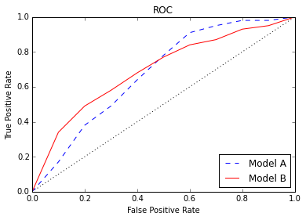

1. You fit a linear regression to predict SAT score with many predictors, one of which is whether or not the student
   was homeschooled. `Beta_homeschool = -40`. How do you interpret the coefficient?

    *All else being equal, a homeschooled student has a 40 point lower SAT score than a non-homeschooled student.*

2. You fit a logistic regression to predict whether or not a student was admitted to a 4-year university. Again,
   `Beta_homeschool = -0.3`. How do you interpret the coefficient?

    *We calculate the odds to get `e^-0.3 = 0.74`. So, all else being equal, a homeschooled student's odds of getting admitted is 74% that of a non-homeschooled student.*

3. Give an example of a confusion matrix with precision > 90% and recall < 10%.

    *There could be any number of answers. One possible confusion matrix is:*

    ```
             Predicted
             ---------
            | 10 | 91 |
    Actual   ---------
            | 01 | 99 |
             ---------
    ```

4. Give an example of a confusion matrix with accuracy > 90%, but both precision < 10% and recall < 10%.

    *There could be any number of answers. One possible confusion matrix is:*

    ```
             Predicted
             -------------
            | 04 |   91  |
    Actual   -------------
            | 91 | 10000 |
             -------------
    ```

5. Take a look at this ROC plot. Assume that we're building a model for a spam filter. We prefer to let spam messages go to the inbox than to let nonspam as go to the spam folder. Interpreting a true positive as correctly identifying spam, which model should we choose?

    

    *We would choose the red curve (Model B) for the low false positive rate, which corresponds to incorrectly identifying nonspam as spam.*

6. Looking at the same ROC plot, assume that we're building a model for a fraud detector. There is a huge cost to missing potential fraud. If we suspect something as fraud we will investigate it further.  Interpreting a true positive as correctly identifying fraud which model should we choose? 

    *We would choose the blue curve (Model A) for the high true positive rate, which corresponds to correctly identifying fraud.*

7. Say I'm building a Decision Tree Classifier on this dataset.

    | color | number | label |
    | ----- | ------ | ----- |
    | blue  | 1      | 0     |
    | blue  | 2      | 1     |
    | red   | 1      | 0     |
    | red   | 5      | 1     |

    Splitting on what feature and value has the best information gain? Use your intuition rather than calculating all the entropy values.

    *Splitting on number for (<= 1) or (> 1) gives the best information gain because the resulting leaves are pure.*

8. Say I'm building a Decision Tree Regressor. What is the information gain of this split of the data?

    ```
    Split A: 6, 5, 8, 8
    Split B: 5, 4, 2, 4, 4
    ```

    *Use the information gain formula with variance as the measure of disorder (instead of entropy).*

    ```
    Var(S) = Var(6,5,8,8,5,4,2,4,4) = 3.4321
    Var(A) = Var(6,5,8,8) = 1.6875
    Var(B) = Var(5,4,2,4,4) = 0.9600

    Gain = Var(S) - 4/9 * Var(A) - 5/9 * Var(B)
         = 2.1488
    ```

9. You build a Decision Tree and get these stats:

    ```
    train set accuracy:  90%
    train set precision: 92%
    train set recall:    87%

    test set accuracy:   60%
    test set precision:  65%
    test set recall:     52%
    ```

    What's going on? What tactic(s) do we have to modify our Decision Tree to fix the issue?

    *Overfitting is happening. One method to modify the tree is to prune it.*

10. How are the Decision Trees in Random Forests different from standard Decision Trees?

    *In Random Forests, the trees are built on bootstrapped samples, so you will very likely have duplicates in your data.*
    
    *In the Decision Trees in Random Forests, at each node, we randomly select the available features to split on. In standard Decision Trees, we consider all the features.*

11. Why are we able to cross validate our Random Forest with our training set (OOB error)? I.e. Why doesn't this count as testing on my training set?

    *The bootstapping means that we are sampling with replacement, so roughly 63% of the data is included in building each tree in the random forest. The 37% that's left out can be used as a test set.*
    
12. Say I have 50 machines that I can use to build my model. Which of these ensemble methods can utilize multiple machines?

    * Random Forest
    * Gradient Boosting
    * AdaBoost
    
    *Random Forest. In Boosting algorithms, each tree depends on its predecessor, so it's not easy to parallelize.*

13. In boosting, what is the hyperparameter `max_depth`?

    *This is the depth of the decision trees. We typically choose a small value (the default is 1) to prevent the trees from overfitting.*

14. In boosting, what is the relationship between the hyperparameters `learning_rate` and `n_estimators`?

    *As we decrease the learning rate we need to increase the number of estimators before the improvement levels off.*

15. In boosting, why might we want to tune `max_features` and `sub_sample`? What purpose does it serve?

    *`max_features` takes a random subsample of the features.
    `sub_sample` takes a random subsample of the training set.
    This is stochastic boosting. Both parameters are adding randomness to your trees.*

16. In Random Forests, what do you expect to happen to the test error as you build more trees? How is this different from increasing the number of trees in Boosting?

    *In a Random Forest, as you build more trees, the test error should decrease and eventually level off. In Boosting, as you build more trees, the test error should decrease and level off, but then increase if you boost too much.*

17. Name the tuning parameters for the following algorithms and describe what you'd expect to happen with bias and variance as you increase the tuning parameter.

    * Lasso / Ridge
    * SVM

    *In Lasso and Ridge, you tune alpha (or lambda), which increases the penalty for your beta coefficients, which decreases variance and increases bias.*
    
    *In SVMs, you tune the cost parameter which is the sum of all your slack variables. Increasing the cost parameter, increases the margin, which tends to decrease variance and increase bias.*
    
    *Note that the SVM cost parameter is different from sklearn's parameter `c`.*
