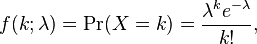

## Section 3 solutions

1. Define the following events:

        F = chose fair die
        S = rolled a six

    Goal: P(F|S) = probability of having chosen the fair die given that you rolled a six

    Use Bayes Rule:

        P(F|S) = P(S|F) * P(F) / P(S)

    Determine the value of each part:

        P(S|F) = 1/6
        P(F) = 1/2
        P(S) = 0.5*3/6 + 0.5*1/6 = 1/3

    Plug in the values:

        P(F|S) = 1/6 * 1/2 / (1/3) = **1/4**


1. a. Since 2 users are expected every minute, 10 users are expected every 5 minutes.

    b. Since Poisson distributions can be used to model an expected number of events in a given time and are often used when you only have an average rather than exact probabilities, it is the probably the best distribution to model the data.

    The formula for the Poisson Distribution is:

    

    lambda is the expected mean of the distribution, which is 10 (part a).

        P(X=0) = e^-10 = 0.0045%


1. a. The last two column can be expressed as linear relations of the the second two:

        Total score = Assignment 1 score + Assignment 2 score
        percent = Total score / 100

    You can remove the last two columns without losing any data. The rank of the matrix is 3 (since there are three columns remaining).
    
    b. Save the data into `scores.csv` and run this code:
    
    ```python
    a = np.genfromtxt('scores.csv', delimiter=',')
    u, s, v = np.linalg.svd(a)
    ```
        
    Look at the `s` list. It should have length 5 and the last two should be essential zero. There are 3 remaining, thus the rank of the matrix is 3.


1. The contingency table is as follows:

    | Group | Registered | Didn't Register |
    | ----- | ---------- | --------------- |
    |     A |        103 |             509 |
    |     B |        144 |             451 |
    
    
    You can use scipy's chi squared test:

    ```python
    from scipy.stats import chi2_contingency
    chi2, p, dof, expected = chi2_contingency([[103, 509], [144, 451]], correction=False)
    print "p-value:", p/2
    ```

    The p-value is 0.00075, which is below the threshold of 0.05 to be considered significant.


1. You should use a regression model.  You can fit multiple regression models using different numbers of polynomial terms.  For example, one model could be MPG ~ Horsepower + Horsepower^2.  To compare these models, you should **not** use RSS, RMSE, or R-squared.  A good standby is cross-validation.  Some alternatives that account for complexity are Adjusted R-squared, AIC, BIC, F-test, etc.  

1. When the degree is < 3, the graph indicates underfitting (both training and testing error are high). When the degree is > 17, the graph indicates overfitting (training error is low, but testing error is high). The optimal degree is the lowest degree with the minimum testing error: 4.


1. a. A model which always predicts not spam would get 90% accuracy.

    b. You need to consider the precision and recall of the models. You could use the f1 score, the confusion matrix and/or a roc plot.

1. Take the mean and standard deviation of the data. Choose a boundary of around 2 or 3 standard deviations from the mean to remove outliers. 

1. a. You should choose Model Black to get a sensitivity of 0.8, since it has a higher specificity when the sensitivity is 0.8.

    b. You should chooce Model Red to get a specificitiy of 0.9, since it has a higher sensitivity when the false positive rate is 0.1.
